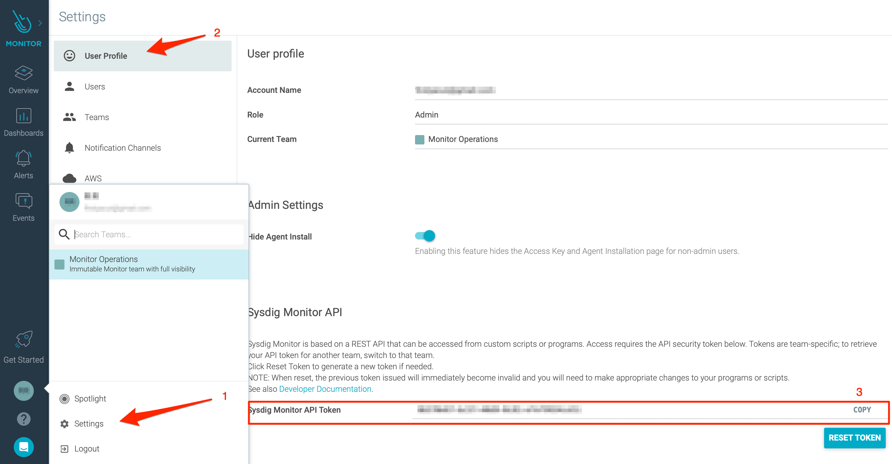

# Sysdig Outbound Integration

## In Sysdig 

### Copy API token 

2. Go to **Settings**, then to **User Profile.** Write down your API Token. You will need it later in iLert.

## In iLert 

### Create a Sysdig Connector and Link to alert source 

1. Click on the gear icon and then on **Connectors** button

2. Click on **Add Connector**

3. Select **Sysdig** as **type** and fill in all fields. Enter a name, the API Token that you copied in the last step.

4. Go to the alert sources tab and open the alert source whose alerts you want to publish in Sysdig. Click on **Alert actions** and then on **Create alert action**.

5. Select **Sysdig** as the **type**, select the connector created in step 3, fill in all fields. In the **Label** field, specify the alert action name.

6. Optional: You can define tags and event filters. More information aber it you can find here: [https://docs.sysdig.com/en/events.html](https://docs.sysdig.com/en/events.html)

7. Finished! You can now test the connection by clicking on the button **Test this connection**. Then a test event will be created in Sysdig.

## FAQ 

**Are updates for an alert adapted in the corresponding Sysdig Event?**

Yes, the state of the iLert Alert is reflected in the brief description of the Sysdig event, eg \[RESOLVED\] Host compute.infra is DOWN.

