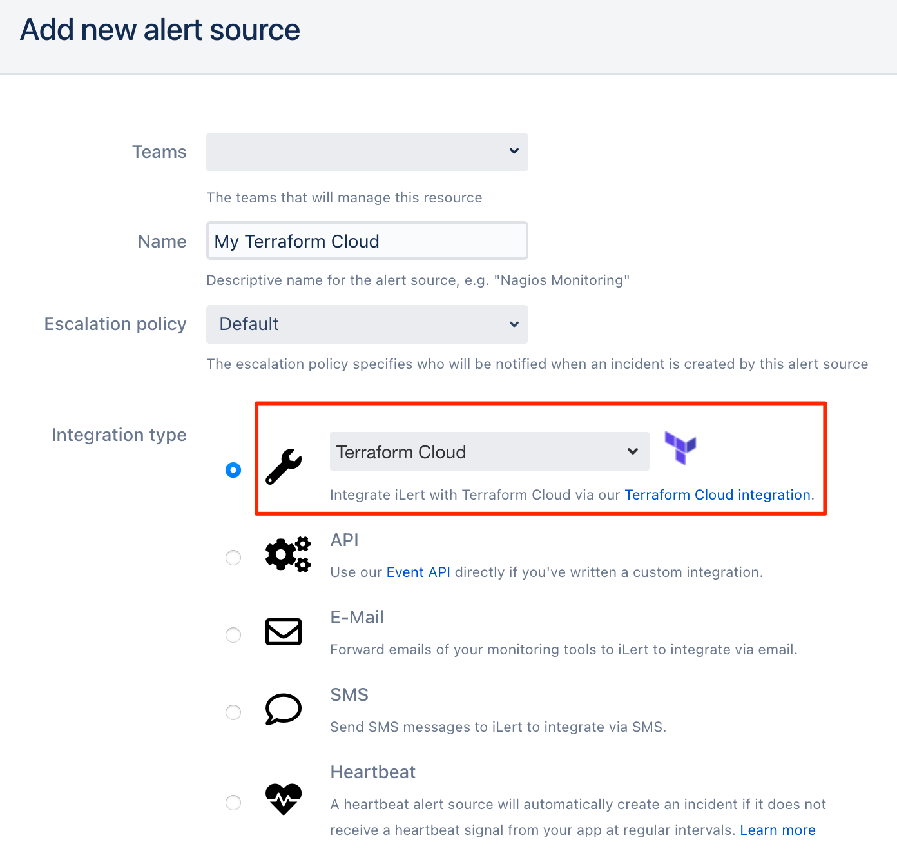
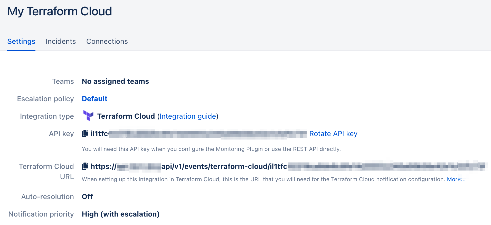
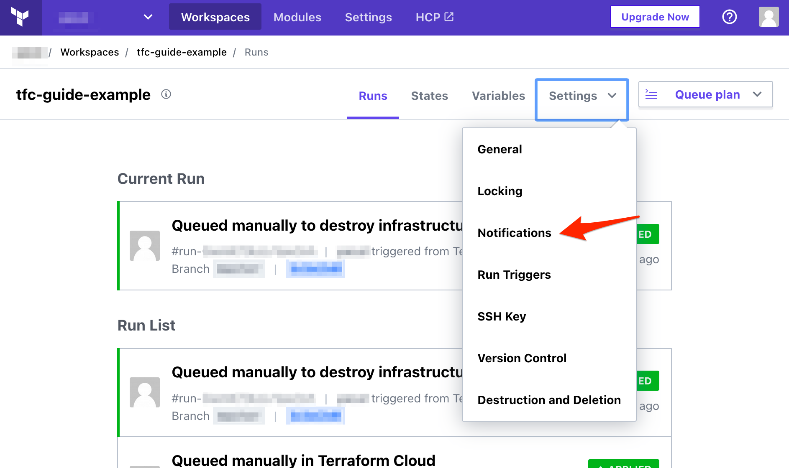
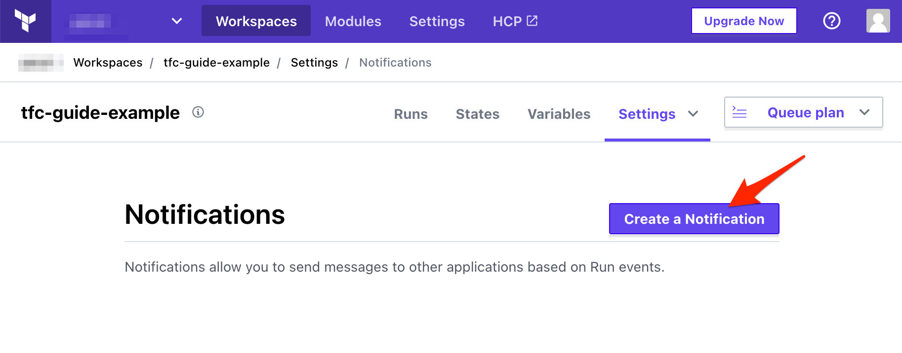
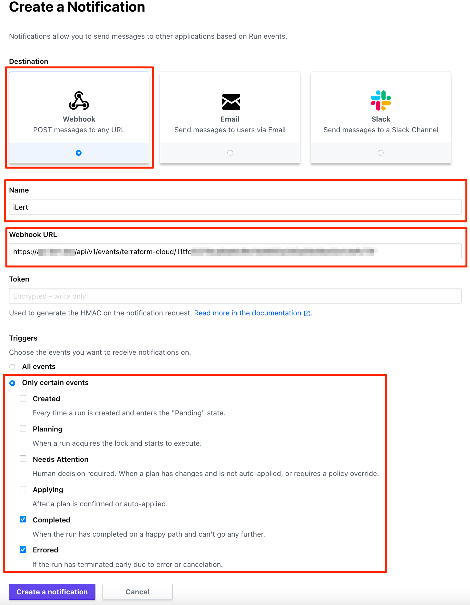

# Terraform Cloud / Terraform Enterprise

## In iLert 

### Create a Terraform Cloud alert source 

1. Go to the "Alert sources" tab and click **Create new alert source**

2. Enter a name and select your desired escalation policy. Select "Terraform Cloud" as the **Integration Type** and click on **Save**.

3. On the next page, a Webhook URL is generated. You will need this URL below when setting up the notification in Terraform Cloud.

## In Terraform Cloud / Terraform Enterprise 

### Create a notification setting 

1. Go to Terraform Cloud and then to **Your Workspace -&gt; Settings -&gt; Notifications**

2. On the next page,  click on the **Create a Notification** button

3. On the next page, name the  notification setting e.g. iLert, paste the **Webhook URL** that you generated in iLert, in the **Triggers** section choose **Only certain events** and select **Completed** and **Errored** options, then click on the **Create a Notification** button

Finished! Your Terraform Cloud run problems will now create alerts in iLert.

## FAQ 

**Will alerts in iLert be resolved automatically?**

Yes, as soon as an alert has been completed in Terraform Cloud, the associated alert in iLert will be resolved automatically.

**Can I connect Terraform Cloud with multiple alert sources from iLert?**

Yes, simply add more notification settings in Terraform Cloud.

