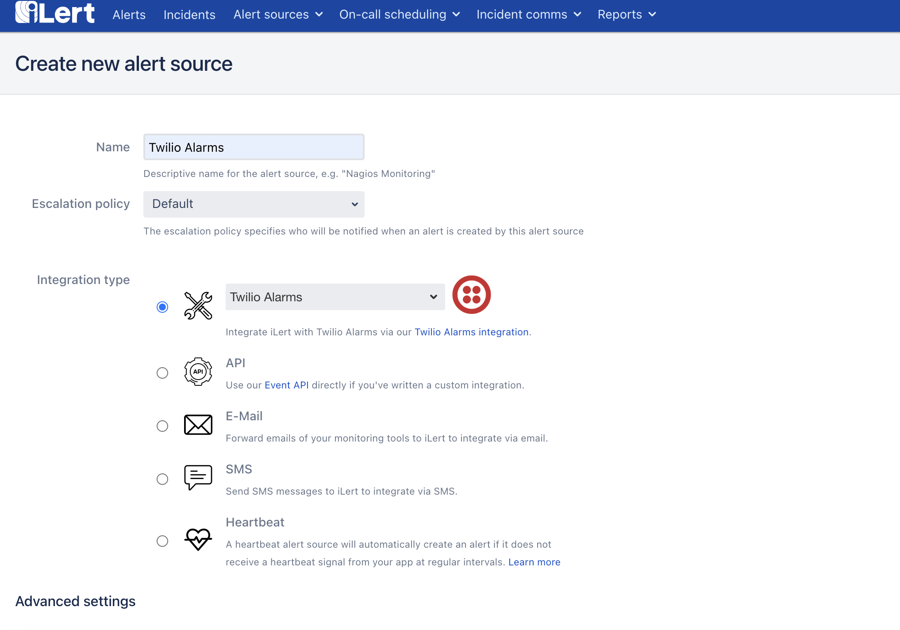
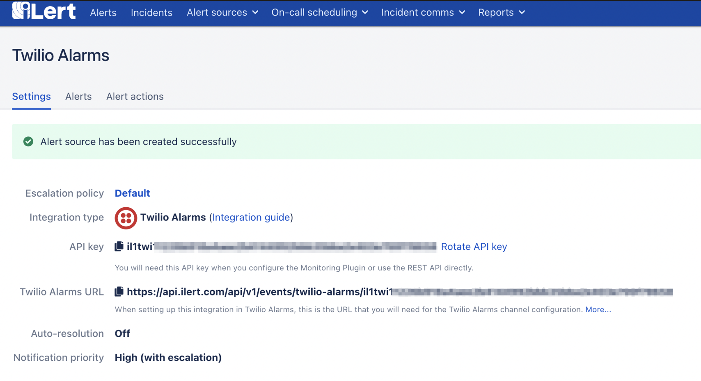

# Twilio Alarms Integration

## In iLert: Create Twilio Alarms alert source

1. Go to **Alert sources** and click on the **Create new alert source** button
2. Set a name for your Twilio Alarms source and select an escalation policy
3. Select **Twilio Alarms** in the Integration type field and save.
4.

    <figure><figcaption></figcaption></figure>
5. On the next page a **Webhook URL** is generated. You will need this URL at the bottom of the setup in Twilio Alarms.
6.

    <figure><figcaption></figcaption></figure>

## In Twilio Alarms: Add iLert Webhook

1. Navigate to **Monitor -> Alarms -> Manage alarms** and click on the **Create alarm** button on the top right corner.
2.

    <figure><figcaption></figcaption></figure>
3. Select **Any Warning or Error** in the **Error code** field.
4.

    <figure><figcaption></figcaption></figure>
5. In the next step define an alarm threshold and a time period.
6.

    <figure><figcaption></figcaption></figure>
7. Select **Enable webhook** and enter the **Webhook URL** from iLert created in [this step](twilio-alarms.md#in-ilert-create-twilio-alarms-alert-source) into the field below.
8.

    <figure><figcaption></figcaption></figure>
9. Enter a name for the alarm and click on Save.

## FAQ

**Will alerts in iLert be resolved automatically?**

No, unfortunately Twilio Alarms is not compatible with iLert's resolve event.
