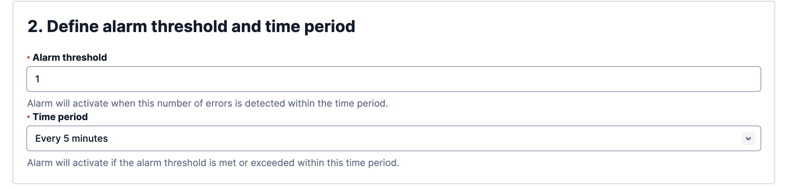

# Twilio Alarms Integration

## In ilert: Create Twilio Alarms alert source

1. Go to **Alert sources** and click on the **Create new alert source** button
2. Set a name for your Twilio Alarms source and select an escalation policy
3.  Select **Twilio Alarms** in the Integration type field and save.

    <figure><figcaption></figcaption></figure>
4.  On the next page a **Webhook URL** is generated. You will need this URL at the bottom of the setup in Twilio Alarms.

    <figure><figcaption></figcaption></figure>

## In Twilio Alarms: Add ilert Webhook

1.  Navigate to **Monitor -> Alarms -> Manage alarms** and click on the **Create alarm** button on the top right corner.

    <figure><figcaption></figcaption></figure>
2.  Select **Any Warning or Error** in the **Error code** field.

    <figure><figcaption></figcaption></figure>
3.  In the next step define an alarm threshold and a time period.

    <figure><figcaption></figcaption></figure>
4.  Select **Enable webhook** and enter the **Webhook URL** from ilert created in [this step](twilio-alarms.md#in-ilert-create-twilio-alarms-alert-source) into the field below.

    <figure><figcaption></figcaption></figure>
5. Enter a name for the alarm and click on Save.

## FAQ

**Will alerts in ilert be resolved automatically?**

No, unfortunately Twilio Alarms is not compatible with ilert's resolve event.
