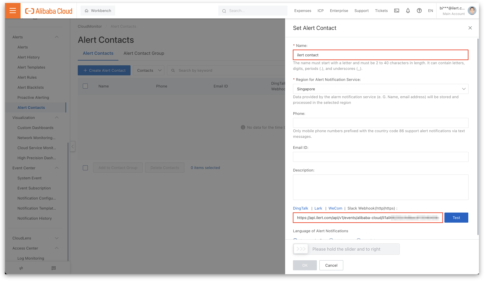

# Twilio Errors Integration

## In ilert: Create Twilio Errors alert source

1. Go to **Alert sources** and click on the **Create new alert source** button
2. Set a name for your Twilio Errors source and select an escalation policy
3. Select **Twilio Errors** in the Integration type field and save.

<figure><figcaption></figcaption></figure>

4. On the next page a **Twilio Errors URL** is generated. You will need this URL at the bottom of the setup in Twilio Errors.

<figure><figcaption></figcaption></figure>

## In Twilio: Add ilert Webhook

1. Navigate to **Monitor -> Logs -> Errors -> Webhook** and enter the [previous](twilio-errors.md#in-ilert-create-twilio-errors-alert-source) generated URL into the **Webhook URL** field.

<figure><figcaption></figcaption></figure>

2. Click on **Save** to finish the Setup

## FAQ

**Will alerts in ilert be resolved automatically?**

No, unfortunately Twilio Errors is not compatible with ilert's resolve event.
