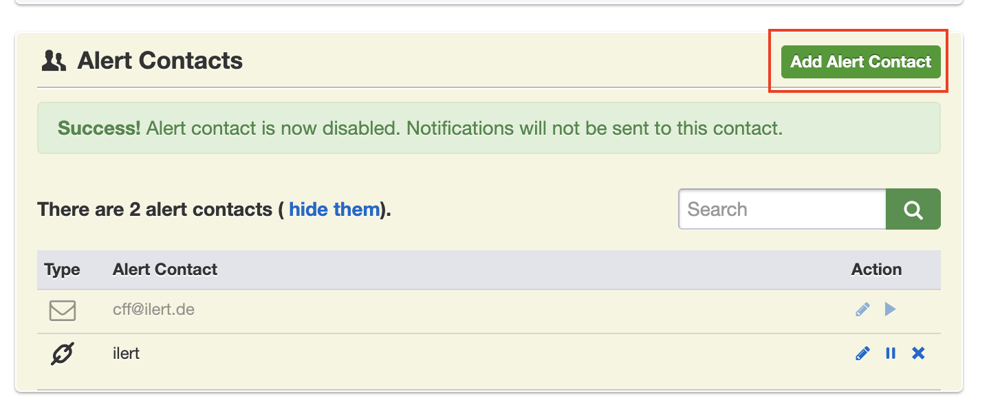
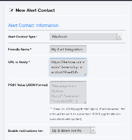
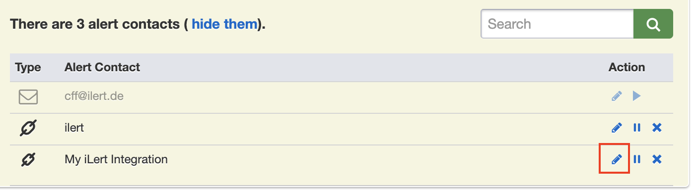
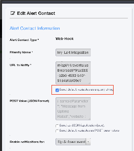
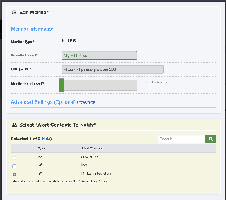

# UptimeRobot Integration

With the UptimeRobot integration, you can easily integrate UptimeRobot notifications into ilert. So you can easily expand UptimeRobot with push and voice notification and duty rosters from ilert. Incidents are created in ilert and automatically closed again as soon as the problem has been resolved.

## In ilert: Create UptimeRobot alert source 

1.  Go to **Alert sources** --> **Alert sources** and click on **Create new alert source**

    <figure><figcaption></figcaption></figure>
2.  Search for **UptimeRobot** in the search field, click on the UptimeRobot tile and click on **Next**.&#x20;

    <figure><figcaption></figcaption></figure>
3. Give your alert source a name, optionally assign teams and click **Next**.
4.  Select an **escalation policy** by creating a new one or assigning an existing one.

    <figure><figcaption></figcaption></figure>
5.  Select you [Alert grouping](../alerting/alert-sources.md#alert-grouping) preference and click **Continue setup**. You may click **Do not group alerts** for now and change it later.&#x20;

    <figure><figcaption></figcaption></figure>
6. The next page show additional settings such as customer alert templates or notification prioritiy. Click on **Finish setup** for now.
7.  On the final page, an API key and / or webhook URL will be generated that you will need later in this guide.

    <figure><figcaption></figcaption></figure>

## In UptimeRobot: Add ilert Webhook as Alert Contact 

1. Go to the menu item "My Settings" and scroll down a little and click on "Add Alert Contact".

2. Select Webhook as the type and in the URL to Notify field insert the webhookurl generated in ilert and add a "?" at the end of the URL. put ( add ), save now via "Create Alert Contact" button.

3. Open the newly created alert contact, then open it again in edit mode.

4. Activate the checkbox that appears for "Default variables via query parameters", scroll down and confirm with "Save Changes".

5. The integration is now set up and the new Alert Contact can be activated in your monitors.

## FAQ 

**Are alerts automatically resolved in ilert?**

Yes, as soon as an alert is resolved with "ok" in UptimeRobot, the associated alert is automatically resolved in ilert.

**Can I link UptimeRobot to multiple alert sources in ilert?**

Yes, create an **alert contact** for this in UptimeRobot for each alert source.
