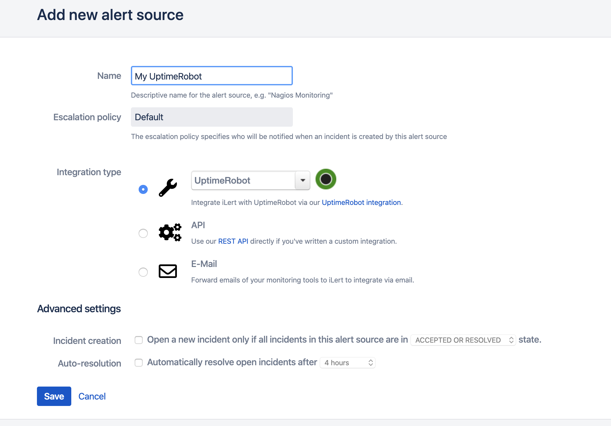
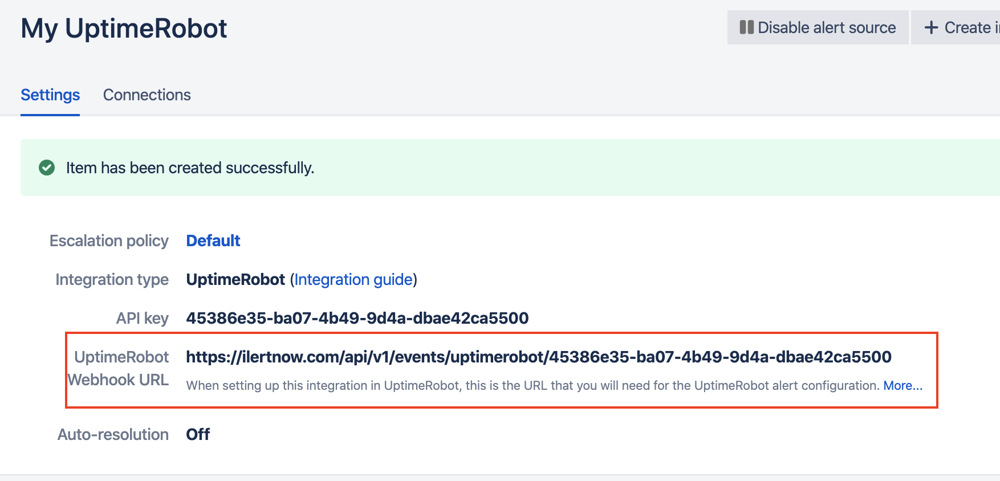

# UptimeRobot Integration

With the UptimeRobot integration, you can easily integrate UptimeRobot notifications into iLert. So you can easily expand UptimeRobot with push and voice notification and duty rosters from iLert. Incidents are created in iLert and automatically closed again as soon as the problem has been resolved.

## In iLert: Create UptimeRobot alert source 

1. Switch to the **alert sources tab** and click the "Create new alert source" button

2. Assign name and select escalation chain

3. Select and save **UptimeRobot** in the Integration type field.

4. A webhook URL is generated on the next page. You will need this URL below when setting up in UptimeRobot.

## In UptimeRobot: Add iLert Webhook as Alert Contact 

1. Go to the menu item "My Settings" and scroll down a little and click on "Add Alert Contact".

2. Select Webhook as the type and in the URL to Notify field insert the webhookurl generated in iLert and add a "?" at the end of the URL. put \( add \), save now via "Create Alert Contact" button.

3. Open the newly created alert contact, then open it again in edit mode.

4. Activate the checkbox that appears for "Default variables via query parameters", scroll down and confirm with "Save Changes".

The integration is now set up and the new Alert Contact can be activated in your monitors.

## FAQ 

**Are incidents automatically resolved in iLert?**

Yes, as soon as an alert is resolved with "ok" in UptimeRobot, the associated incident is automatically resolved in iLert.

**Can I link UptimeRobot to multiple alert sources in iLert?**

Yes, create an **alert contact** for this in UptimeRobot for each alert source.

