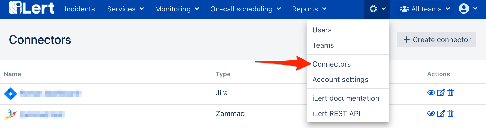

# Cisco Webex

## In iLert 

### Create the Cisco Webex Connector and link it to the alert source

1. ****Click the gear icon and then click on the **Connectors** link

2. Click the **Add Connector** button

3. On the next page, choose **Cisco Webex** as type, name the connector and click on the save button to authorize iLert App with your Zoom account.

4. On the next page, agree with the requested permissions and click on the **Authorize** button

5. Go to the alert sources tab and open the alert source whose incidents you want to create Zoom Meeting. Click on the **Incident actions** tab and then on the **Add new incident action** button

6. On the next page choose **Cisco Webex** as the type, choose the connector created in step 3, name it**,** choose **incident events** and ****the **root** to publish and click on the **Save** button.

6. Finished! You can now test the connection by clicking on the button **Test this connection**. Thereafter, a test message will be posted on the Cisco Webex room.

## FAQ 

**Can I link multiple Cisco Accounts to an iLert account?**

Yes.

**Are updates to an incident published on the Cisco Webex room?**

Yes, the following updates to an incident are currently being released:

* **Escalations** : An incident is assigned to another user through an automatic escalation.
* **Manual Assignments** : An incident is manually assigned to someone.
* **Actions** : An incident is accepted or resolved.

**Can I choose which updates to an incident will be published in Cisco Webex?**

Yes.

