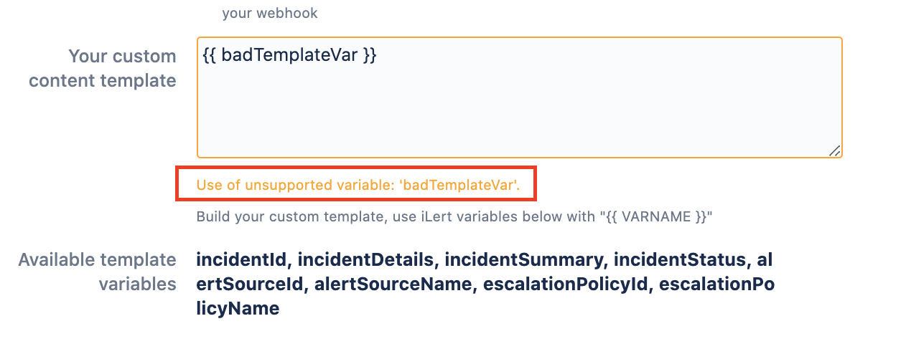
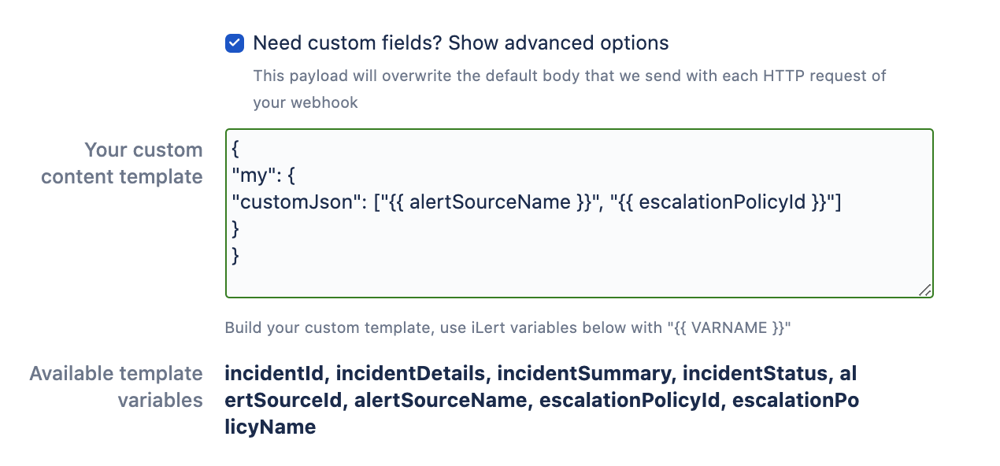

# Webhook Integration

## In iLert: Create webhook alert action <a href="#create-webhook" id="create-webhook"></a>

1. Switch to the **alert sources** tab and open the alert source whose alerts you want to publish via a webhook. Click on **Alert actions → Create new alert action**

.png>)

1. Select **Webhook** as **type** and fill out all fields. In the **Filter Alert Events** field, select the alert events for which you want to receive a webhook call. Webhook events are sent as `HTTP POST` to the specified URL. The URL must be accessible from the internet. Click on **Save**.

.png>)

1. Finished!

## Webhook payload <a href="#payload" id="payload"></a>

A sample webhook payload can be seen below.\
To get more information on the **status** or **eventType** fields, visit the _Template variables explained_ section of this page.

```
{
     "id": "2983781",
     "status": "ACCEPTED",
     "summary": "PROBLEM Host Alert: app.compute is DOWN",
     "details": "details",
     "reportTime": "2019-08-29T09: 52: 39.551Z",
     "eventType": "incident-acknowledged",
     "priority": "LOW",
     "alertSource": {
         "id": 2101194,
         "name": "Nagios Network and Hosts"
     },
     "assignedTo": {
         "username": "abr",
         "email": " example@example.com ",
         "firstName": "Andreas",
         "lastName": "farmer"
     }
}
```

## Custom webhook payload / request body <a href="#custom" id="custom"></a>

In case you want to customize the HTTP Post request body of your webhook, you can simply enable the custom fields option.


This will allow you to add any kind of custom body that you want to send. In case of an invalid template the border will become yellow or red.



In case of a valid template the border will turn green. As you may have noticed we also offer to use iLert related variables that will be swapped with the corresponding event related data when the request is made. These work, as described under the template field in simple mustache sytnax `{{ VARNAME }}`. Our editor will tell you if you are using the variables incorrectly.



## Template variables explained

| Variable key         | Description                                                                                                                                                     |
| -------------------- | --------------------------------------------------------------------------------------------------------------------------------------------------------------- |
| alertId              | The ID of the alert                                                                                                                                             |
| alertDetails         | Full alert details                                                                                                                                              |
| alertSummary         | Alert summary                                                                                                                                                   |
| alertStatus          | PENDING, ACCEPTED or RESOLVED                                                                                                                                   |
| alertPriority        | HIGH or LOW                                                                                                                                                     |
| alertUrl             | URL that links to the alert in iLert                                                                                                                            |
| alertSourceId        | The ID of the alert's alert source                                                                                                                              |
| alertSourceName      | The name of the alert's alert source                                                                                                                            |
| escalationPolicyId   | The ID of the escalation policy of the alert's alert source                                                                                                     |
| escalationPolicyName | The name of the escalation policy of the alert's alert source                                                                                                   |
| reportTime           | ISO-8601 representation of the alert report time                                                                                                                |
| link                 | If present, the first link in the alert's payload e.g. links to the origin monitoring tool that send the event initially                                        |
| eventType            | alert-created, alert-assigned, alert-auto-escalated, alert-auto-resolved, alert-acknowledged, alert-rejected, alert-raised, alert-comment-added, alert-resolved |

## FAQ <a href="#faq" id="faq"></a>

### **Do you support authentication?**

Yes, **HTTP Basic Auth** is supported. The username and password must be specified in the URL.

Example: https: // username: password@example.com / webhooks / ilert

Special characters in the user name or password must be [encoded URL](https://www.w3schools.com/tags/ref\_urlencode.asp).

### **Can you also specify the HTTP port?**

Yes. By default, port 80 is used for HTTP connections and port 443 for HTTPS connections. You can overwrite the port number by adding a colon : after the host address and the port.

incident-created, incident-assigned, incident-auto-escalated, incident-auto-resolved, incident-acknowledged, incident-rejected, incident-raised, incident-comment-added, incident-resolved

Example: [https://example.com:8443/webhooks/ilert](https://example.com:8443/webhooks/ilert)

### I cannot rely on user-agent headers for my firewall, is there a way to whitelist ip addresses of the webhooks?

Basically it is not possible to whitelist the ip addresses for all of our agents, as there are just too many blocks that may change at any time. However we do offer static IP agents in our Premium plan - the static ip addresses are listed [here](../getting-started/phone-numbers/#email-services).
