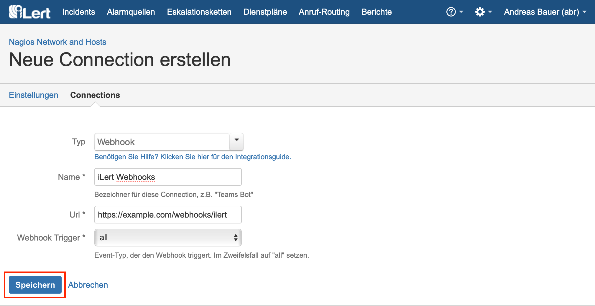
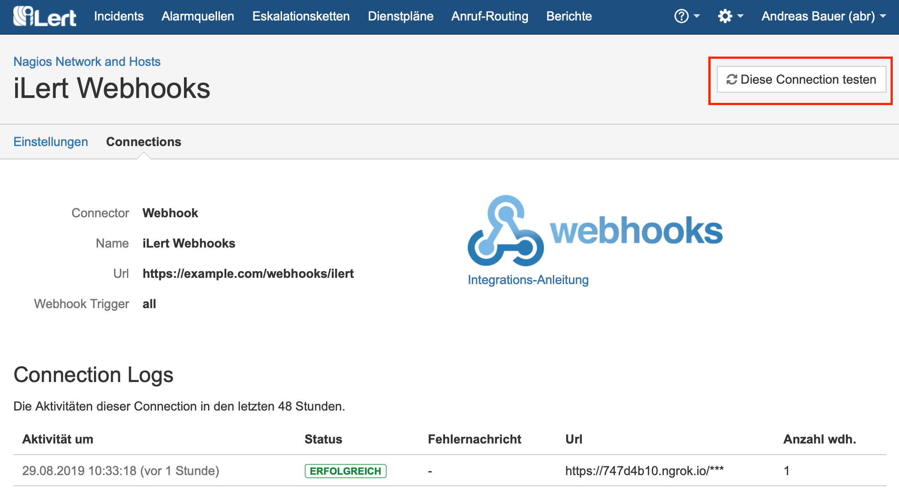
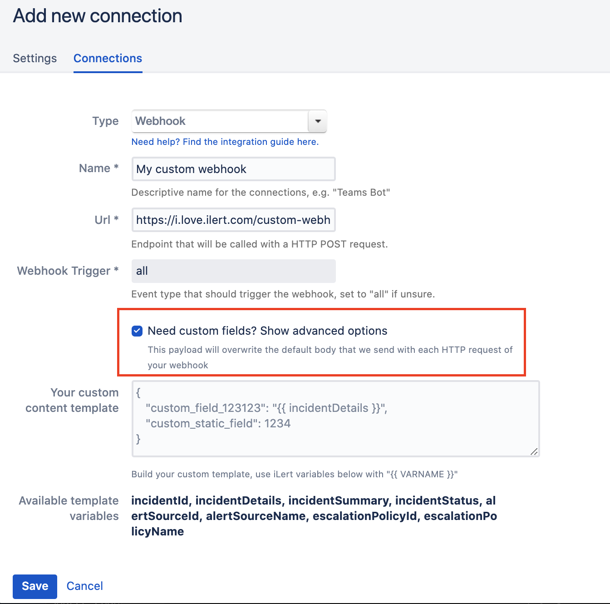

# Webhook Integration

## In iLert: Create webhook connection <a id="create-webhook"></a>

**Admin authorization required** To set up the integration, you must have admin rights in iLert.

1. Switch to the **alert sources** tab and open the alert source whose incidents you want to publish via a webhook. Click on **Connections → Add new connection**


2. Select **Webhook** as **type** and fill out all fields. In the **Webhook Trigger** field, select the incident events for which you want to receive a webhook call. Webhook events are sent as `HTTP POST` to the specified URL. The URL must be accessible from the internet. Click on **Save**.



3. Finished! You can now test the connection by clicking the **Test this connection** button.



## Webhook payload <a id="payload"></a>

```text
{
     "id": "2983781",
     "status": "ACCEPTED",
     "summary": "PROBLEM Host Alert: app.compute is DOWN",
     "details": "details,
     "reportTime": "2019-08-29T09: 52: 39.551Z",
     "alertSource": {
         "id": 2101194,
         "name": "Nagios Network and Hosts"
     },
     "assignedTo": {
         "username": "abr",
         "email": " example@example.com ",
         "firstName": "Andreas",
         "lastName": "farmer"
     }
}
```

## Custom webhook payload / request body <a id="custom"></a>

In case you want to customize the HTTP Post request body of your webhook, you can simply enable the custom fields option.



This will allow you to add any kind of custom body that you want to send. In case of an invalid template the border will become yellow or red.


In case of a valid template the border will turn green. As you may have noticed we also offer to use iLert related variables that will be swapped with the corresponding event related data when the request is made. These work, as described under the template field in simple mustache sytnax `{{ VARNAME }}`. Our editor will tell you if you are using the variables incorrectly.


## FAQ <a id="faq"></a>

**Do you support authentication?**

Yes, **HTTP Basic Auth** is supported. The username and password must be specified in the URL.

Example: https: // username: password@example.com / webhooks / ilert

Special characters in the user name or password must be [encoded URL](https://www.w3schools.com/tags/ref_urlencode.asp).

**Can you also specify the HTTP port?**

Yes. By default, port 80 is used for HTTP connections and port 443 for HTTPS connections. You can overwrite the port number by adding a colon : after the host address and the port.

Example: [https://example.com:8443/webhooks/ilert](https://example.com:8443/webhooks/ilert)

