# Zabbix 4.4+ Integration

## System Requirements <a id="requirements"></a>


Are you using Zabbix 4.3 or lower? Please refer to our  [Zabbix 2.2 - 4.3 Integration](script.md) guide.


* Zabbix 4.4+

## In iLert: Create an alert source <a id="create-alarm-source"></a>

1. Go to **Alert sources** and click on **Add a new alert source**.

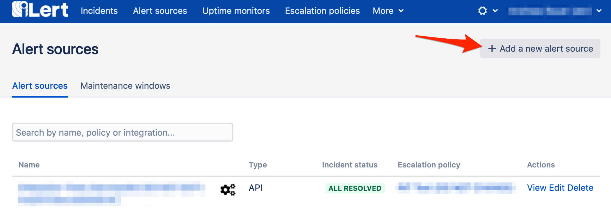

2. Set a name \(e.g. "Zabbix"\) and select your desired escalation policy.

3. Set the **Integration type** to Zabbix.

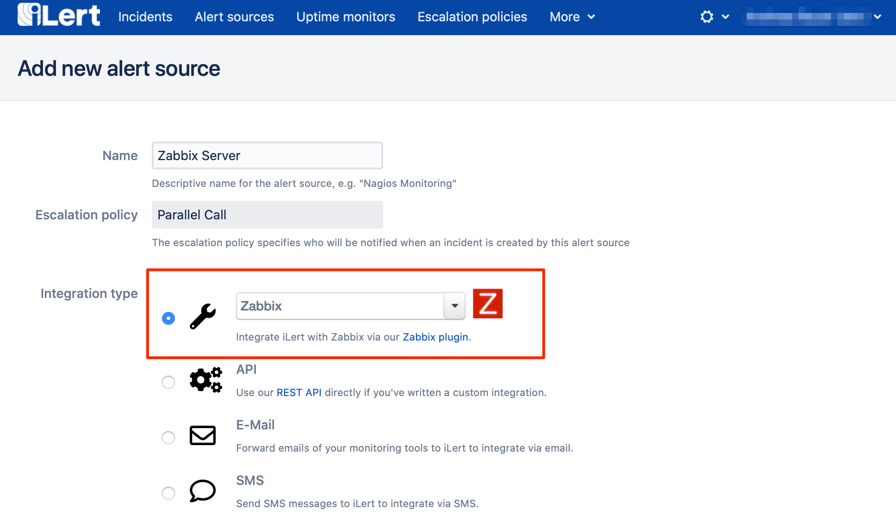

4. An API key is generated on the next page. You will need the API key below when creating an iLert user in Zabbix.

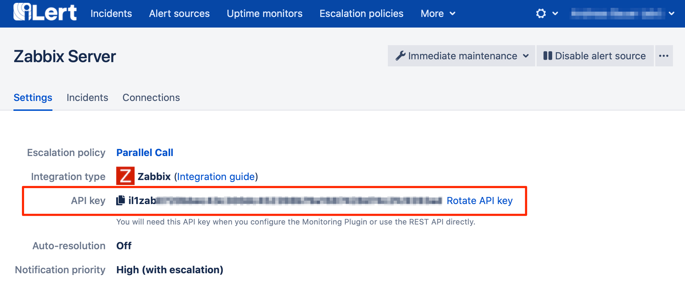

## In Zabbix <a id="zabbix"></a>

### Import iLert media type \(if needed\)

1. Download the iLert Zabbix Media Type file: [https://raw.githubusercontent.com/iLert/ilert-zabbix/master/media\_ilert.xml](https://raw.githubusercontent.com/iLert/ilert-zabbix/master/media_ilert.xml)

```text
curl -o media_ilert.xml \
   https://raw.githubusercontent.com/iLert/ilert-zabbix/master/media_ilert.xml
```

2. Go to the **Administration → Media types** tab and click the **Import** button.

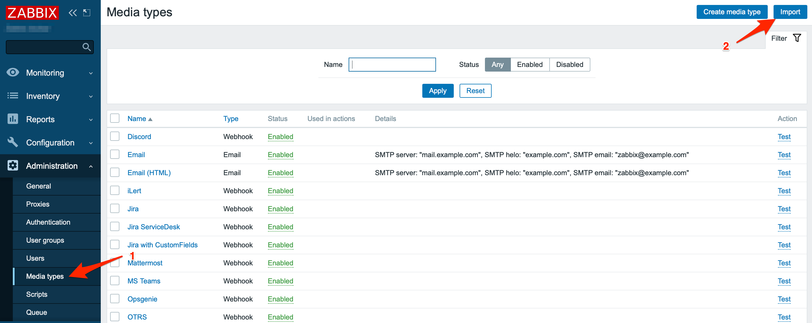

3. Select import file `media_ilert.xml` and click the **Import** button at the bottom to import the iLert media type.

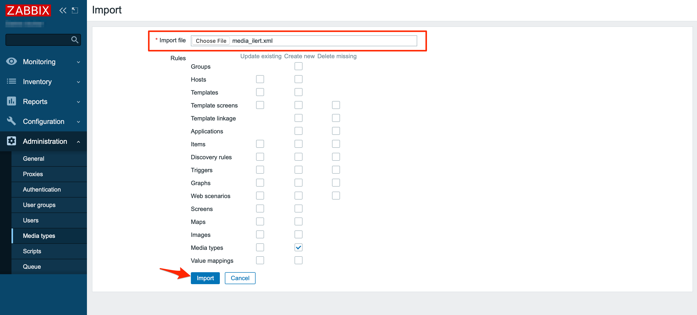

4. **Optional**: Go to **Media types** and open the imported **iLert** media type. You can overwrite the default incident summary with a custom template using the `.ILERT.INCIDENT.SUMMARY` variable e.g. `{TRIGGER.NAME}: {TRIGGER.STATUS} for {HOST.HOST}`

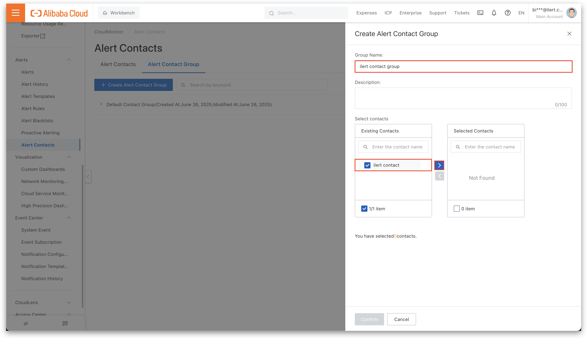

6. Click on the **Update** button to save the media type.

### Create iLert user and group

1. Go to the **Administration → User groups** tab and click on the **Create user group** button.

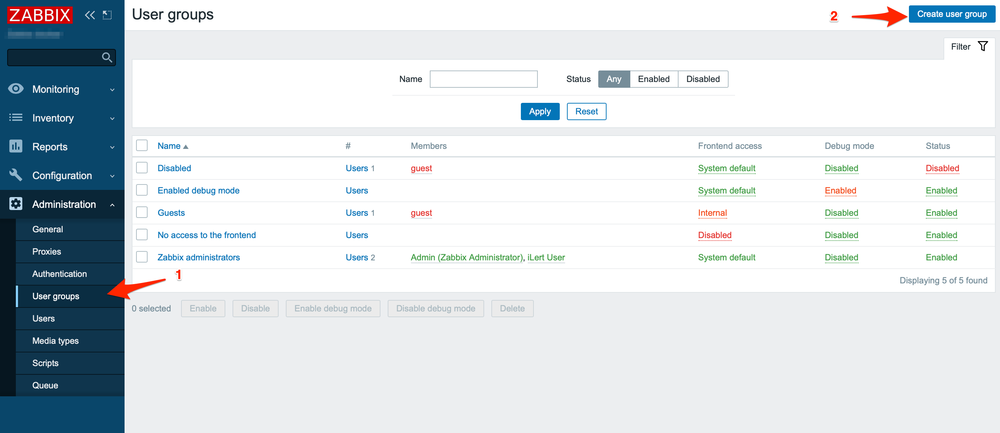

2. Set the name for the iLert group \(eg. "iLert group"\).

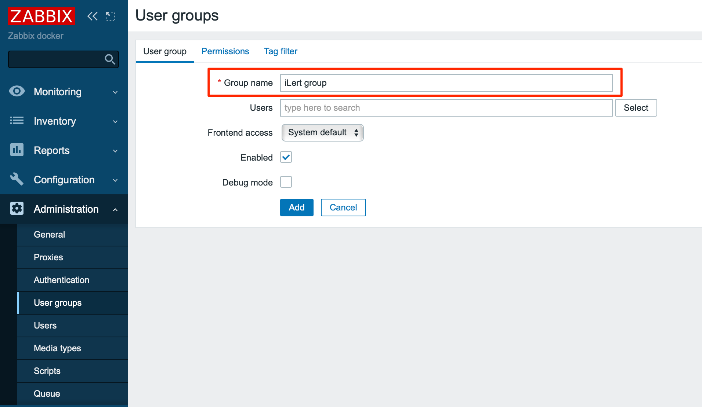

3. Switch to the **Permissions** tab and select the **host groups** that the iLert group should have read access to, for sending notifications. Without read access, iLert cannot receive notifications for the hosts in the group \(see also [here](https://www.zabbix.com/documentation/4.4/manual/quickstart/notification)\).

4. Click the **Add** button to save the group.

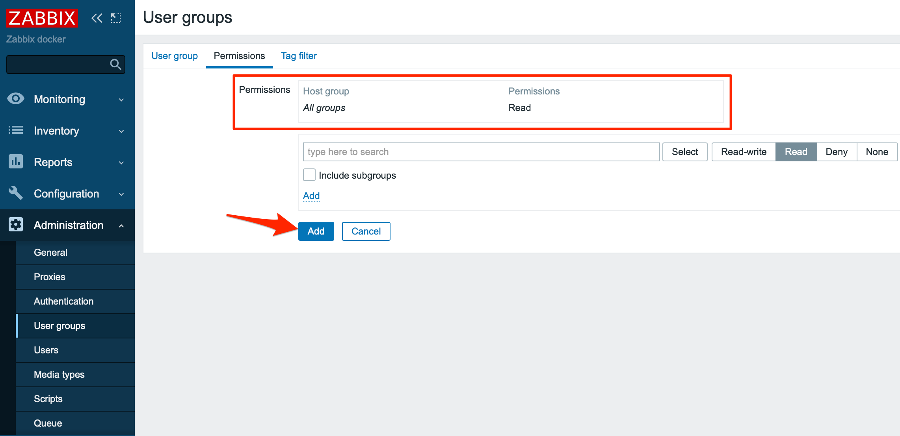

5. Switch to the Users tab and click on the **Create user** button.

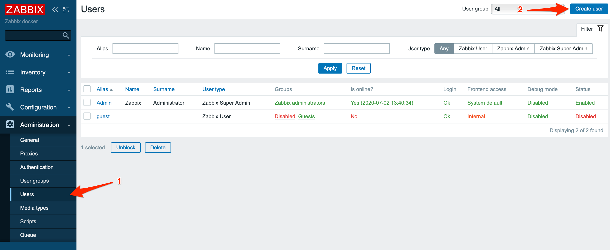

6. Assign an **alias** and **name** and add the user to the iLert group. No further details such as a password are required as this user will not log in to Zabbix.

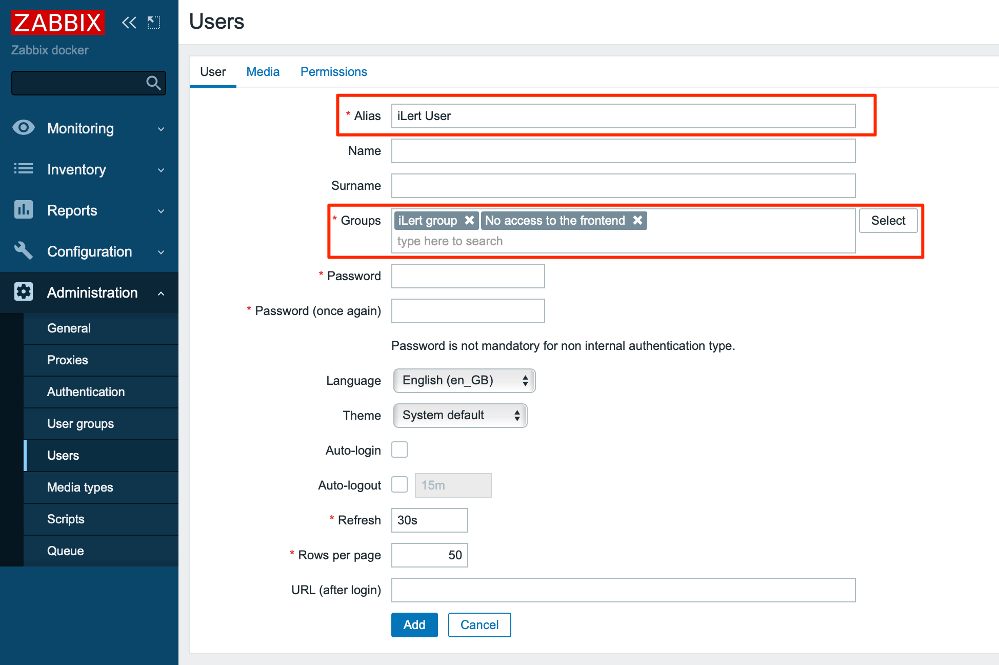

7. Switch to the **Media** tab and click on the **Add** link

8. In the **media** window, select iLert as **Type** 

9.  In the **Send to** field enter the alert source api key that you generated in iLert

10. Click the **Add** button


9. Click the **Add** button in the **Users** tab to save the user.

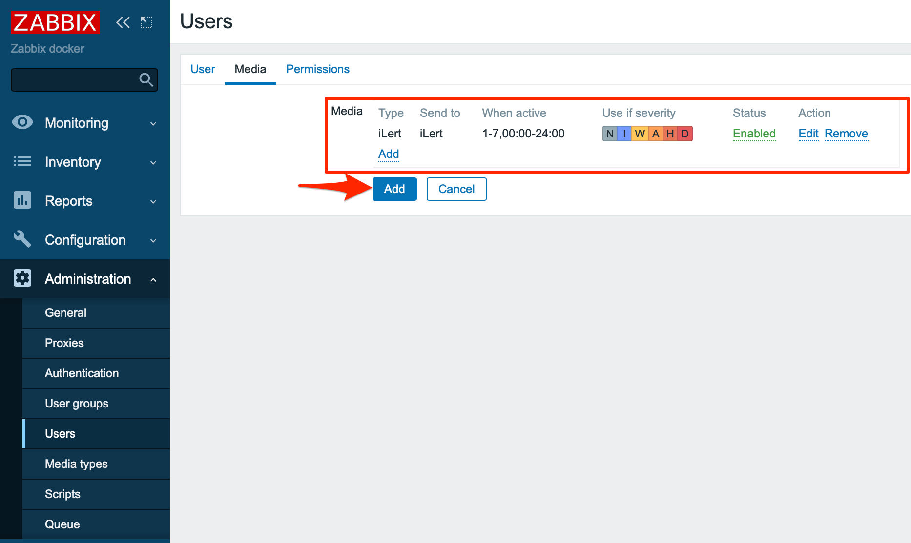

### Create alert action

1. Switch to the **Configuration → Actions** tab and click the **Create action** button

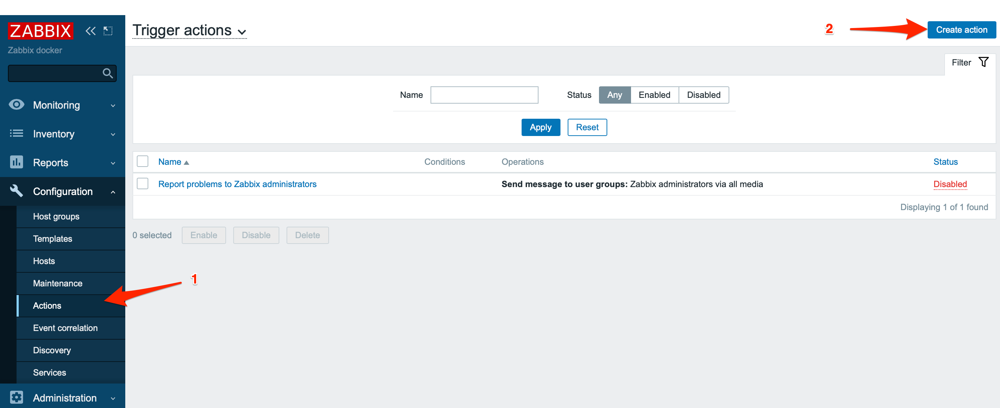

2. Give the action a name, eg "iLert notifications".

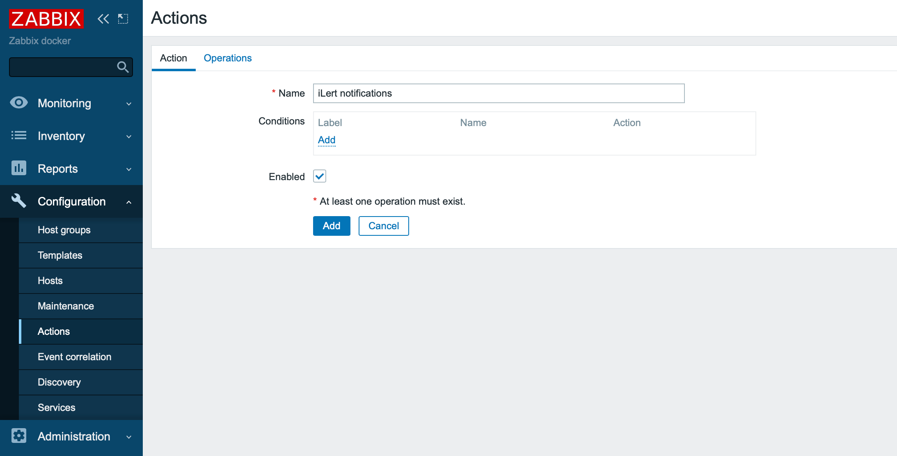

3. Perform the following actions on the **Operations**, **Recovery operations** and **Acknowledgment operations** tabs

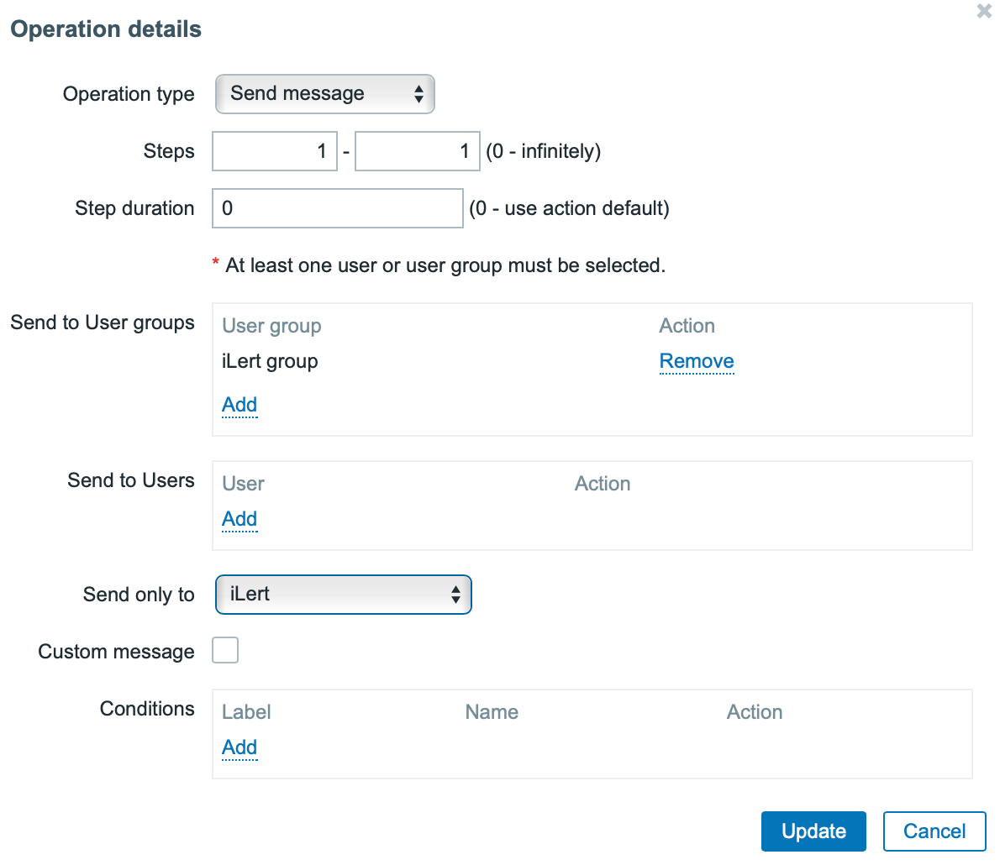

4. Change the default subject and default message if you want.

5. Click on the **New** link under **Operations** and select the **iLert** group created above under Send to User groups.

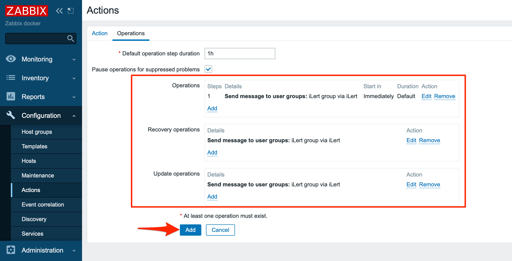

6. Click the **Add** button to save the action

## FAQ <a id="faq"></a>

**Are incidents automatically resolved in iLert?**

Yes, as soon as the status of an incident is OK in Zabbix, the associated incident will be resolved in iLert.

**Can I link Zabbix to multiple alert sources in iLert?**

Yes, create several **iLert users** in Zabbix and store the corresponding **API key** in the user **Send To** field.

**What if my internet connection is lost? Are the events generated in Zabbix lost?**

No events are lost. The zabbix server tries to send the events to iLert every 30 seconds with 10 attempts \(can be configured in media type settings\). As soon as your connection is available again, all events are sent to iLert. We also recommend that you monitor your Internet connection with an external monitoring service. You can then send these alerts to iLert too.

**The plugin does not work. How do I find the mistake?**

Please look at the **Problems View** in Zabbix under the actions column first. If you can not find the error, please contact our support at [support@ilert.com](mailto:support@ilert.com).

