# Zabbix 2.2 – 4.3 Integration

## System Requirements <a href="#requirements" id="requirements"></a>


Are you using Zabbix 4.4 or higher? Please refer our [Zabbix 4.4+ Integration](native.md) guide.


* Zabbix 2.2 - 3.x
* Python 3.x

## In ilert: Create alert source <a href="#create-alarm-source" id="create-alarm-source"></a>

1.  Go to **Alert sources** --> **Alert sources** and click on **Create new alert source**

    <figure><figcaption></figcaption></figure>
2.  Search for **Zabbix** in the search field, click on the Zabbix tile and click on **Next**.&#x20;

    <figure><figcaption></figcaption></figure>
3. Give your alert source a name, optionally assign teams and click **Next**.
4.  Select an **escalation policy** by creating a new one or assigning an existing one.

    <figure><figcaption></figcaption></figure>
5.  Select you [Alert grouping](../../alerting/alert-sources.md#alert-grouping) preference and click **Continue setup**. You may click **Do not group alerts** for now and change it later.&#x20;

    <figure><figcaption></figcaption></figure>
6. The next page show additional settings such as customer alert templates or notification prioritiy. Click on **Finish setup** for now.
7.  On the final page, an API key and / or webhook URL will be generated that you will need later in this guide.

    <figure><figcaption></figcaption></figure>

## In Zabbix <a href="#zabbix" id="zabbix"></a>

### Download the Zabbix plugin

1. Download the ilert Zabbix plugin script. The script must be executable by both Zabbix and the cron daemon:

```
> wget https://raw.githubusercontent.com/iLert/ilert-zabbix/master/ilert-zabbix.py 
> chmod 755 ilert-zabbix.py
```

1. Move the plugin into the `AlertsScriptsPath` directory. Typically, this is the `/usr/local/share/zabbix/alertscripts` or `/usr/lib/zabbix/alertscripts`.

When in doubt, check the file `zabbix_server.conf`.

```
> mv ilert-zabbix.py /usr/lib/zabbix/alertscripts/
```

### Create ilert media type

1. Go to the **Administration → Media types** tab and click the **Create media type** button.

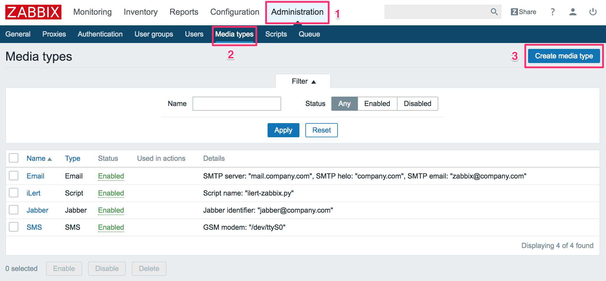

1. On the **media type** configuration page, enter "iLert" as name, select "Script" as **type** and `ilert-zabbix.py` as **script name** .

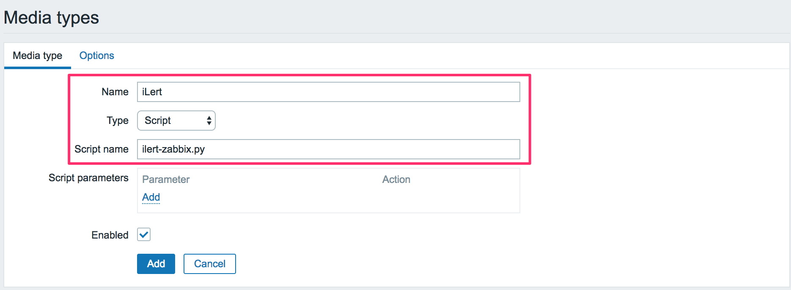

1. Add three **script parameters** by clicking on **Add** three times and enter the following macros in the specified order.

**Note:** This step is not necessary in Zabbix 2.2 , because in this version these three script parameters are passed by default.

* `{ALERT.SENDTO }`
* `{ALERT.SUBJECT }`
* `{ALERT.MESSAGE }`

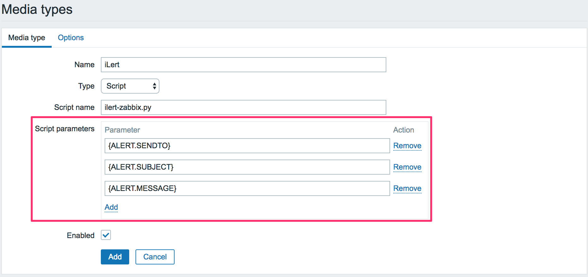

1. Click the **Add** button to save the media type.

### Create ilert user and group

1. Go to the **Administration → User groups** tab and click the **Create user group** button.

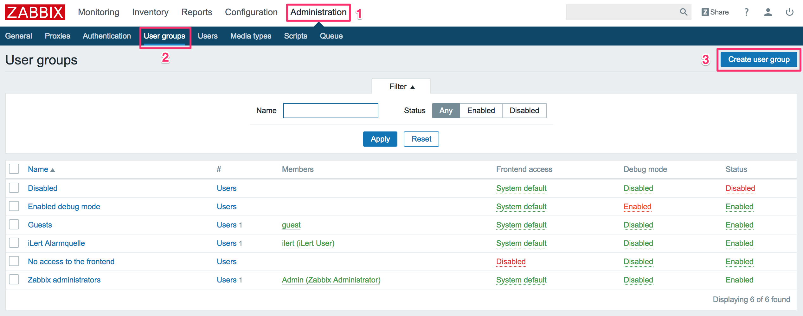

1. Set the name for the ilert group (eg "ilert group").

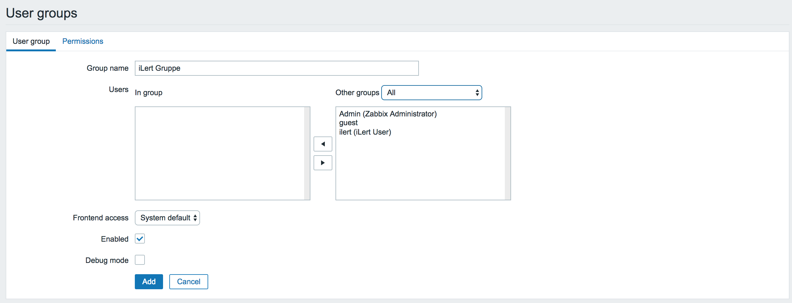

1. Switch to the **Permissions** tab and select the **host groups** that the ilert group should have read access to send notifications. Without read access, ilert cannot receive notifications for the hosts in the group (see also [here](https://www.zabbix.com/documentation/3.4/manual/quickstart/notification)).
2. Click the Add button to save the group.

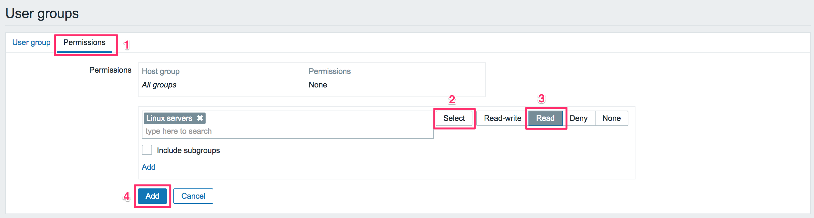

1. Switch to the Users tab and click the **Create user** button.

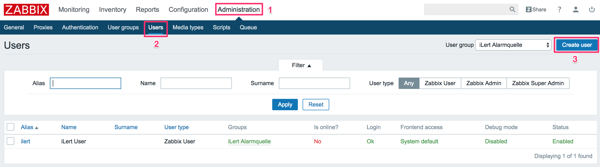

1. Assign **alias** and **name** and add the user to the ilert group. No further details such as password are necessary as this user will not log in to Zabbix.

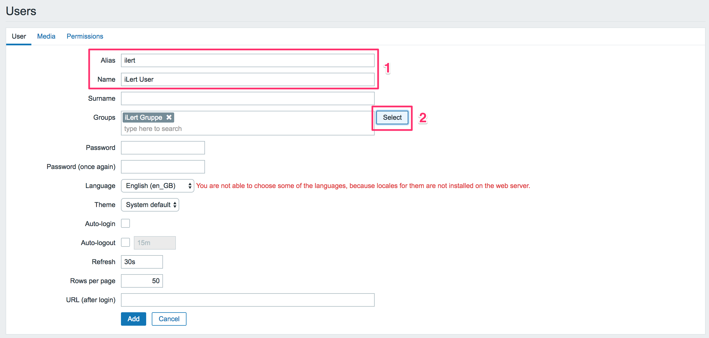

1. Switch to the **Media** tab and click the **Add** link

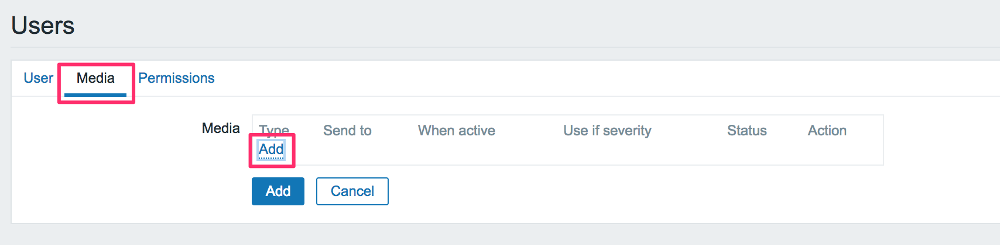

1. In the **media** window, select ilert as **Type** , enter the API key generated above in the **Send to** field and click the **Add** button

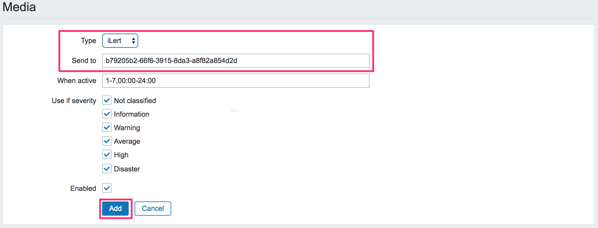

1. Click the **Add** button in the **Users** tab to save the user.

### Create alert action

1. Switch to the **Configuration → Actions** tab and click the **Create action** button

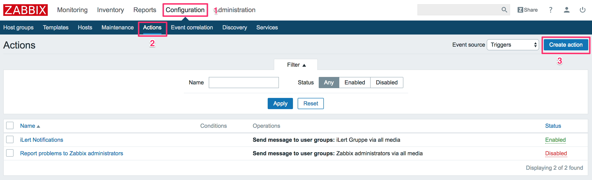

1. Give the action a name, eg "ilert notifications".

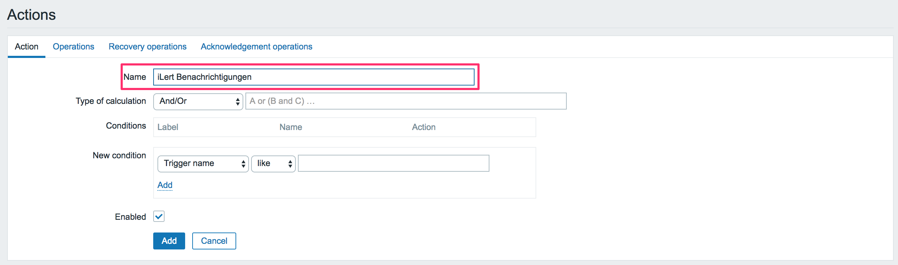

1. Perform the following actions on the **Operations**, **Recovery operations** and **Acknowledgment operations** tabs
2. Fill in the default subject and default message exactly as shown below.
3. Click on the New link under Operations and select the ilert group created above under Send to User groups . Then click on the Add link.

**Operations**

* **Default subject** `alert`
*   **Default message**

    ```
    {
     "EVENT.ID": "{EVENT.ID}",
     "TRIGGER.ID": "{TRIGGER.ID}",
     "TRIGGER.VALUE": "{TRIGGER.VALUE}",
     "TRIGGER.NAME": "{TRIGGER.NAME}",
     "TRIGGER.DESCRIPTION": "{TRIGGER.DESCRIPTION}",
     "TRIGGER.STATUS": "{TRIGGER.STATUS}",
     "TRIGGER.SEVERITY": "{TRIGGER.SEVERITY}",
     "TRIGGER.URL": "{TRIGGER.URL}",
     "HOST.HOST": "{HOST.HOST}",
     "HOST.IP": "{HOST.IP}"
    }
    ```

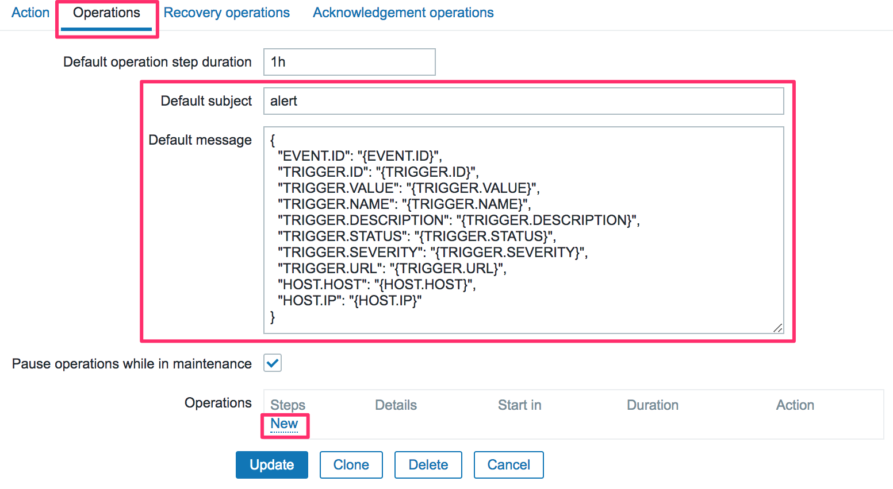

#### Recovery operations

* **Default subject** `resolve`
*   **Default message**

    ```
    {
     "EVENT.ID": "{EVENT.ID}"
    }
    ```

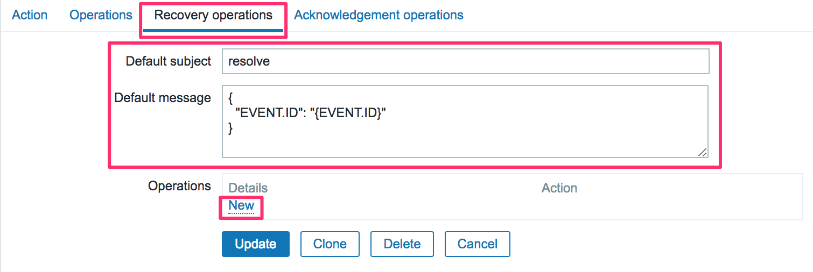

#### Acknowledgment operations

* **Default subject** `ack`
*   **Default message**

    ```
    {
     "EVENT.ID": "{EVENT.ID}"
    }
    ```

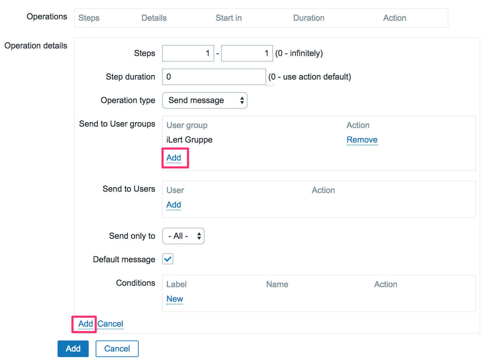

1. Click the **Add** button to save the action

### Set up cron job

In the event that the events generated by Zabbix cannot be sent to ilert on the first attempt (e.g. due to a network problem), a cron job is set up. This cron job is executed every minute and sends all failed events to ilert.

1. Edit the crab file from the Zabbix user

```
> sudo crontab -u zabbix -e
```

1. Add the following entry

```
* * * * * /usr/lib/zabbix/alertscripts/ilert-zabbix.py -m send
```

Adjust the directory according to your `AlertScriptsPath` configuration in Zabbix.

1. The Zabbix integration is now set up!

## FAQ <a href="#faq" id="faq"></a>

**Are alerts automatically resolved in ilert?**

Yes, as soon as the status of an alert is OK in Zabbix, the associated alert is resolved in ilert.

**Can I link Zabbix to multiple alert sources in ilert?**

Yes, create several **ilert users** in Zabbix and store the corresponding **API key** in the user **Send To** field.

**What if my internet connection is lost? Are the events generated in Zabbix lost?**

No events are lost. The plugin saves the events locally in a temporary directory and tries to send them to ilert every minute. As soon as your connection is available again, buffered events are sent to ilert. We also recommend that you monitor your Internet connection with an external monitoring service. You can then send these alerts to ilert.

**The plugin does not work. How do I find the mistake?**

Please look first in the log file. The plugin uses the Unix / Linux system log for logging (eg under `/var/log/messages` or `/var/log/syslog` ). If you can not find the error, please contact our support at [support@ilert.com](mailto:support@ilert.com).
