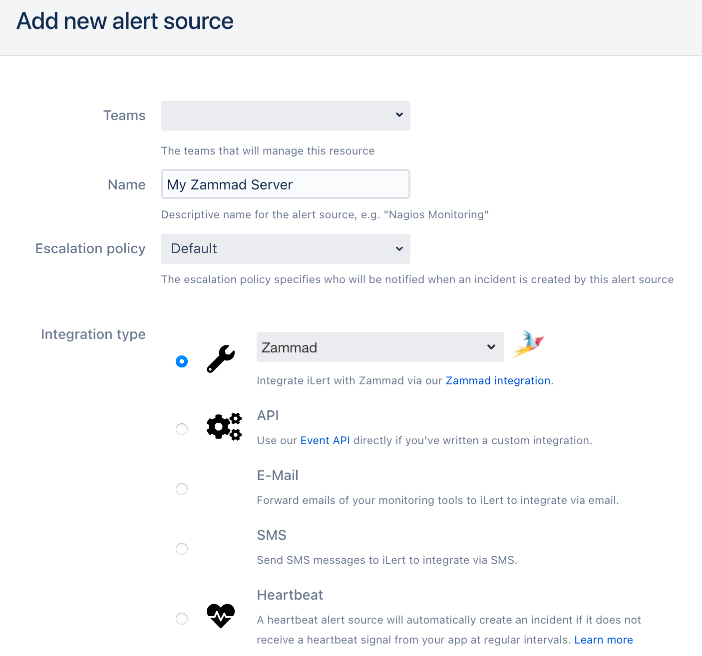
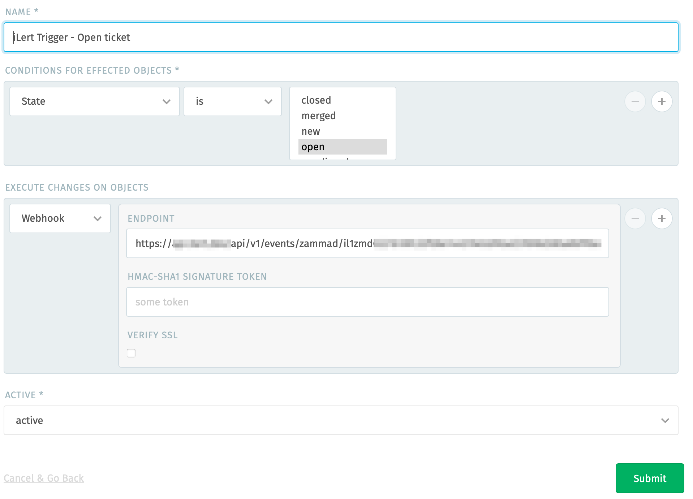
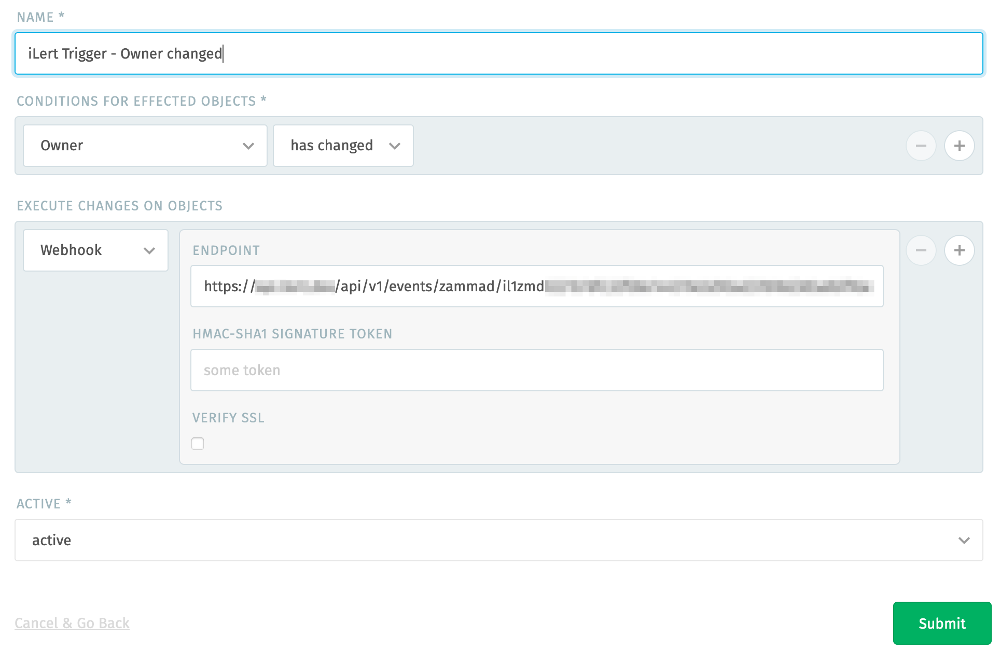

# Zammad Inbound Integration

## In iLert 

### Create a Zammad alert source 

1. Go to the "Alert sources" tab and click **Create new alert source**
2. Enter a name and select your desired escalation policy. Select "Zammad" as the **Integration Type** and click on **Save**.

1. On the next page, a Webhook URL is generated. You will need this URL below when setting up the hook in Zammad.

## In Zammad 

### Create ticket triggers 

1. Go to Zammad and then to **Trigger**

1. Click on **New Trigger.** On the modal window, in the **Conditions for effected objects** section choose the condition **State is new,** name the trigger e.g. **iLert Trigger - New Ticket** , in the **Execute changes on object** section choose **Webhook** and paste the **Webhook URL** that you generated in iLert then click on **Submit**

1. Click on **New Trigger.** On the modal window, in the **Conditions for effected objects** section choose the condition **State is open,** name the trigger e.g. **iLert Trigger - Open Ticket** , in the **Execute changes on object** section choose **Webhook** and paste the **Webhook URL** that you have generated in iLert and then click on **Submit**

1. Click on **New Trigger.** On the modal window, in the **Conditions for effected objects** section choose the condition **Owner has changed,** name the trigger e.g. **iLert Trigger - Owner changed** , in the **Execute changes on object** section choose **Webhook** and paste the **Webhook URL** that you have generated in iLert and then click on **Submit**

1. Click on **New Trigger.** On the modal window, in the **Conditions for effected objects** section choose the condition **State has changed,** name the trigger e.g. **iLert Trigger - Ticket changed** , in the **Execute changes on object** section choose **Webhook** and paste the **Webhook URL** that you have generated in iLert and then click on **Submit**

Your Zammad triggers are now in place and will trigger appropriate iLert alert actions of your created alert source.

## Mapping of Zammand Ticket Priority to Alert Priority

The Zammad ticket priority is mapped to the iLert alert priority according to the following table:

| Zammand ticket priority | iLert alert priority |
| :--- | :--- |
| **High \(id: 3\)** | High |
| Any other | Low |

## FAQ 

### **Will alerts in iLert be resolved automatically?**

Yes

### **Can I connect Zammad with multiple alert sources from iLert?**

Yes, simply create more action sequences in Zammad.

### Will Zammad comments be synced to iLert?

Yes, Zammad comments will automatically be attached to iLert alerts.

