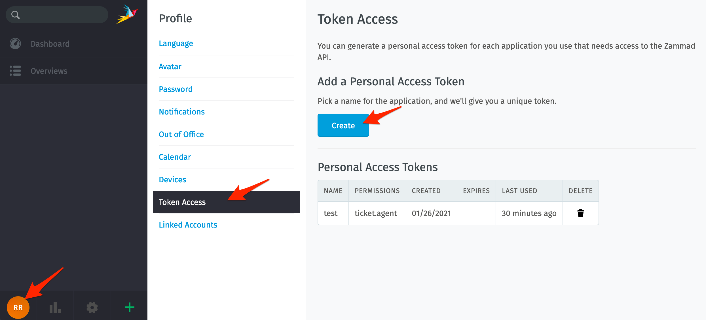
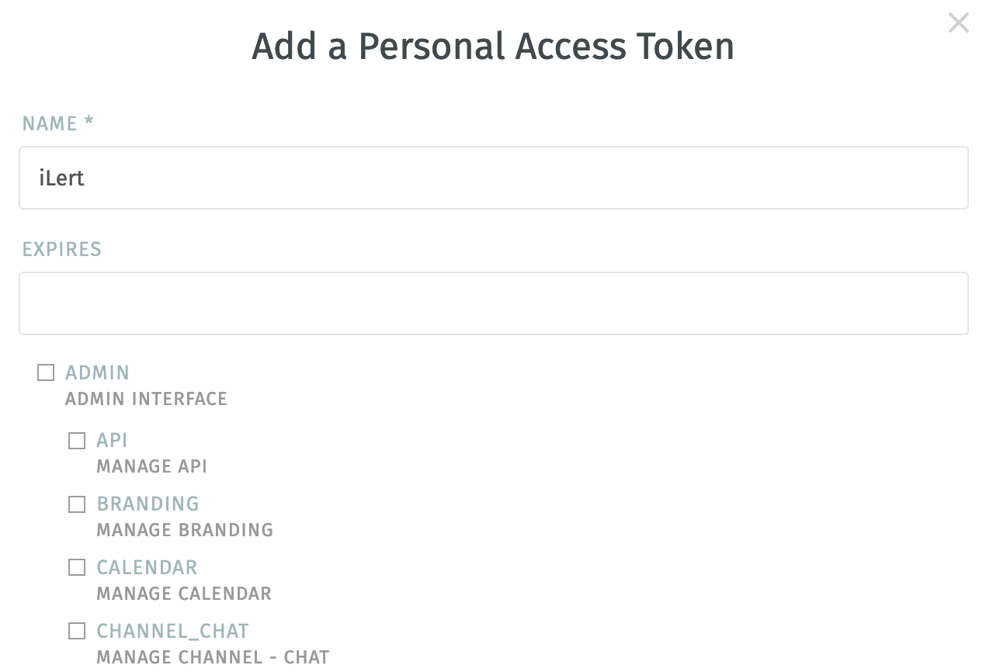
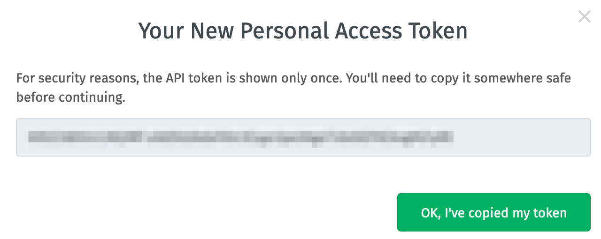
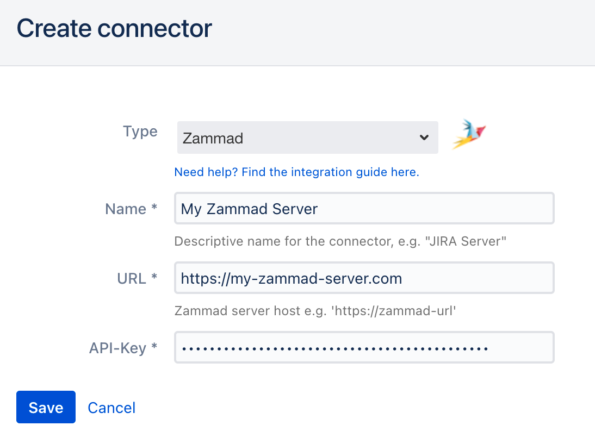
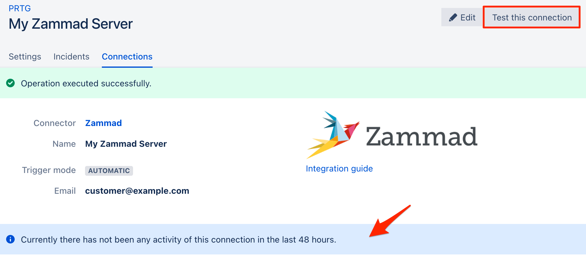

# Zammad Outbound Integration

## In Zammad 

### Create an API key 

1. Optional: create a dedicated iLert user in Zammad. This has the advantage that you can distinguish the Zammad tickets created by iLert.

2. Go to **Profile**, then to **Token Access** and click on **Create**

3. In the **Name** section, enter a name eg. iLert

4. In the **Ticket** section,  choose **Agent**

5. Click on **Create**

9. The modal window, copy the generated api key

## In iLert 

### Create a Zammad Connector and Link to alert source 

1. Click on the gear icon and then on **Connectors** button

2. Click on **Add Connector**

3. Select **Zammad** as **type** and fill in all fields. Enter a name, the URL of your Zammad server and API Key that you created [in the last step]().

4. Go to the alert sources tab and open the alert source whose incidents you want to publish in Zammad. Click on **Connections** and then on **Add New Connection**.

5. Select **Zammad** as the **type**, select the connector created in step 3, fill in all fields. In the **Name** field, enter the existing customer email in zammad.

6. Finished! You can now test the connection by clicking on the button **Test this connection**. Then a test ticket will be published in Zammad.

## FAQ 

**Are updates to an incident published in the Zammad Ticket?**

Yes, the state of the iLert Incident is reflected in the brief description of the Zammad ticket, eg \[RESOLVED\] Host compute.infra is DOWN.

**Can I choose which updates to publish to an incident in Zammad?**

Currently not. If you wish, we look forward to your feedback via chat or e-mail

