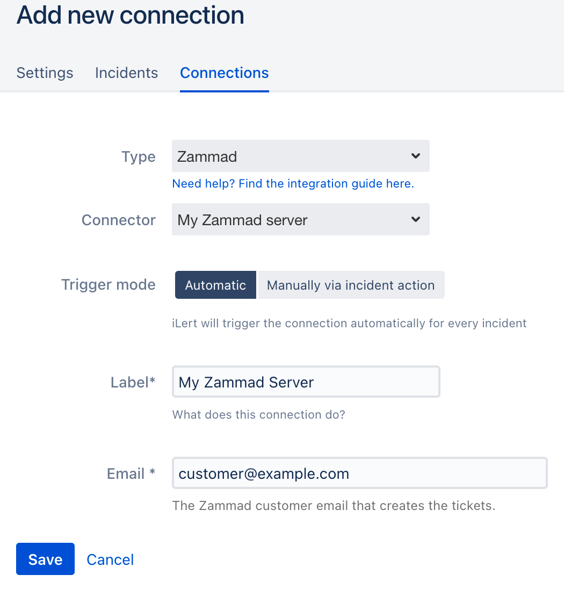

# Zammad Outbound Integration


To set up this integration, you must have admin rights in iLert.


## In Zammad 

### Create an API key 

1. Optional: create a dedicated iLert user in Zammad. This has the advantage that you can distinguish the Zammad tickets created by iLert.

2. Go to **Profile**, then to **Token Access** and click on **Create**

3. In the **Name** section, enter a name eg. iLert

4. In the **Ticket** section,  choose **Agent**

5. Click on **Create**

9. The modal window will open, copy the generated access token

## In iLert 

### Create a Zammad Connector and Link to the alert source 

1. Click on the gear icon and then on the **Connectors** button

2. Click on **Add Connector**

3. Select **Zammad** as **type** and fill in all fields. Enter a name, the URL of your Zammad server and the access token that you have created in the previous step.

4. Go to the alert sources tab and open the alert source whose incidents you want to publish in Zammad. Click on **Connections** and then on **Add New Connection**.

5. Select **Zammad** as the **type**; ****futhermore ****select the connector created in step 3, fill in all fields.  
In the **Email** field enter the existing customer email of Zammad.

6. Finished! You can now test the connection by clicking on the button **Test this connection**.  
A test ticket will be created in Zammad.

## FAQ 

**Are updates to an incident added to the Zammad Ticket?**

Yes, the state of the iLert Incident is reflected in the brief description of the Zammad ticket eg. _\[RESOLVED\] Host compute.infra is DOWN._

**Can I choose which updates are to be published to a Zammad Ticket?**

Currently not. If you wish to, we look forward to your feedback via chat or e-mail

