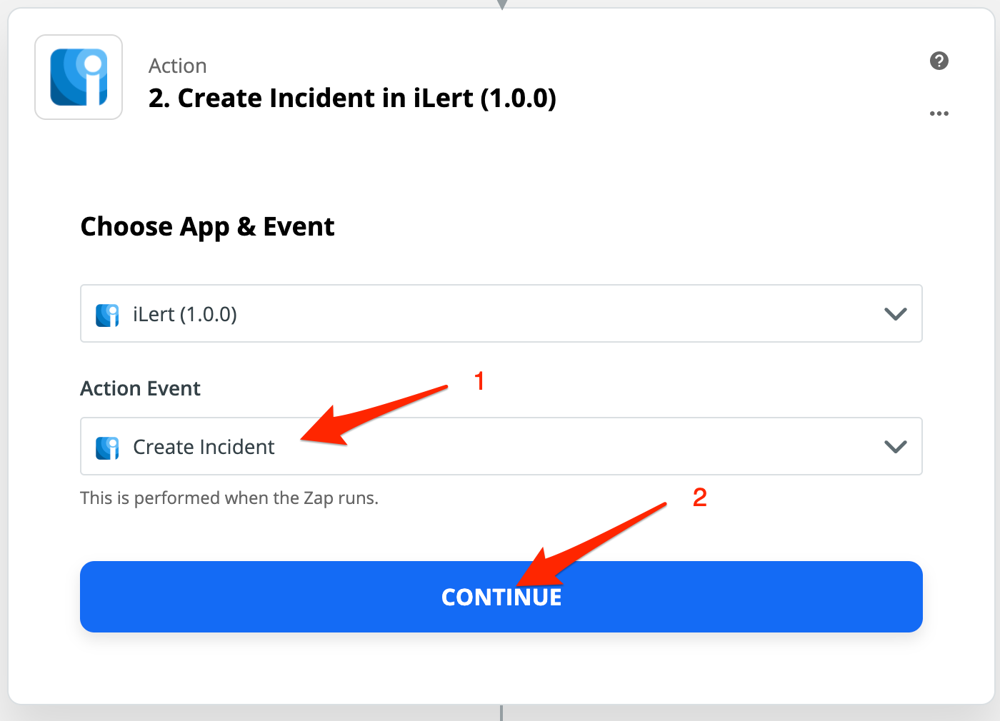
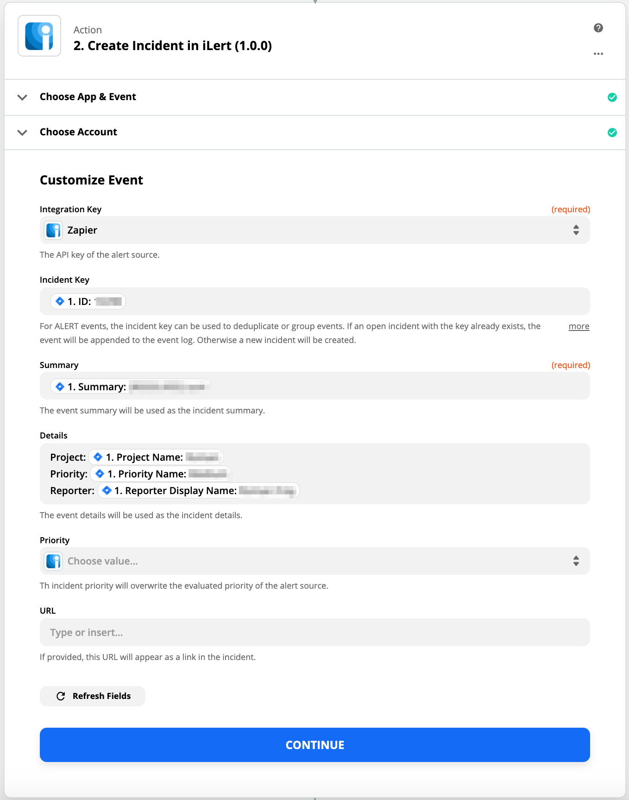
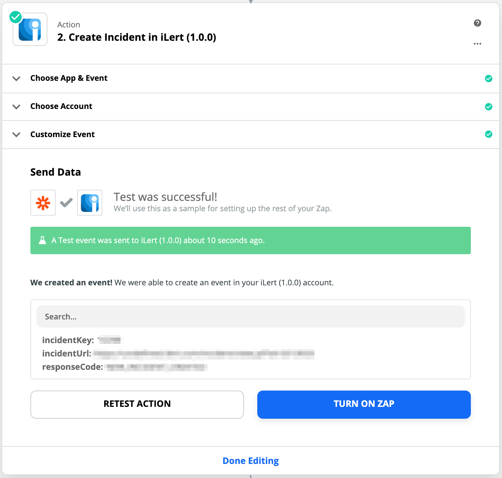

# Zapier Inbound Integration

## In iLert 

### Create a Zapier alert source \(optional\) 

> You can connect Zapier with an exiting alert source of any integration type. If you already have an alert source, then skip this step.

1. Go to the "Alert sources" tab and click **Create new alert source**

2. Enter a name and select your desired escalation policy. Select "Zapier" as the **Integration Type** and click on **Save**.

## In Zapier 

### Create a Zap 

1. Go to Zapier and click on **Make a Zap**

2. On the next page, search for a trigger source, e.g. Jira

3. Choose your account and customize the settings of you trigger source, then click on the **Done Editing** button

4. Click on the **Choose an Action** button to add iLert action

4. Enter **iLert** into the search field and click on the **iLert app**

5. In the **Action Event** section choose the **Create Incident** action ****to create an incident when a Jira issue is created. Then click on the **Continue** button.

6. On the next slide, choose your iLert account. Then click on the **Continue** button.

7. On the next slide, in the **Integration Key** section, choose the Alert Source that you created before. In the **Incident key** section, we recommend to enter an incident key, so you can accept or resolve an incident in other Zaps. In the **Summary** section, enter or insert an incident summary. You can optionally enter or insert **Details**, **Priority** and **URL**. Then click on the **Continue** button.

8. On the next slide, click on **Test & Continue** to test incident creation.

9. On the next slide, click on **Turn On Zap** to activate your confugation.

## FAQ 

**Will incidents in iLert be resolved automatically?**

Yes, you need to configure an **Accept Incident** action with **Incident Key** for this in your Zap

**Will incidents in iLert be accepted automatically?**

Yes, you need to configure an **Resolve Incident** action with **Incident Key** for this in your Zap

**Can I connect Zapier with multiple alert sources from iLert?**

Yes, simply create more Zaps in Zapier.

