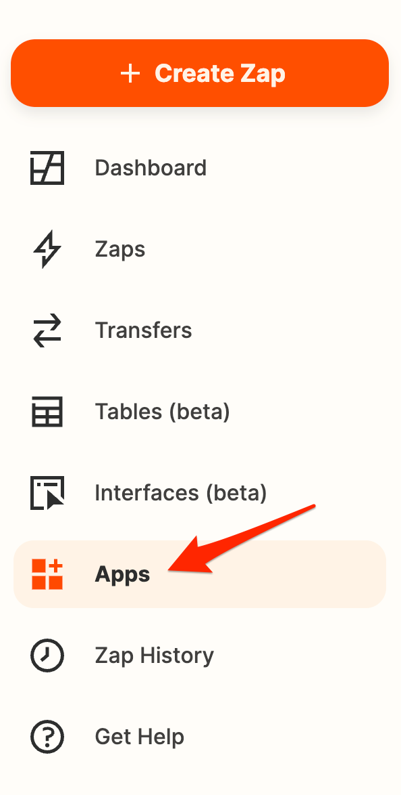
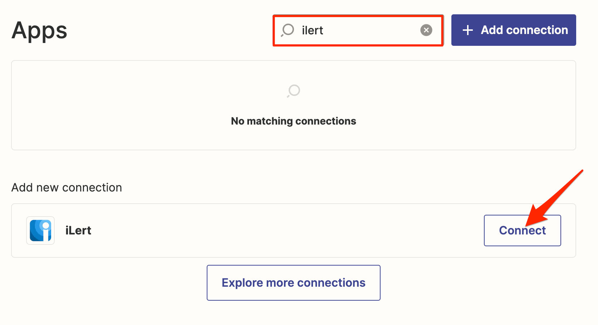
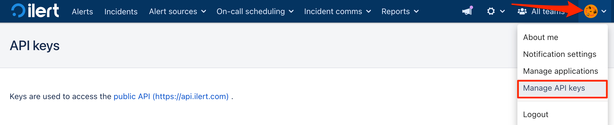
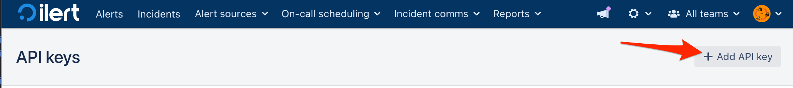
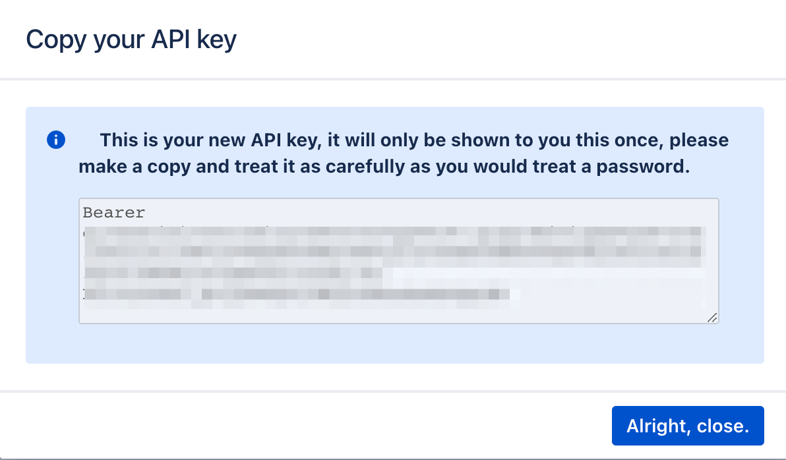
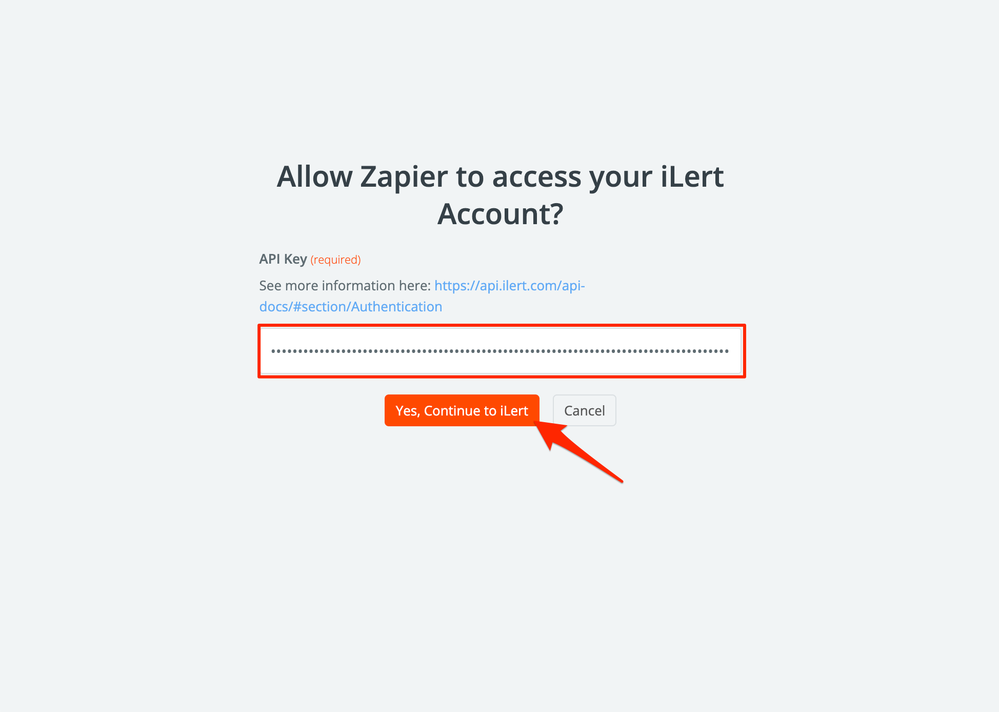

# Zapier Inbound Integration

## In ilert 

### Create a Zapier alert source (optional) 


You can connect Zapier with an existing alert source of any integration type. Skip this step, if you'd like to connect Zapier with an existing alert source.


1. Go to the "Alert sources" tab and click **Create new alert source**
2. Enter a name and select your desired escalation policy. Select "Zapier" as the **Integration Type** and click on **Save**.

## In Zapier 

### Connect Zapier with ilert 

1. In the sidebar, click on **Apps**

<figure><figcaption></figcaption></figure>

2. Search for ilert in the search field and click on **Connect**

<figure><figcaption></figcaption></figure>

3. A pop up window will open and asks for an ilert **API Key**
4. To create an ilert API Key, switch back to ilert and click on the **user icon -> Manage API keys**

<figure><figcaption></figcaption></figure>

5. Now click on **Add API key**

<figure><figcaption></figcaption></figure>

6. Enter a **Name** for the API key and click on **Save**

<figure><figcaption></figcaption></figure>

7. A pop up window will now appear, containing the API key. Copy the key

<figure><figcaption></figcaption></figure>

8. Paste the new generated API key into Zapier pop up window and click **Yes, Continue to iLert**

<figure><figcaption></figcaption></figure>

### Create a Zap 

1. Go to Zapier and click on **Make a Zap**

2. On the next page, search for a trigger source, e.g. Jira

3. Choose your account and customize the settings of you trigger source, then click on the **Done Editing** button
4. Click on the **Choose an Action** button to add ilert action

5. Enter **iLert** into the search field and click on the **ilert app**

.png>)

6. In the **Action Event** section choose the **Create Alert** action **\*\*to create an alert when a Jira issue is created. Then click on the** Continue\*\* button.

7. On the next slide, choose your ilert account. Then click on the **Continue** button.

8. On the next slide, in the **Integration Key** section, choose the Alert Source that you created before. In the **Alert key** section, we recommend to enter an alert key, so you can accept or resolve an alert in other Zaps. In the **Summary** section, enter or insert an alert summary. You can optionally enter or insert **Details**, **Priority** and **URL**. Then click on the **Continue** button.

9. On the next slide, click on **Test & Continue** to test alert creation.

10. &#x20;On the next slide, click on **Turn On Zap** to activate your confugation.

## FAQ 

**Will alerts in ilert be resolved automatically?**

Yes, you need to configure an **Accept Alert** action with **Alert Key** for this in your Zap

**Will alerts in ilert be accepted automatically?**

Yes, you need to configure an **Resolve Alert** action with **Alert Key** for this in your Zap

**Can I connect Zapier with multiple alert sources from ilert?**

Yes, simply create more Zaps in Zapier.
