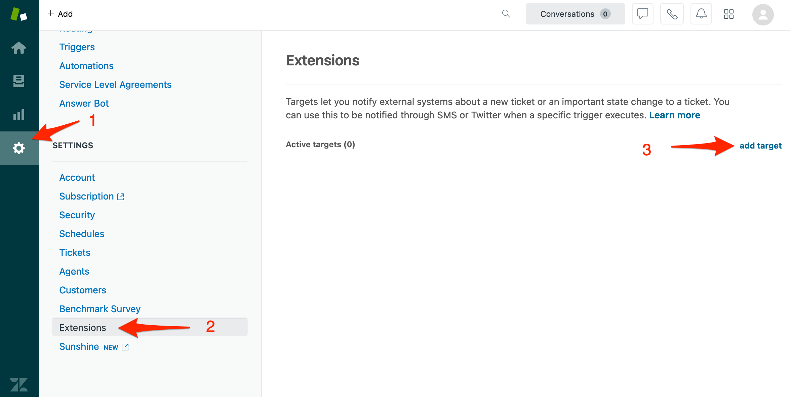

# Zendesk Inbound Integration

[Zendesk](https://www.zendesk.com/) is a cloud-based help desk management solution offering customizable tools to build customer service portal, knowledge base and online communities.

## In iLert <a id="create-alert-source"></a>

### Create a Zendesk alert source

1. Go to the "Alert sources" tab and click **Create new alert source**
2. Enter a name and select your desired escalation policy. Select "Zendesk" as the **Integration Type** and click on **Save**.


1. On the next page, a **Webhook URL** is generated. You will need this URL below when setting up the Webhook in Zendesk.


## In Zendesk <a id="in-topdesk"></a>

### Create a Target

1. Go to Zendesk and then to **Settings -&gt; Extensions** and click on the **Add target** button



1. On the next page click the **HTTP target** link


1. On the next page:
2. In the **Title** section, enter a name eg. iLert
3. In the **URL** section, paste the **Webhook URL** that you generated in iLert
4. In the **Method** section, choose **POST**
5. In the **Content type** section, choose **JSON**
6. In the bottom section choose **Create target**
7. Click the **Submit** button


### Create a Trigger

1. Go to Zendesk and then to **Business Rules -&gt; Triggers** and click on the **Add trigger** button


1. On the next page:
2. In the **Trigger name** section, enter a name eg. iLert
3. In the **Category** section, choose a category, e.g. Notifications
4. In the **Meet ANY of following conditions** section, add **Ticket is created** and **Ticket is updated** rules


* Scroll down to the **Actions** panel and choose the **iLert Notify target** that you created above
* In the **JSON body** sections, paste the following  object:

```javascript
{
  "id": "{{ticket.id}}",
  "title": "{{ticket.title}}",
  "description": "{{ticket.description}}",
  "via": "{{ticket.via}}",
  "status": "{{ticket.status}}",
  "priority": "{{ticket.priority}}",
  "requester_name": "{{ticket.requester.name}}",
  "group_name": "{{ticket.group.name}}",
  "assignee_name": "{{ticket.assignee.name}}",
  "account": "{{ticket.account}}",
  "link": "{{ticket.link}}",
  "latest_comment": "{{ticket.latest_comment}}",
  "latest_comment_author_name": "{{comment.author.name}}"
}
```

* Click on the **Create** button


## Zendesk Incident Lifecycle

<table>
  <thead>
    <tr>
      <th style="text-align:left">When I create an Zendesk ticket with status...</th>
      <th style="text-align:left">...then an iLert Alert...</th>
    </tr>
  </thead>
  <tbody>
    <tr>
      <td style="text-align:left"><b>New</b> or <b>Open</b>
      </td>
      <td style="text-align:left">is created</td>
    </tr>
    <tr>
      <td style="text-align:left"><b>Pending</b>
      </td>
      <td style="text-align:left">is created</td>
    </tr>
    <tr>
      <td style="text-align:left"><b>Solved</b> or <b>Closed</b>
      </td>
      <td style="text-align:left">
        <p>will not be created and a</p>
        <p>400 (bad request) error occurs</p>
      </td>
    </tr>
  </tbody>
</table>

<table>
  <thead>
    <tr>
      <th style="text-align:left">When I update an Zendesk ticket with status...</th>
      <th style="text-align:left">...and the iLert alert...</th>
      <th style="text-align:left">...then the/an iLert Alert...</th>
    </tr>
  </thead>
  <tbody>
    <tr>
      <td style="text-align:left"><b>New</b> or <b>Open</b>
      </td>
      <td style="text-align:left">does not exist</td>
      <td style="text-align:left">is created</td>
    </tr>
    <tr>
      <td style="text-align:left"><b>Solved</b> or <b>Closed</b>
      </td>
      <td style="text-align:left">does not exist</td>
      <td style="text-align:left">
        <p>will not be created and a</p>
        <p>400 (bad request) error occurs</p>
      </td>
    </tr>
    <tr>
      <td style="text-align:left"><b>Pending</b>
      </td>
      <td style="text-align:left">does not exist</td>
      <td style="text-align:left">is created</td>
    </tr>
    <tr>
      <td style="text-align:left"><b>New</b> or <b>Open</b>
      </td>
      <td style="text-align:left">exists</td>
      <td style="text-align:left">doesn&apos;t change</td>
    </tr>
    <tr>
      <td style="text-align:left"><b>Solved</b> or <b>Closed</b>
      </td>
      <td style="text-align:left">exists</td>
      <td style="text-align:left">change status to <b>Resolved</b> if not already resolved</td>
    </tr>
    <tr>
      <td style="text-align:left"><b>Pending</b>
      </td>
      <td style="text-align:left">exists</td>
      <td style="text-align:left">change status to <b>Accepted</b> if not already accepted</td>
    </tr>
  </tbody>
</table>

## Additional Custom Ticket Details <a id="faq"></a>

You may provide an additional field for the Zendesk trigger template to render additional information into iLert alert details.

```javascript
{
  "additional_ticket_details": {
        "test": "{{ticket.title}}",
        "two": 3,
        "three": ["one", "two", "three"]
    }
}
```

The `additional_ticket_details` map's values will be displayed in a human readable format in the alert's detail section.

## FAQ <a id="faq"></a>

### **Will alerts in iLert be resolved automatically?**

Yes, as soon as an Zendesk Ticket is completed, the alert in iLert will be resolved automatically.

### **Can I connect Zendesk with multiple alert sources from iLert?**

Yes, simply create more Webhooks in Zendesk.

### **Can I customize the alert messages?**

No.

### Are Zendesk comments synced with iLert alerts?

Yes, if the variables `latest_comment` and `latest_comment_author_name` are provided in your Zendesk trigger JSON template the comments will be synced to iLert alerts.

