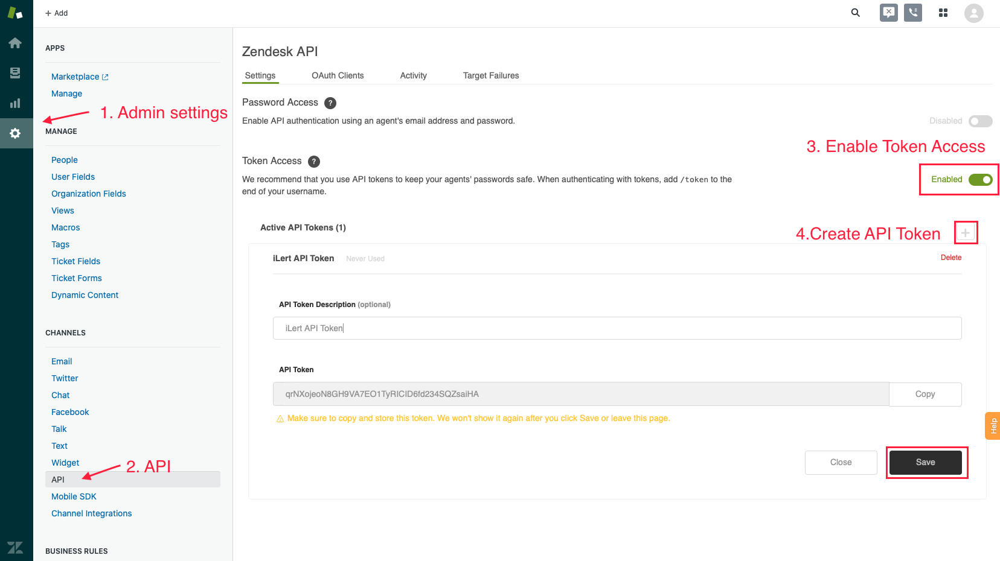

# Zendesk Outbound Integration

[Zendesk](https://www.zendesk.com/) is a cloud-based help desk management solution offering customizable tools to build customer service portal, knowledge base and online communities.

## In Zendesk: Create API Token 

1. Optional: create a dedicated ilert user in Zendesk. That way, you will be able to distinguish tickets created by ilert.


**Admin permission required**

To set up the integration, the Zendesk user must have agent permissions.


1. Go to admin settings, select the API channel, enable token access and create an API token.&#x20;

1. You will need this API token later in ilert. Make sure to copy and store it. You won't be able to see it again in Zendesk. Click **Save**.

## In ilert: create a Zendesk connector and link it with an alert source 


**Admin permission required**

To set up the integration, you must have admin rights in ilert.


1. **\*\*Click the gear icon and then click on the** Connectors\*\* link

1. Click the **Add Connector** button

1. On the next page, choose **Zendesk Support** as type, name the connector, enter your zendesk URL in the form [https://{your-domain}.zendesk.com](https://{your-domain}.zendesk.com), enter your Zendesk user **Email** and **API-Key** that you generated before _\*\*_ and click on the save button

.png>)

1. Go to **Alert sources** and select the alert source you want to connect with Zendesk. Click on **Alert Actions → Add new alert action**.

.png>)

1. On the next page choose **Zendesk Support** as the type, choose the connector created in step 3, name it, choose **Priority** of the Zendesk tickets and click on the **Save** button.

.png>)

1. You're done! You can now test this connection by clicking on **Test this connection**. A test ticket will be created in Zendesk.

.png>)

## FAQ 

**Are tickets updated in Zendesk if the alert is updated in ilert?**

Yes, status updates to ilert Alerts are reflected in the title of the Zendesk ticket, e.g. `RESOLVED` host compute.infra is `DOWN`.

**Can I choose which updates to publish to a ticket in Zendesk?**

Currently not. If that's something you'd like see in ilert, we look forward to your feedback via chat or e-mail.
