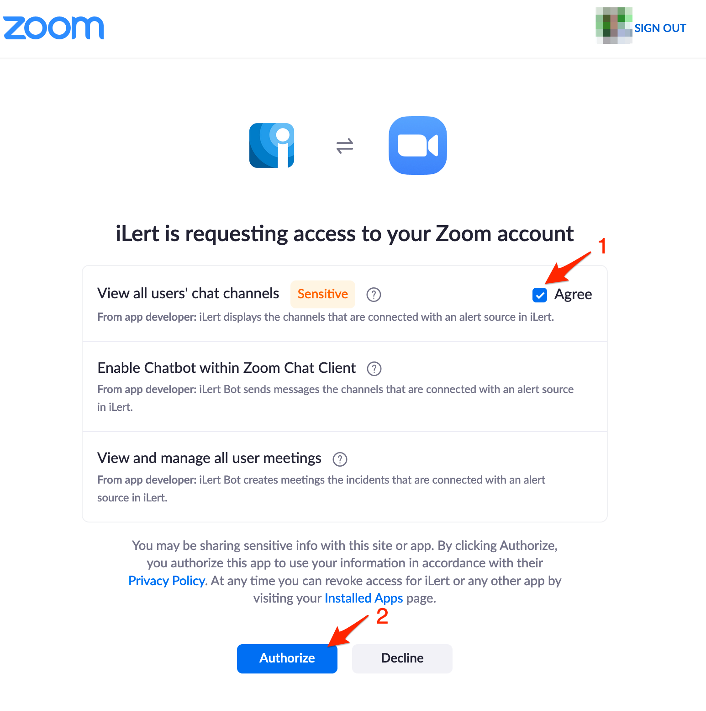

# Zoom Chat Integration

## In iLert 

### Create the Zoom Chat Connector and link it to the alert source


**Admin permission required**

To set up the integration, you must have admin rights in iLert.


1. ****Click the gear icon and then click on the **Connectors** link

2. Click the **Add Connector** button

3. On the next page, choose **Zoom Chat** as type, name the connector and click on the save button to authorize iLert App with your Zoom account.

4. On the next page, agree with the requested permissions and click on the **Authorize** button

5. Go to the alert sources tab and open the alert source whose incidents you want to create Zoom Meeting. Click on the **Incident actions** tab and then on the **Add new incident action** button

6. On the next page choose **Zoom Chat** as the type, choose the connector created in step 3, name it**,** choose **incident events** to publish and click on the **Save** button.

6. Finished! You can now test the connection by clicking on the button **Test this connection**. Thereafter, a test message will be posted on the Zoom Chat channel.

## FAQ 

**Can I link multiple Zoom Accounts to an iLert account?**

Yes.

**Are updates to an incident published on the Zoom Chat channel?**

Yes, the following updates to an incident are currently being released:

* **Escalations** : An incident is assigned to another user through an automatic escalation.
* **Manual Assignments** : An incident is manually assigned to someone.
* **Actions** : An incident is accepted or resolved.

**Can I choose which updates to an incident will be published in Zoom Chat?**

Yes.

**How can I uninstall the iLert App from my Zoom account?**

1. Login to your Zoom Account and navigate to the Zoom App Marketplace
2. Click on the **Manage** link and then on the **Installed Apps** link \(alternatively you may also search for the **iLert** app\)
3. Click on the **iLert** app
4. Click on the **Uninstall** button

