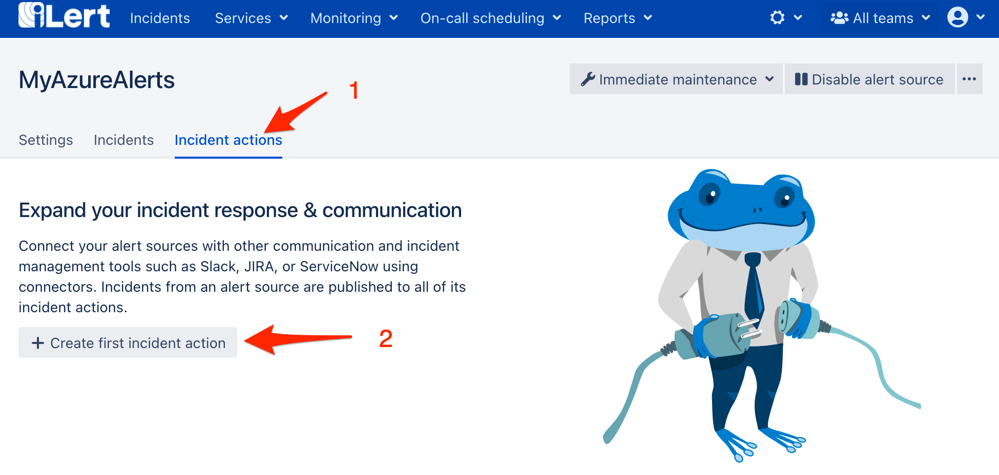

# Zoom Meeting Integration


**Admin permission required**

To set up the integration, you must have admin rights in iLert.


## In iLert 

### Create the Zoom Meeting Connector and link it to the alert source

1. ****Click the gear icon and then click on the **Connectors** link

2. Click the **Add Connector** button

3. On the next page, choose **Zoom Meeting** as type, name the connector and click on the save button to authorize iLert App with your Zoom account.

4. On the next page, agree with the requested permissions and click on the **Authorize** button

5. Go to the alert sources tab and open the alert source whose incidents you want to create Zoom Meeting. Click on the **Incident actions** tab and then on the **Add new incident action** button

6. On the next page choose **Zoom Meeting** as the type, choose the connector created in step 3, name it, choose **Trigger mode,** optionally ****enter meeting password if you want to protect your meetings and click on the **Save** button.

7. Finished! Now a Zoom Meeting will be created  for each incident in automatic trigger mode or via manual incident action.

## FAQ 

**Can I link multiple Zoom Accounts to an iLert account?**

Yes.

**How can I uninstall the iLert App from my Zoom account?**

1. Login to your Zoom Account and navigate to the Zoom App Marketplace
2. Click on the **Manage** link and then on the **Installed Apps** link \(alternatively you may also search for the **iLert** app\)
3. Click on the **iLert** app
4. Click on the **Uninstall** button

