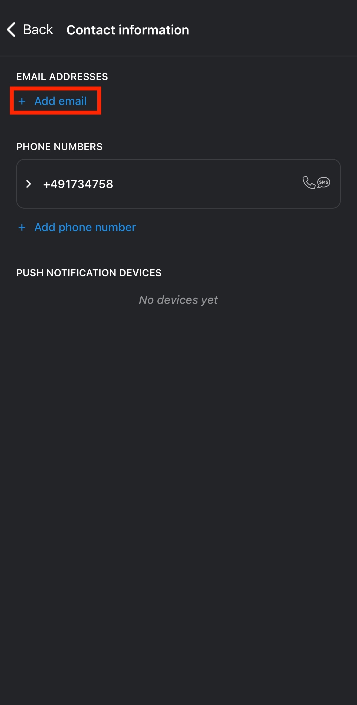
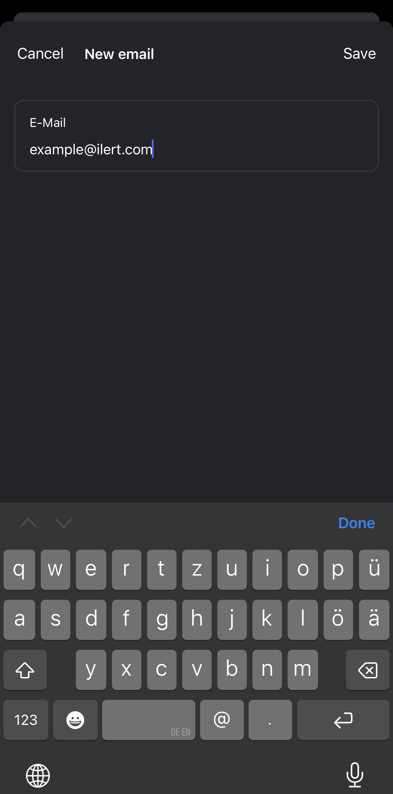
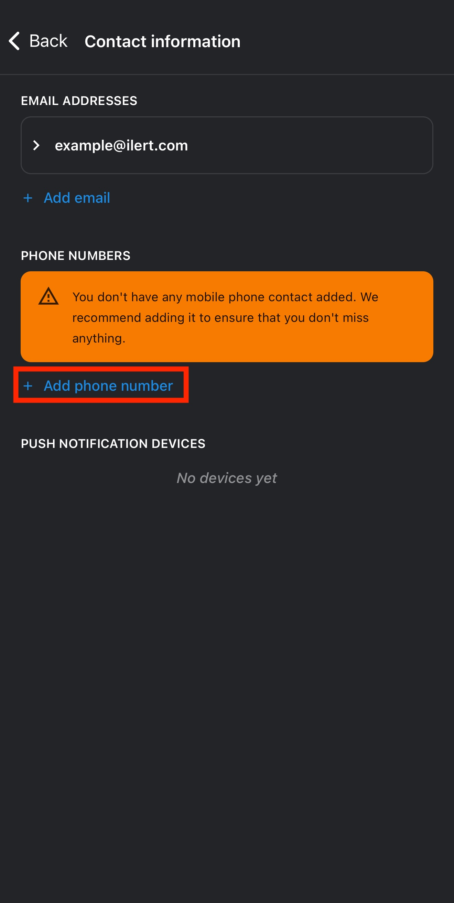
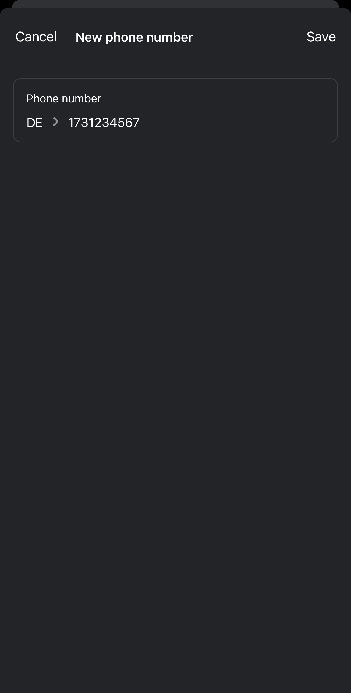
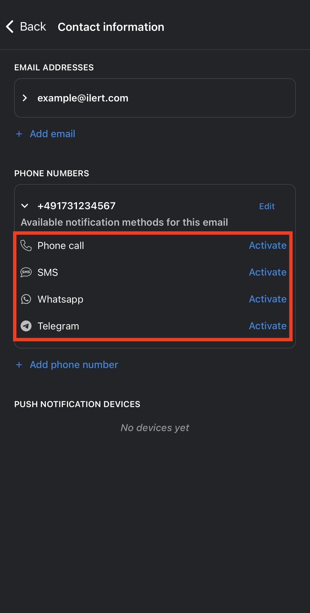
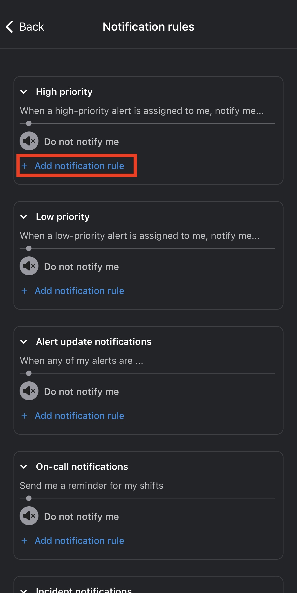
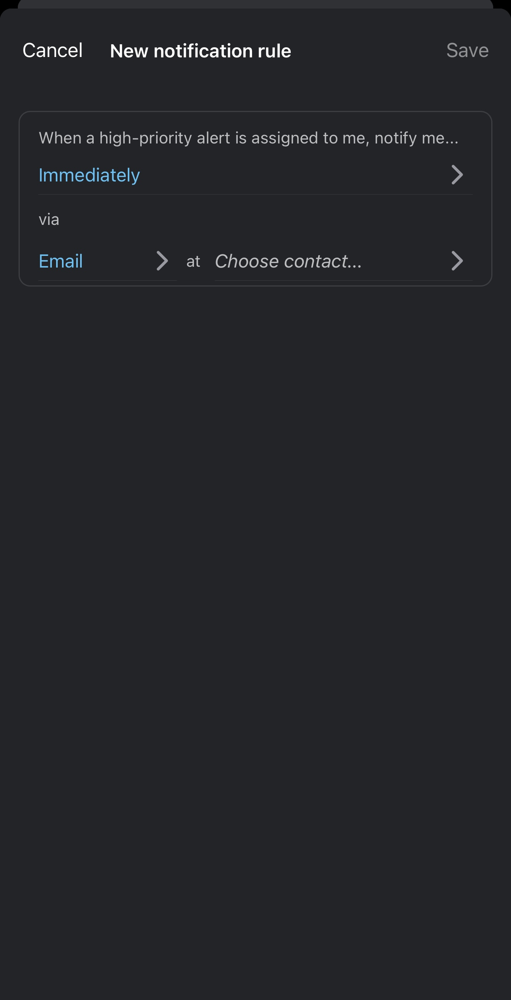

# Mobile app notification settings

### Accessing contact information & notification rules

This section walks you through managing your notification contacts (email, phone, push devices) and setting up notification rules in the ilert **mobile app**. If you’re looking specifically to configure **critical alert behavior** (e.g., bypassing Do Not Disturb), please see our [**Critical Alerts**](critical-push-notifications-and-dnd-overrides/) article.

1. Open the navigation by tapping on the menu icon on the top left.
2. Select the **Gear Icon** → **Contact information | Notification rules**

### **Contact information**

ilert enables you to add and verify multiple contacts, then activate channels to deliver alerts.

<figure><figcaption></figcaption></figure> <figure><figcaption></figcaption></figure>

#### Email addresses

* Tap **Add email** and enter your address.
* Tap **Save**.
* Click the verification link sent to your inbox.
* Tap **Send test notification** to confirm delivery.

<figure><figcaption></figcaption></figure> <figure><figcaption></figcaption></figure> <figure><figcaption></figcaption></figure>

#### Phone numbers

* Tap **Add phone number**.
* Select your country and enter your number.
* Tap **Save**.
* Enter the verification code sent to you.

> **Note:** Verifying via SMS also enables phone-call notifications.

#### Push notification devices

* [Set up Push Notifications](getting-started-with-ilert-mobile-app.md#enable-push-notifications)
* [Set up Critical Push Notifications](critical-push-notifications-and-dnd-overrides/)
* **View devices:** Listed under **Push devices**
* **Delete:** Swipe left on any device entry

### Supported Notification Channels

* **Email**
* **SMS**
* **Phone Call**
* **iOS & Android Push**
* **WhatsApp**
* **Telegram**

> You must activate each channel (via a verification code) before you can use it in any rule.

### Notification rules

Define when and how you want to be notified for each event type.

#### Rule types

| Rule Type                  | Description                                                                                                          |
| -------------------------- | -------------------------------------------------------------------------------------------------------------------- |
| **High-priority alerts**   | Notifies you when a high-priority alert is assigned (on creation or when added as a responder).                      |
| **Low-priority alerts**    | Notifies you when a low-priority alert is assigned (on creation or when added as a responder).                       |
| **Alert status updates**   | Notifies you when you’re already assigned to an alert and its status changes (e.g., another user accepts the alert). |
| **Incident notifications** | Notifies you when you’re added to an incident as a subscriber (on creation or when added manually).                  |
| **On-call notifications**  | Notifies you at a specified time before your on-call shift begins (e.g., 15 min prior).                              |

#### Creating a notification rule (Example: High-Priority Alerts)

Follow these steps to set up a rule that sends you an **email** **3 minutes** after a high-priority alert is created:

1. **Tap + Add notification rule**  &#x20;

<figure><figcaption></figcaption></figure>

2. **Configure the rule**

* **Contact & Channel:** Email
* **Timing:** Delay by 3 minutes

<figure><figcaption></figcaption></figure>

3. Save the Rule

Alert notifications in ilert are bi-directional; you can respond to a notification using the same channel on which you were notified (without logging into ilert), e.g., by replying to an SMS.

You have the following response options:

1. Acknowledge the alert
2. Mark the alert as resolved
3. Escalation to the next user in the alert's escalation policy
