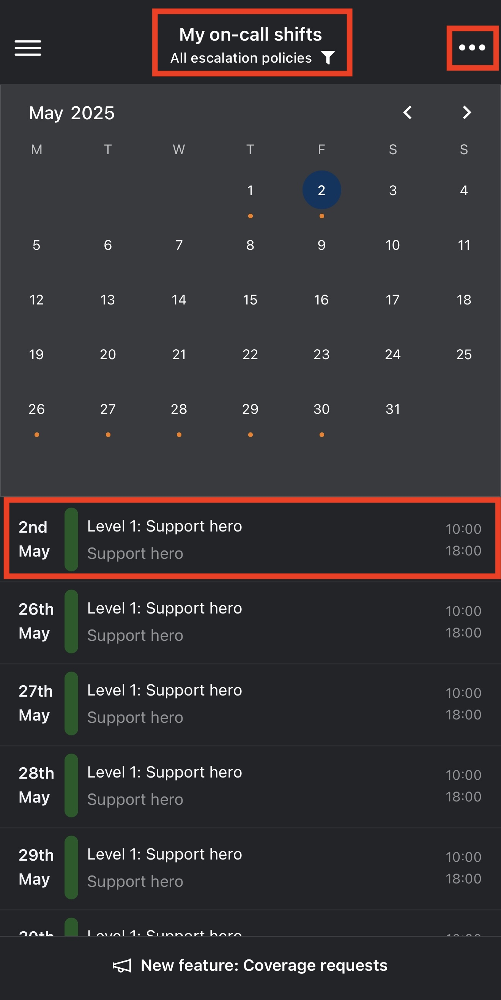

# On-call widget

### Check your on-call status

1. Open the navigation by tapping the menu icon in the top-left corner.

<figure><figcaption></figcaption></figure> <figure><figcaption></figcaption></figure>

2. Now, you can see the widget right below your name.

* **You are on-call**\
  Shows how much time remains in your current shift.
* **Not on-call**\
  Indicates you’re off duty and displays how many policies are currently selected.

**Actions:**

* Tap the widget itself to open the My on-call shifts screen.
* Tap **Request coverage** to launch the [coverage request](../on-call-management-and-escalations/on-call-coverage-requests.md) dialog.

### My on-call shifts page

<figure><figcaption></figcaption></figure>

* **Policy selector (top-center):**\
  Select the escalation levels for which you wish to see on-call entries.\
  &#xNAN;_&#x4E;ote: You can only select policies to which you’re assigned._
* **Actions menu (top-right):** Tap the **•••** icon to open available actions.
* **Shift list (bottom section):**\
  Displays each shift’s date, time range, and associated policy.\
  Tap any entry to open the **Override shift** menu.

<figure><figcaption></figcaption></figure>

**Actions menu options:**

* **Take someone else's on-call**\
  Opens the menu to temporarily assign yourself to someone’s on-call shift.
* [**Request on-call coverage**](../on-call-management-and-escalations/on-call-coverage-requests.md)\
  Request coverage for your on-call shifts from colleagues.
* **Export to my calendar**\
  Add your shifts to your phone’s calendar.
* **Change time zone**\
  Adjust the calendar display to a different time zone.
