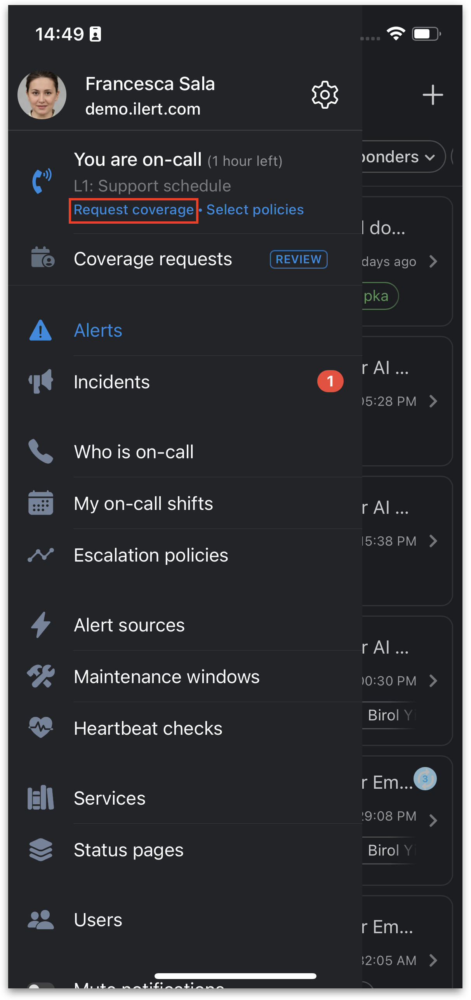
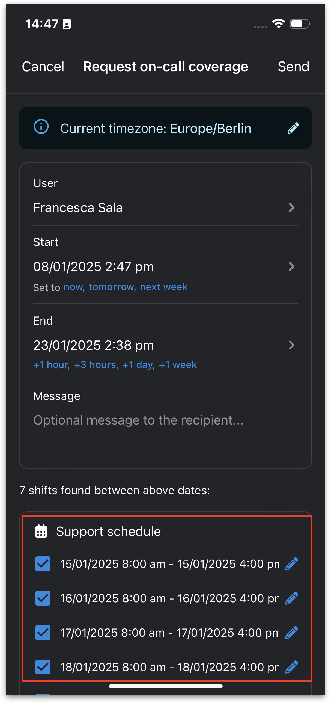
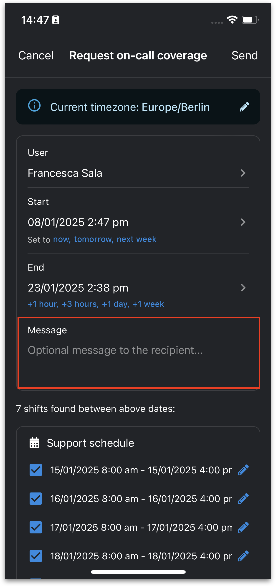
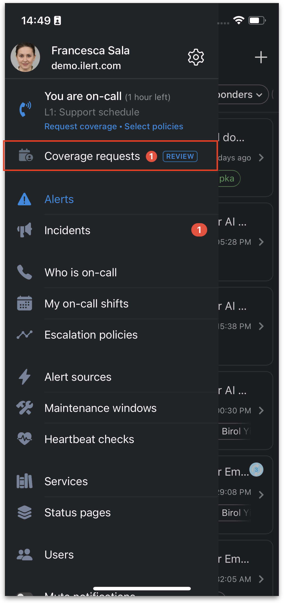
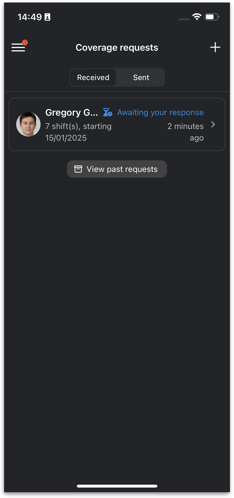
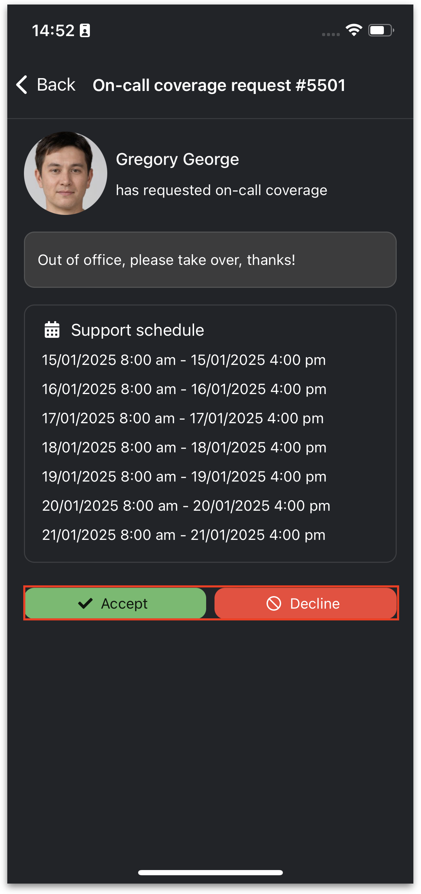
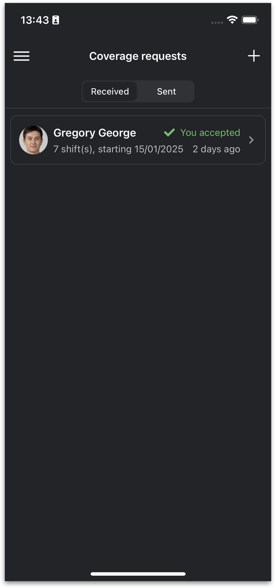

# Coverage requests

ilert’s **Coverage requests** feature allows users to request coverage for their on-call shifts from colleagues. Rather than directly overriding or reassigning a shift, Coverage requests create a lightweight workflow where the requester asks a colleague to take over specific shifts. This is especially helpful if you need to step away from your on-call duties for a personal appointment, an unexpected emergency or personal time-off.


**ilert mobile app required**

Currently, coverage requests are mobile-only, meaning requests can only be created, viewed, and managed in the ilert mobile app.


### Key benefits

* Collaboration: Allows on-call team members to coordinate coverage among themselves without admin intervention.
* Flexibility: Users can select exact shifts within a desired time period and send a request for coverage.
* Transparency: Both the requester and the recipient can track the status of each request - pending, accepted, or declined.

### How it differs from an override

* Coverage Request: A request-based workflow. The requester asks a teammate to cover one or more specific shifts. The teammate must accept or decline.
* Override (requires [User permission](../user-administration/user-roles-and-permissions.md)): An admin can directly reassign a shift without requiring acceptance. Any responder can add themselves as an override for any shift, but cannot add another person.

### Creating a coverage request

1. Open the ilert mobile app. Ensure you have the latest version installed on your iOS or Android device.
2. Open the navigation by tapping on the menu icon on the top left.
3. Tap on **Request coverage**.

<figure><figcaption></figcaption></figure>

4. Select the User: choose the colleague you’d like to request coverage from.
5. Enter desired coverage period:
   * Pick a start and end time to define the timeframe you need coverage.
   * ilert will display your existing on-call shifts within this period.

<figure><figcaption></figcaption></figure>

6. Choose the individual shift(s) you’d like your colleague to cover.

<figure><figcaption></figcaption></figure>

7. &#x20;Add an optional message.

<figure><figcaption></figcaption></figure>

8. Send the request.

Your colleague will receive a notification via the mobile app.\

### Responding to coverage requests

When someone requests coverage from you:

1. You’ll receive a push notification and a badge on the requests tab in the ilert mobile app.
2. Open **Coverage requests** from the main navigation. Review the shift dates/times and any message from the requester.

<figure><figcaption></figcaption></figure> <figure><figcaption></figcaption></figure>

3. **Accept** or **Decline**

* Tap **Accept** if you can cover the shift.
* Tap **Decline** if you’re unable to cover.
* Once you choose, both you and the requester will be notified of the decision.

<figure><figcaption></figcaption></figure> <figure><figcaption></figcaption></figure>

### FAQs

#### Can I send coverage requests from the ilert web app?

Not at this time. Coverage requests are available only via the ilert mobile app.

#### Can an admin override my shift if I send a coverage request?

Yes. Admins retain the ability to directly override or reassign shifts, which bypasses the request/accept workflow.

#### Can I cancel a request after sending it?

Yes. Navigate to **Coverage requests** in the mobile app, locate the request, and select **Cancel** if your colleague hasn’t already accepted.
