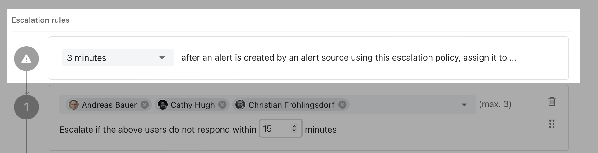

# Escalation policies

Escalation policies define whom to assign an alert to when an alert is triggered by an alert source. They consist of rules that specify a target (a user or schedule) and an escalation timeout.&#x20;

By defining multiple escalation rules, you can ensure that an alert doesn't get missed if the first responder fails to acknowledge the alert.

To create an escalation policy, navigate to **Escalation policies** and click on **Create new escalation policy**. Give it a name and optionally assign the policy to a team.

### Escalation rules

An escalation policy must have at least one escalation rule. You can add more rules by clicking on the **Add escalation rule** link. An escalation rule consists of:

* A **target**: an individual user or a schedule. If the target is a schedule, the user on-call at the time of the alert assignment will be added as a responder to an alert. If an alert occurs during a time with no coverage in your schedule, then the alert will be escalated immediately to the next escalation level, without waiting for the escalation timeout. If no one is on-call on the entire escalation policy, no one will be notified.
* An **escalation timeout**: the amount of time that a responder has to accept an alert until it is automatically escalated to the next escalation level.

 (2).png>)


**Alerting multiple users at the same time**

The maxiumun number of users and on-call schedules that you can set in a single escalation level depends on your plan and is indicated in the escalation rule. In the above screenshot, the maximum number of targets per escalation level is 5.&#x20;


### Delayed escalation

With delayed escalation, you can delay escalation by a set period of time (up to 60 minutes). That way, you can avoid getting paged for alerts that quickly resolve themselves. When an alert is created and resolved before the defined delay has passed, ilert won't notify anyone. You can still have those alerts posted somewhere (e.g. Slack) by creating an alert action that gets triggered when an alert is created.

<figure><figcaption>
Chose a delay in the top of an escalation policy
</figcaption></figure>

### Routing key (optional)

By default, an alert source is associated with a single escalation policy and always uses the same policy for every alert that it creates. An escalation policy's routing key can be used in the Events API to overwrite an alert source's escalation policy and route alerts dynamically based on the escalation policy's routing key.

