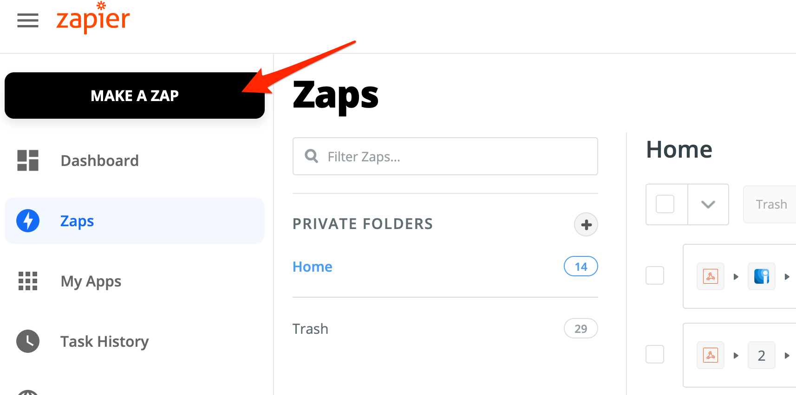

# Zapier Outbound Integration

## In Zapier: Create a Zap 

1. Go to Zapier and click on **Make a Zap**

2. On the next page, search for **iLert** trigger source and choose it:

3. In the section **Trigger Event** choose **New or Updated Alert** and click on the **Continue** button

.png>)

4. On the next slide, choose your ilert account. Then click on the **Continue** button.

.png>)

5. On the next slide, choose **an alert source** and **trigger types** e.g. Alert Created. Then click on the **Continue** button.


NOTE: you can't use an Zapier alert source here, as it will lead to an infinite loop


.png>)

6. On the next slide, click on the **Test Trigger** button to see example data. Then click on the **Continue** button.

.png>)

7. Now you can **add any action** available in Zapier, e.g. Jira to create a ticket on your Jira board

## FAQ 

**Why the Zapier connector is in my alert source?**

Every time you create a Zap with an ilert trigger, the Zapier connector in ilert is created automatically for the alert source you selected in the trigger.

## Related articles


[zapier.md](../inbound-integrations-1/zapier.md)

