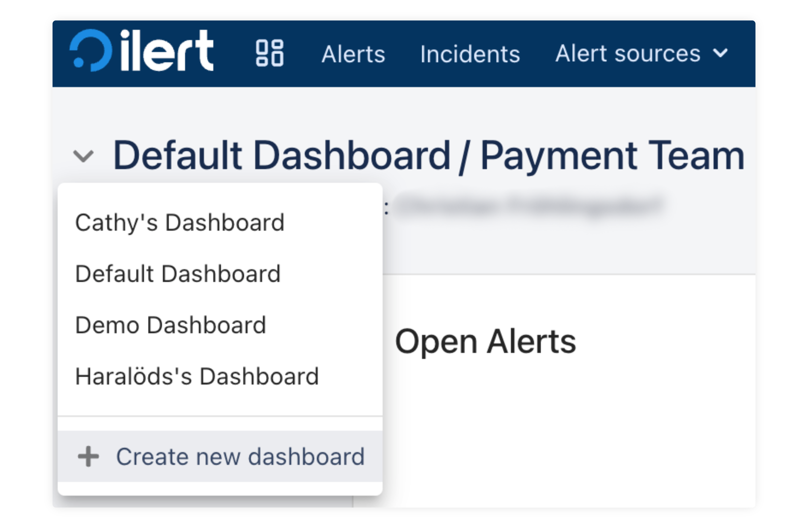
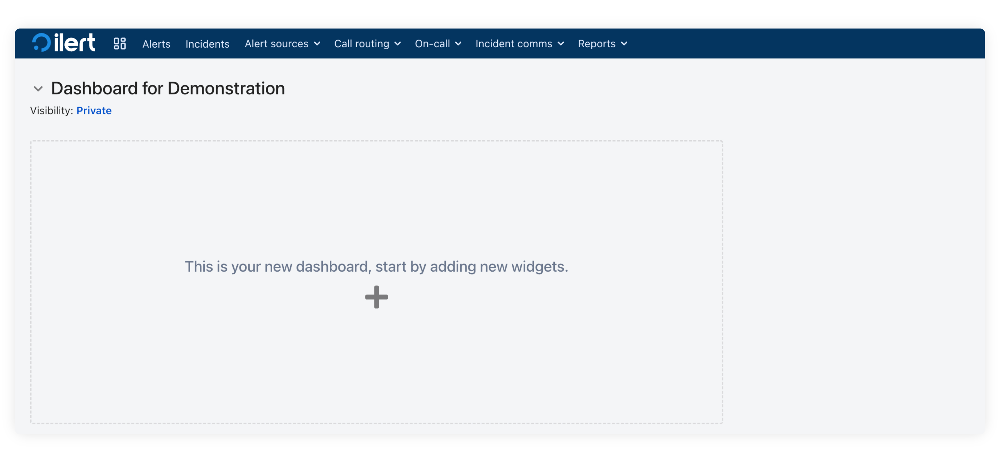
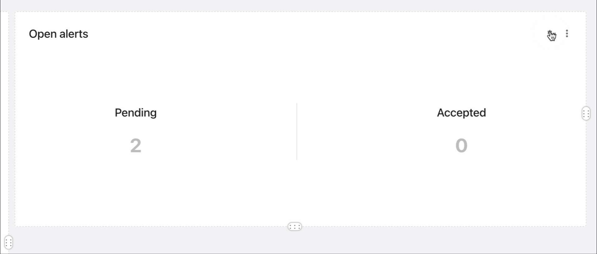

# Dashboard

The ilert dashboard is a customizable page that allows you to keep track of your favorite team-related metrics and gain insights into different aspects of ilert. You can create multiple dashboards, each tailored to specific needs or teams. With a variety of widgets at your disposal, you can add, remove, and rearrange widgets to build a dashboard that fits your needs.

<figure><figcaption>
Dashboard example
</figcaption></figure>

### Create your first Dashboard

To start with dashboards, click **Create new dashboard**, and give it a name.&#x20;

Choose one of the three visibility types:

<figure><figcaption></figcaption></figure>

* **View only**: The dashboard will be available for everyone within your organization, but they cannot change anything in it.
* **View and edit**: The dashboard will be available for everyone within your organization, and they can make changes to it.
* **Private**: the dashboard will only be available to you.

Navigate to the **plus icon** and choose one of six widgets: Metrics, On-call now, Open alerts, Open incidents, Recent alert activity, or Services. Later, you can also add widgets by clicking the **Add** button at the top right corner of your screen.

<figure><figcaption></figcaption></figure>

You can adjust each widget's settings by clicking the **cogs icon** at the top right corner of the widget. Below are more details on each widget and its settings.

<figure><figcaption></figcaption></figure>

### Widgets

**Metrics.** If you are using the [Metrics](../incident-comms-and-status-pages/metrics/) feature, you can display essential graphs in the Dashboard. In the settings under the cogs icon, you can choose a specific [team](../user-administration/teams.md) or metric and adjust the time range.

**On-call now.** This widget helps to observe current [on-call duty](broken-reference) shifts. Adjust a specific team schedule or specify the [escalation policy](../on-call-management-and-escalations/escalation-policies.md) you want to see in the dashboard.&#x20;

**Open alerts.** This widget shows ongoing [alerts](broken-reference) that have yet to be resolved. By clicking the cogs icon, you can specify a team or [alert source](alert-sources.md).

**Open incidents**. The widget displays current [incidents](../incident-comms-and-status-pages/incidents.md), their status, and the services they affected. In the widget settings, you can specify teams and services.

**Recent alert activity.** Alert sources, time stamps, and activity details are available in this widget. You can choose to display all types of timeline events to display or limit the list to only those events that are important to you. Additionally, you can limit teams and alert sources shown here.

**Services.** This widget shows the status of important [services](../incident-comms-and-status-pages/services.md). Again, you can view all the alert sources and teams or include only those that are important to you.&#x20;

You can adjust the appearance of your dashboard by dragging widgets and changing their sizes.&#x20;

<figure><figcaption></figcaption></figure>

If you want to change the sharing settings, such as making the private widget public, click **Edit** at the top right corner, and then the **Visibility** link under the widget's title.
