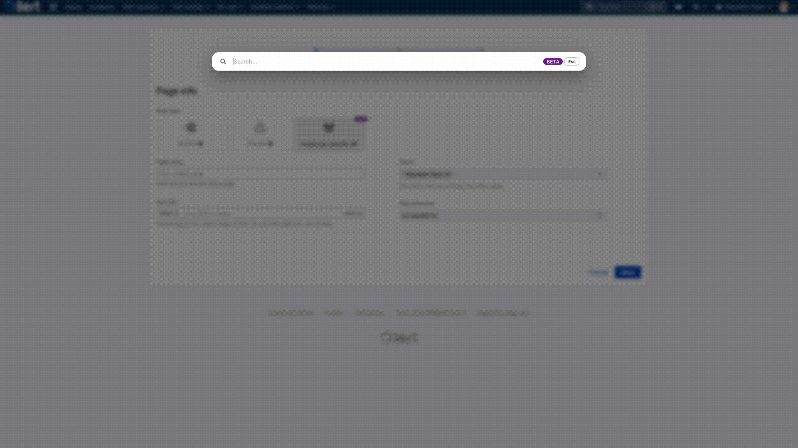

# Global Search enhanced by ilert AI

<figure><figcaption></figcaption></figure>

### Searching for resources

ilert global search is a superfast way to access any resource in your ilert account. No matter if master data like alert sources or dynamic data such as alerts or incidents.

<figure><figcaption></figcaption></figure>

Locate it at the top of your navigation bar in any view or press `CTRL/CMD + K` to open the search bar. Enter your desired search term and wait a moment for your results to be gathered.

<figure><figcaption></figcaption></figure>

The result window gives you a quick glance over all resource types in your account that match the search term. ilert uses a hybrid search approach that mixes full-text search and vector similarity with reranking to provide you with the best results to your search, even if your search term is not exactly matching.

### Drilling down deeper

You may drill down into more results for a specific category, this will widen the vectorized search part as well, trying to resolve even more results. Just **click on a category header** of your search results.

<figure><figcaption></figcaption></figure>

This will open the category specific results:

<figure><figcaption></figcaption></figure>


Note that by hovering a result you can see the full text of the item


### Mouseless usage

You may use the search without interacting with your mouse.

1. Press `CTRL / CMD + K` to open the search bar
2. Enter your search term
3. Press Enter to open the detail view of the first top result

