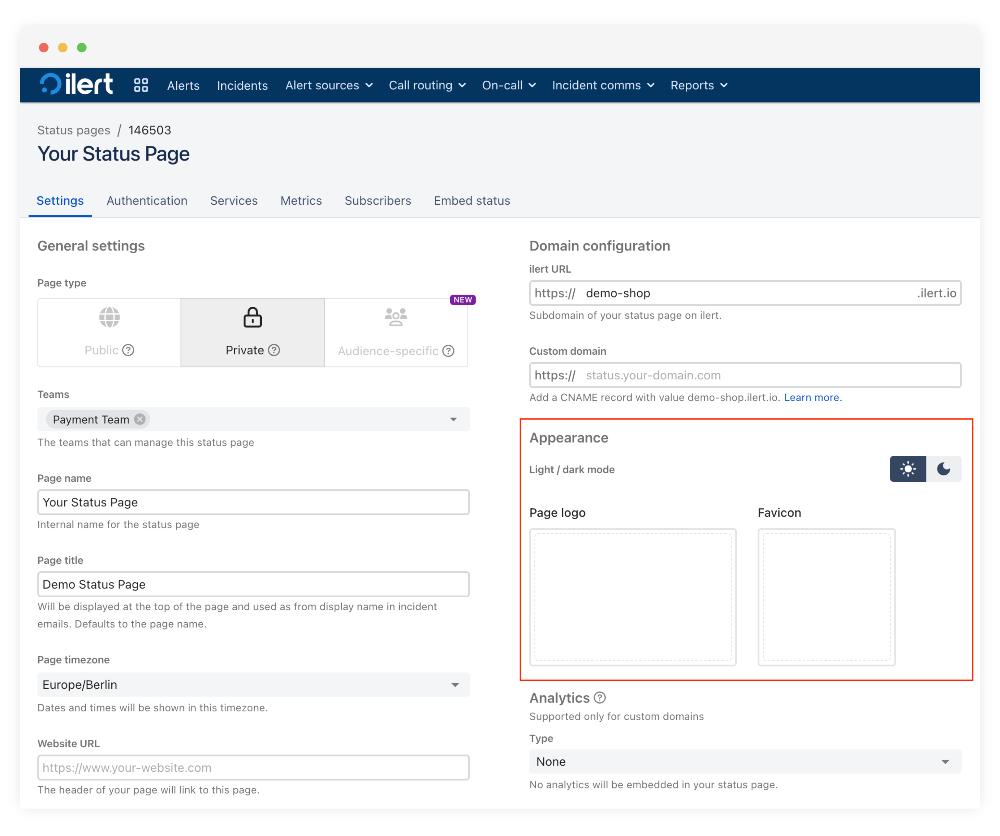
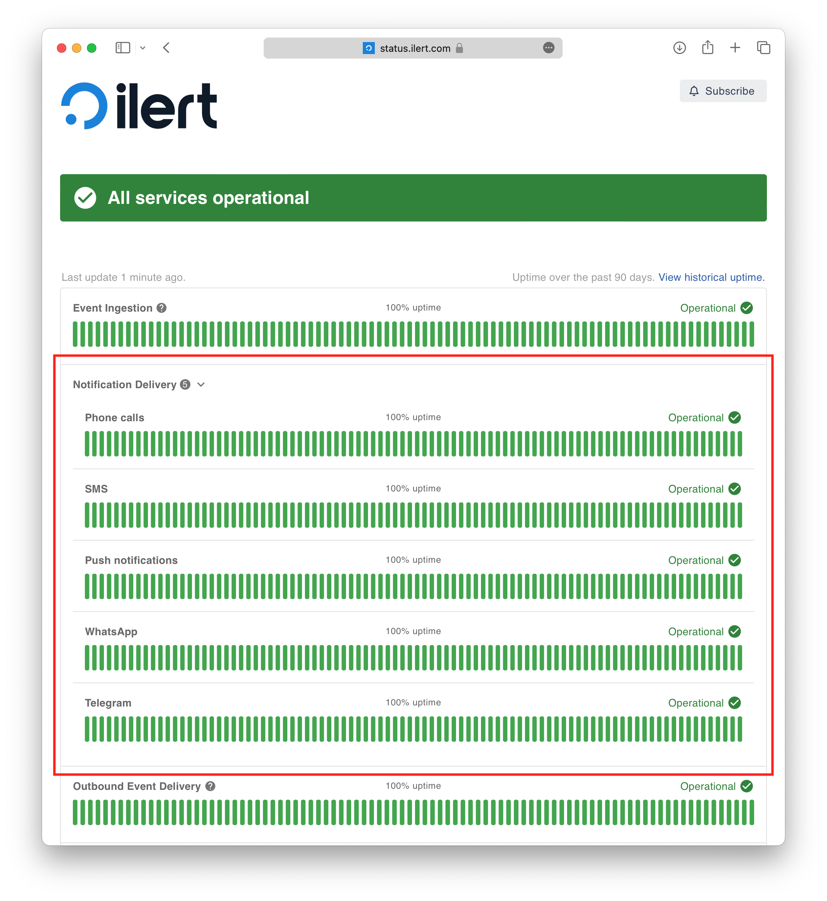
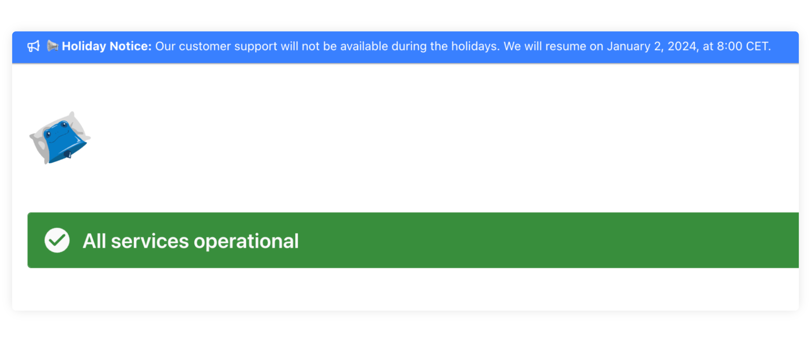

# Status pages

### Create a status page

Creating a status page is a matter of a few clicks.

1\. Navigate to **Status pages** in the navigation bar and click on the **Create status page** button.

2\. Select your page type, ilert URL, and the teams that should manage the status page.

<figure><figcaption></figcaption></figure>

3\. Select the services that you would like to include in the status page. You can also create a new service and add it to the status page from the drop-down list.

<figure><figcaption></figcaption></figure>

4\. Optionally add your own logo and fav icon and click on **Save**.

5\. Click on the **Visit status page** button to preview your status page. Once you are satisfied with your status page, click on the **Activate** button to make your page available and viewable to your users.

### Update the status of your status page

The status of your status page is automatically updated whenever

* The status of a service that is included in the status page is updated (e.g. by setting a service to _Degraded_)
* An [incident is created](../incidents.md#create-and-communicate-incidents) that affects any of the services from your status page

[-> How to create an incident](../incidents.md#create-and-communicate-incidents)


[https://www.youtube.com/@ilertVideos](https://www.youtube.com/@ilertVideos)


#### Automation with alert sources

You can automatically update your status page in the following ways:

* Automatically update the status of a service (for example, set the status to _Degraded_)
* Automatically create an incident on your status page using an [incident template](../incidents.md#create-an-incident-template) and (optionally) notify subscribers

Both cases work by using the **ilert incidents** alert action on an alert source. See [-> Services: automation with alert sources](../services.md#automation-with-alert-sources) for more information.


[https://www.youtube.com/@ilertVideos](https://www.youtube.com/@ilertVideos)


### Status page appearance

You can adjust the appearance of your status page to reflect your company brand. Choose between light and dark mode and upload your logotype and favicon.

<figure><figcaption></figcaption></figure>


**Note:** If you are using a private (including audience-specific) status page, your logotype, name of the page, and favicon will also be visible on the login page of your status page.&#x20;


### Status page layout options

#### Service groups: How to group related services together

Service groups let you group related services together on a status page. This allows users to quickly see the overall health of a system and identify any issues that may be impacting multiple services.

Below is an example service group from our status page. When the service group is collapsed, it shows a combined status and uptime graph. When the service group is expanded, it shows the status and uptime graph for each service individually. The overall status of multiple services in a service group is calculated by taking the status of the service with the highest impact. Similarly, the uptime percentage and outage graph is calculated by combining the outages of all services.

To create a service group

1. Navigate to the status page for which you want to create a service group
2. Go to the **Services** tab.
3. Click on the **Create service group** button and give it a name.
4.  You can add services to the service group during creation or later by dragging and dropping services into the group.\

    <figure><figcaption></figcaption></figure>

Use the following settings on a service group and service to further customize how they appear on your status page:

* **Expand group on page**: Activate this option if you want to expand the entire service group by default on your status page
* **Show uptime history:** Activate this option if you want to show the service's historical uptime and its SLA

<figure><figcaption></figcaption></figure>

#### Services layout: single vs responsive columns

You can choose between two layout options for displaying services on your status page.&#x20;

* **A single column** presents items in a vertical list.&#x20;
* **Responsive columns** arrange items in a grid with up to 3 columns that adapt to your screen size.

|                                              Single column                                              |                                            Responsive columns                                           |
| :-----------------------------------------------------------------------------------------------------: | :-----------------------------------------------------------------------------------------------------: |
|  |  |

To change the service on a status page

1. Go to **Status pages** and click on the status page you want to change its layout.
2. Click on the **Services** tab
3.  Select your layout option and click save\

    <figure><figcaption></figcaption></figure>

### Setting up your custom domain 

Every status page (both private and public) comes with support for custom domains, so that you can make your status page accessible from your own subdomains (e.g., status.example.com).

Setting up a custom domain consists of the following steps:

1. Set the custom domain in ilert
2. Configure DNS
3. Wait for the changes to take effect

#### 1. Set the custom domain in ilert

Go to your status page settings, enter a custom domain, and click **Save**.

#### 2. Configure DNS

Configuring DNS happens outside of ilert, at the DNS provider you are using for your domain.

1. Create a new DNS record and select **CNAME** as the record type
2. Enter the name for the CNAME record. The **name** or **DNS entry** is where you enter your subdomain. You might need to enter it in full (e.g., **status.example.com**) or you might just need to enter the part before your apex domain (e.g., **status**). If you're not sure which to use, check with your DNS provider.
3. Enter the ilert URL of your status page as the value for the CNAME record. The **target,** **value,** or **destination** is where the subdomain should be pointed. Taking the screenshot from above as an example, you would need to enter `ilert-demo.ilert.io` .

You might also see a field named **TTL**, which stands for Time To Live. It's the number of seconds that the DNS record can be cached for. If you're not sure what to set, look at the TTL for your existing DNS records. You could set the same number. If you're still not sure, we suggest setting 43200 seconds (12 hours) or 86400 seconds (24 hours).


**Are you using Cloudflare?**

Whenever possible, please **turn off Cloudflare proxying** (the orange cloud, also called "Proxy status" in your domain settings) to ensure that your status page is served without issues and can be monitored by ilert.


#### 3. Wait for the changes to take effect

You might need to wait 1-48 hours for the DNS changes to take effect. This depends on the TTL setting of your DNS record and the time it takes until the DNS change is propagated throughout the internet.

### Status page analytics

For pages with custom domains, it is possible to use external analytics tools. External tools can help you gain insights into your status page's most common traffic channels and user behavior.&#x20;

You can choose from two options—Google Analytics and PostHog. You need a key for both solutions to connect an analytics platform and ilert.&#x20;


Please beware that using external analytics often requires user agreement with data collection and processing. Consult with your legal department regarding the best approach to collecting information.


### Embed the status of your status page on your website 

Communicate incidents to your users right where they are using your service: on your website or web app.

To embed the status of your status page in your web app or website, you can use ilert's floating status widget or status badge. The status page widget will only be visible if there is an ongoing incident or scheduled maintenance and will be hidden if all services are operating normally. The status widget will always be visible and show the overall status of your status page.


Your users don't have to update a page to see the changes in the widget. The **widget refresh is automatic**, so your clients will notice the updates as soon as they occur.


To configure your status page floating widget:

1. Go to **Status Pages**
2. Click on the Status Page where you would like to configure the widget
3. Click on the **Status embed** tab
4. Select **Floating widget**
5. Configure your widget by choosing your colors and widget position, copy the generated snippet code.
6. Paste the generated code snippet from step 4 into the `<head>` section of your target page.
7. Test the widget by creating a test maintenance window or incident.

<figure><figcaption></figcaption></figure>


**Making changes to your widget**

Changes to your status page will not propagate automatically to your pages. You need to update the code snippet in your target for any changes to take effect.


The localization of the widget will be automatically detected using the viewer's browser language. If you want to set the **language** to a fixed setting, you can optionally provide the query parameter `&lng=en` or `&lng=de` to the scripts already existing parameters.

### Announcement Bar 

Share essential announcements via your status page. Enable an announcement bar in the status page settings. To make your message more engaging, use simple Markdown and emojis. The announcement bar will be shown at the top of your status page.

<figure><figcaption>
Announcement bar settings
</figcaption></figure>

<figure><figcaption>
Example of the annoumcement bar
</figcaption></figure>

### FAQ 

#### We are a managed service provider and would like to use multiple status pages to communicate incidents to different customers with private pages without exposing data between customers. Is that possible?

Yes. Our Premium plan even gives you unlimited stakeholder licenses. That way, you can invite as many customers as you need without requiring a full license.

To isolate customers from each other, we recommend the following approach:

1. Create a team for every customer and make the team [private](../../user-administration/teams.md#private-teams)
2. Invite your customer to ilert choosing the **Stakeholder** role
3. Add the customer to the respective customer team.
4. Assign the status page to the respective customer team.

#### I have set my status page to Public, but it's still not accessible from the internet. What am I missing?

You probably forgot to activate your status page. Once you are satisfied with your status page, click on the **Activate** button to make your page available and viewable to your users.

 (1).png>)

**Can I export a list of status page subscribers?**

Yes. To export a CSV file of your status page subscribers, go to Subscribers tab in Status Page Settings and click "Download subscribers" button in the upper right corner.&#x20;

**What if a subscriber hasn't confirmed a status page subscription?**

No worries, ilert will automatically send double opt-in confirmation reminders to your subscribers after 24 hours, three days, and one week.
