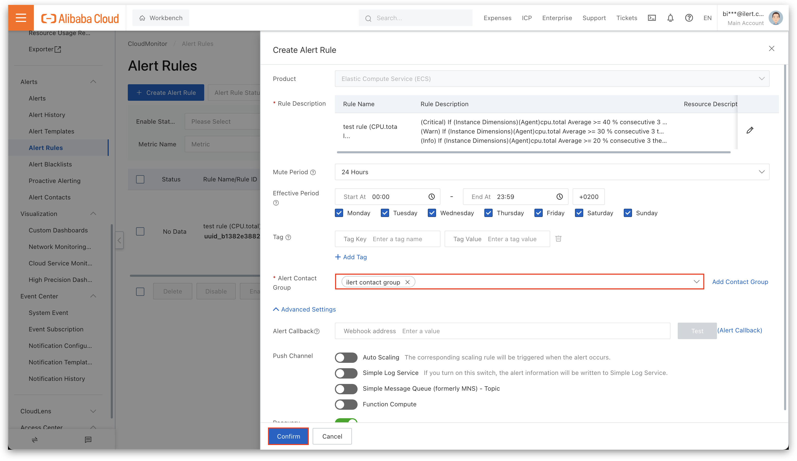

# Alibaba CloudMonitor Integration

## In ilert: Create a Alibaba CloudMonitor alert source&#x20;

1.  Go to **Alert sources** -> **Alert sources** and click **Create new alert source**.

    <figure><figcaption></figcaption></figure>
2.  Search for **Alibaba CloudMonitor** in the search field, click the Alibaba CloudMonitor tile, and then **Next**.&#x20;

    <figure><figcaption></figcaption></figure>
3. Give your alert source a name, optionally assign teams, and click **Next**.
4.  Select an **escalation policy** by creating a new one or assigning an existing one.

    <figure><figcaption></figcaption></figure>
5.  Select your [Alert grouping](../../alerting/alert-sources.md#alert-grouping) preference and click **Continue setup**. You may click **Do not group alerts** for now and change it later.&#x20;

    <figure><figcaption></figcaption></figure>
6. The next page shows additional settings, such as customer alert templates or notification priority. Click **Finish setup** for now.
7. On the final page, an API key and/or webhook URL will be generated. You will need it later.

<figure><figcaption></figcaption></figure>

## In Alibaba CloudMonitor: Create an Alert Contact and Alert Contact Group

1. On the sidebar, navigate to **Alert Contacts**.

<figure><figcaption></figcaption></figure>

2. Click **Create Alert Contact** to create a new alert contact.

<figure><figcaption></figcaption></figure>

3. Enter a Name and the previously in ilert created integration url into the **Webhook** field.

<figure><figcaption></figcaption></figure>

4. Pull the slider to the right and click **OK**.

<figure><figcaption></figcaption></figure>

5. Now navigate to **Alert Contact Group** and click **Create Alert Contact Group**.

<figure><figcaption></figcaption></figure>

6. Now enter a **Group Name** and select the contact created from the previous step.

<figure><figcaption></figcaption></figure>

7. Click **Confirm**.

<figure><figcaption></figcaption></figure>

## In Alibaba CloudMonitor: Assign the Alert Contact Group to an Alert Rule

1. On the sidebar navigate to **Alert Rules**.

<figure><figcaption></figcaption></figure>

2. Now select or create an **Alert Rule**.
3. Head to the **Alert Contact Group** field and select the previously created Alert Contact Group.
4. Click **Confirm** to finish the setup.

<figure><figcaption></figcaption></figure>

## FAQ 

**Will alerts in ilert be resolved automatically?**

Yes, as soon as Alibaba CloudMonitor is sending a notification with the `alertState` field set to `OK`, corresponding alert in ilert will be resolved.
