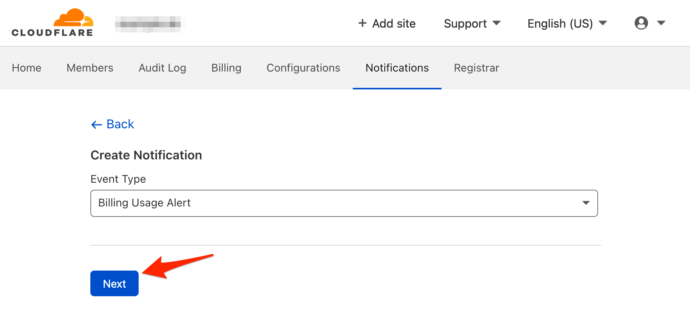
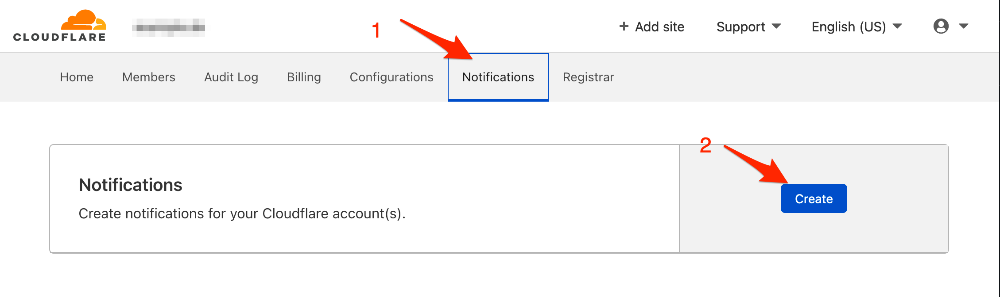

# Cloudflare Integration

Cloudflare allows you to set alert notifications to track DDoS attacks, billing usage and many more.

With ilert Cloudflare Integration, you can receive Cloudflare alert through ilert and easily extend Cloudflare functionality with SMS, push, voice, and ilert on-call schedules.

## In ilert: Create an email alert source 

1.  Go to **Alert sources** --> **Alert sources** and click on **Create new alert source**

    <figure><figcaption></figcaption></figure>
2.  Search for **email** in the search field, click on the email tile and click on **Next**.&#x20;

    <figure><figcaption></figcaption></figure>
3. Give your alert source a name, optionally assign teams and click **Next**.
4.  Select an **escalation policy** by creating a new one or assigning an existing one.

    <figure><figcaption></figcaption></figure>
5.  Select you [Alert grouping](../../alerting/alert-sources.md#alert-grouping) preference and click **Continue setup**. You may click **Do not group alerts** for now and change it later.&#x20;

    <figure><figcaption></figcaption></figure>
6. The next page show additional settings such as customer alert templates or notification prioritiy. Click on **Finish setup** for now.
7.  On the final page, an **Integration email** will be generated that you will need later in this guide.

    <figure><figcaption></figcaption></figure>

## In Cloudflare: Create a notification

1. Go to Cloudflare and then to **Account Home**

2. On the next page, click on the **Notifications** tab and then on the **Create** button

3. On the next page, choose an **Event Type** and then on the **Next** button

.png>)

4. On the next page, name the notification e.g. ilert, paste the **email** paste that you created in ilert and click on the **Create** button

.png>)

Finished! Your Cloudflare notifications will now create alerts in ilert.

## FAQ 

**Will alerts in ilert be resolved automatically?**

No, unfortunately Cloudflare is not sent resolution notifications.

**Can I connect Cloudflare with multiple alert sources from ilert?**

Yes, simply add more notification settings in Cloudflare.
