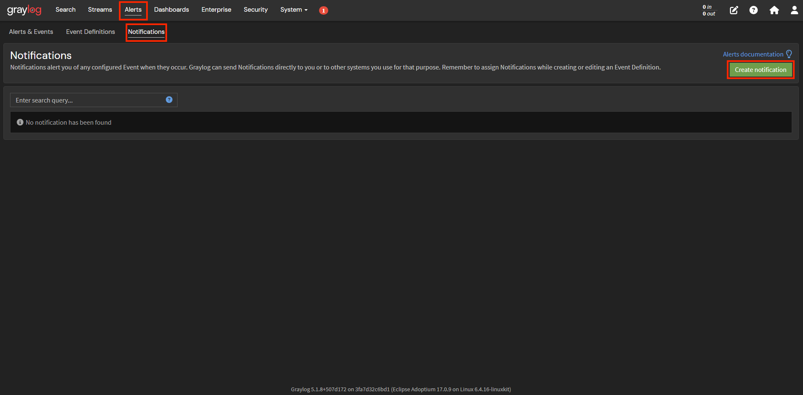
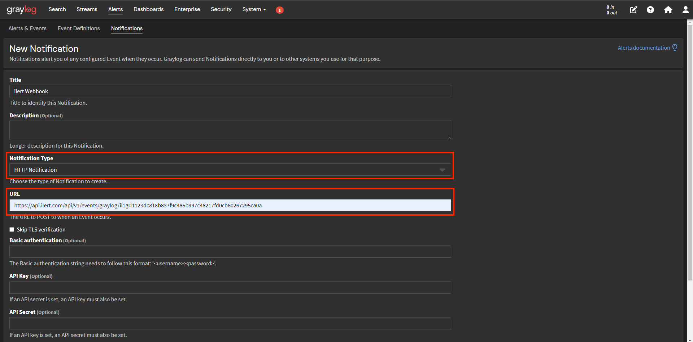
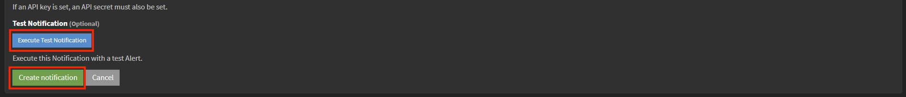

# Graylog Integration

[Graylog](https://graylog.org) is a sophisticated log management and Security Information and Event Management (SIEM) solution that assists teams in addressing security, application, and IT infrastructure issues. It achieves this by providing a platform to combine, enrich, correlate, query, and visualize all your log data in a single location. This centralized approach enhances the efficiency of managing large volumes of log data, which is crucial for monitoring systems, debugging applications, and maintaining security.

With ilert integration for Graylog, you can receive alerts from Graylog via voice, push, SMS, and messenger notifications.

## In ilert: Create a Graylog alert source

1.  Go to **Alert sources** -> **Alert sources** and click on **Create new alert source**

    <figure><figcaption></figcaption></figure>
2.  Search for **Graylog** in the search field, click on the Graylog tile and click on **Next**.&#x20;

    <figure><figcaption></figcaption></figure>
3. Give your alert source a name, optionally assign teams and click **Next**.
4.  Select an **escalation policy** by creating a new one or assigning an existing one.

    <figure><figcaption></figcaption></figure>
5.  Select you [Alert grouping](../../alerting/alert-sources.md#alert-grouping) preference and click **Continue setup**. You may click **Do not group alerts** for now and change it later.&#x20;

    <figure><figcaption></figcaption></figure>
6. The next page show additional settings such as customer alert templates or notification prioritiy. Click on **Finish setup** for now.
7.  On the final page, an API key and / or webhook URL will be generated that you will need later in this guide.

    <figure><figcaption></figcaption></figure>

## In Graylog: Sending alerts via Graylog

1. In the Topbar click on **Alerts** -> **Notifications** -> **Create notification**.

<figure><figcaption></figcaption></figure>

2. Add a **Title** to the new notification.

<figure><figcaption></figcaption></figure>

3. In the **Notification Type** field choose HTTP Notification and add the previous generated ilert alert source URL into the **URL** field.

<figure><figcaption></figcaption></figure>

4. Optional: Click on **Execute Test Notification** to test the notification.
5. Click on Create notification to save your new notification.

<figure><figcaption></figcaption></figure>

## FAQ 

**Will alerts in ilert be resolved automatically?**

Yes, as soon as Graylog sends an event with the key `alert` set to `false`, the associated alert in ilert is resolved.
