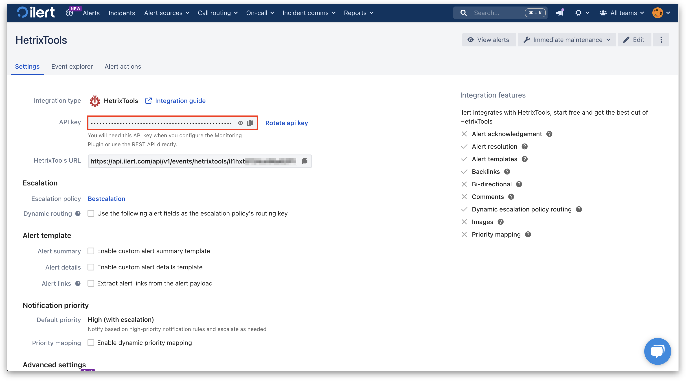

# HetrixTools Integration

[HetrixTools](https://hetrixtools.com/) is a platform that provides uptime monitoring, server monitoring, and blacklist monitoring to ensure optimal performance and security of IT infrastructure. This article provides step-by-step instructions on how to connect your HetrixTools monitoring with ilert.

## In ilert: Create a HetrixTools alert source&#x20;

1.  Go to **Alert sources** -> **Alert sources** and click **Create new alert source**.

    <figure><figcaption></figcaption></figure>
2.  Search for **HetrixTools** in the search field, click the HetrixTools tile, and then **Next**.&#x20;

    <figure><figcaption></figcaption></figure>
3. Give your alert source a name, optionally assign teams, and click **Next**.
4.  Select an **escalation policy** by creating a new one or assigning an existing one.

    <figure><figcaption></figcaption></figure>
5.  Select your [Alert grouping](../../alerting/alert-sources.md#alert-grouping) preference and click **Continue setup**. You may click **Do not group alerts** for now and change it later.&#x20;

    <figure><figcaption></figcaption></figure>
6. The next page shows additional settings, such as customer alert templates or notification priority. Click **Finish setup** for now.
7.  On the final page, an API key and/or webhook URL will be generated. You will need it later.

    <figure><figcaption></figcaption></figure>

## In HetrixTools: Create a Contact Webhook

1. On the sidebar, click on **Contact Lists**.

<figure><figcaption></figcaption></figure>

2. Now click on **Add new Contact List**.

<figure><figcaption></figcaption></figure>

3. Enter a **Contact List Name** and expand the **ilert** section.

<figure><figcaption></figcaption></figure>

4. Enter the previously created alert source api key into the **ilert API Key** field.
5. Optional: Click on the **Send test notification** to test the integration.

<figure><figcaption></figcaption></figure>

6. Now navigate to the monitor you want to receive an alert from.
7. Click on **\[No Contact List]** to select a contact list.

<figure><figcaption></figcaption></figure>

8. Select the contact list that was created in Step 3.

<figure><figcaption></figcaption></figure>

## FAQ 

**Will alerts in ilert be resolved automatically?**

Yes, partially. As soon as the HetrixTools sends a notification with 'online' status, the corresponding alerts in ilert will be resolved automatically. Note that this will only apply to Uptime Monitors.
