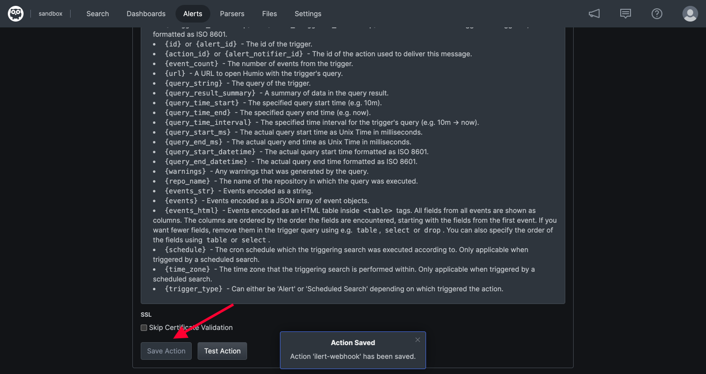

# CrowdStrike Falcon LogScale Integration


Humio has been renamed to CrowdStrike Falcon LogScale


## In ilert: Create a CrowdStrike Falcon LogScale alert source&#x20;

1.  Go to **Alert sources** --> **Alert sources** and click on **Create new alert source**

    <figure><figcaption></figcaption></figure>
2.  Search for **CrowdStrike Falcon LogScale** in the search field, click on the CrowdStrike Falcon LogScale tile and click on **Next**.&#x20;

    <figure><figcaption></figcaption></figure>
3. Give your alert source a name, optionally assign teams and click **Next**.
4.  Select an **escalation policy** by creating a new one or assigning an existing one.

    <figure><figcaption></figcaption></figure>
5.  Select you [Alert grouping](../../alerting/alert-sources.md#alert-grouping) preference and click **Continue setup**. You may click **Do not group alerts** for now and change it later.&#x20;

    <figure><figcaption></figcaption></figure>
6. The next page show additional settings such as customer alert templates or notification prioritiy. Click on **Finish setup** for now.
7.  On the final page, an API key and / or webhook URL will be generated that you will need later in this guide.

    <figure><figcaption></figcaption></figure>

## In CrowdStrike Falcon LogScale

1. Create an Action by clicking **Alerts** -> **Actions** -> **New Action** from your dashboard

2. Choose **Webhook** as type, fill in the name in this case **ilert-webhook**, and on Endpoint URL, put on the **Humio URL** that is generated on ilert

3. Save the Action Webhook by clicking on **Save Action** after scrolling down

4. Add a new Alert by Clicking **Alerts -> Alerts -> New Alert**

5. Create the Alert by specifying the query that you want the Alert to be based on, and don't forget to check **Alert Enabled** and put the **Webhook Action** that has been configured earlier

6. Save the alert, and upon the alert, the incident will be created on ilert side as well
7. For more information about LogScale Alerts please refer to the following: [https://library.humio.com/data-analysis/automated-alerts.html](https://library.humio.com/data-analysis/automated-alerts.html)
