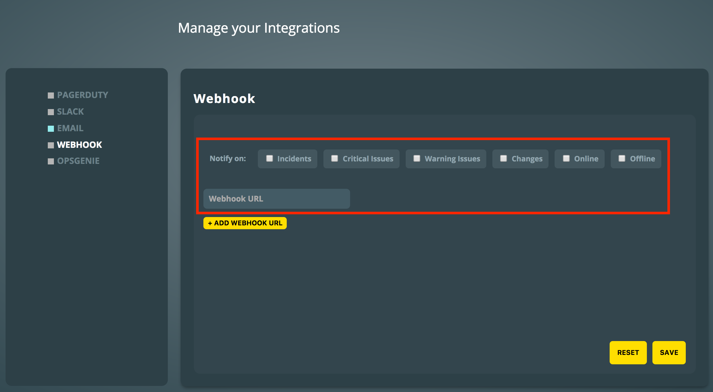

# Instana Integration

[Instana](https://www.instana.com/) is an application performance monitoring software for microservice applications. With the ilert Instana Integration, you can receive Instana alerts through ilert and easily extend Instana with SMS, Push, Voice, and ilert on-call-scheduling.

## In ilert: Create an Instana alert source 

1.  Go to **Alert sources** --> **Alert sources** and click on **Create new alert source**

    <figure><figcaption></figcaption></figure>
2.  Search for **Instana** in the search field, click on the Instana tile and click on **Next**.&#x20;

    <figure><figcaption></figcaption></figure>
3. Give your alert source a name, optionally assign teams and click **Next**.
4.  Select an **escalation policy** by creating a new one or assigning an existing one.

    <figure><figcaption></figcaption></figure>
5.  Select you [Alert grouping](../../alerting/alert-sources.md#alert-grouping) preference and click **Continue setup**. You may click **Do not group alerts** for now and change it later.&#x20;

    <figure><figcaption></figcaption></figure>
6. The next page show additional settings such as customer alert templates or notification prioritiy. Click on **Finish setup** for now.
7.  On the final page, an API key and / or webhook URL will be generated that you will need later in this guide.

    <figure><figcaption></figcaption></figure>

## In Instana: Create a webhook integration 

1. \_\*\*\_Open the Management Portal by clicking on Profile → Management Portal
2. Go to the **Integration** tab and click on **WEBHOOK**.

3. In the **Notify on** field, select the event types for which you want alerts from ilert.
4. In the **Webhook URL** field, copy the URL from the alert source set up in ilert and click on **Save**.

## FAQ 

**Will alerts in ilert be resolved automatically?**

For alerts and issues in Instana: Yes, as soon as the state of an alert or issue is CLOSED in Instana, the alert in ilert will be resolved.

For Change and On / Offline Events: Every Change and On / Offline event generates a new Alert in ilert.
