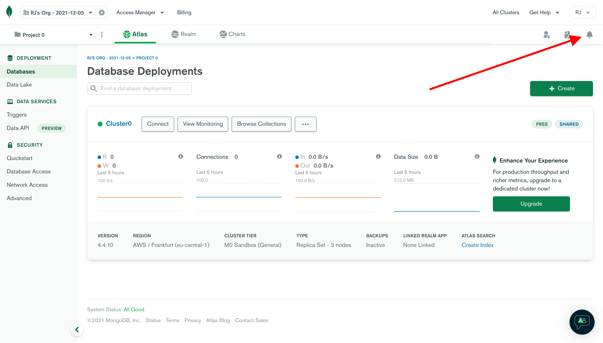
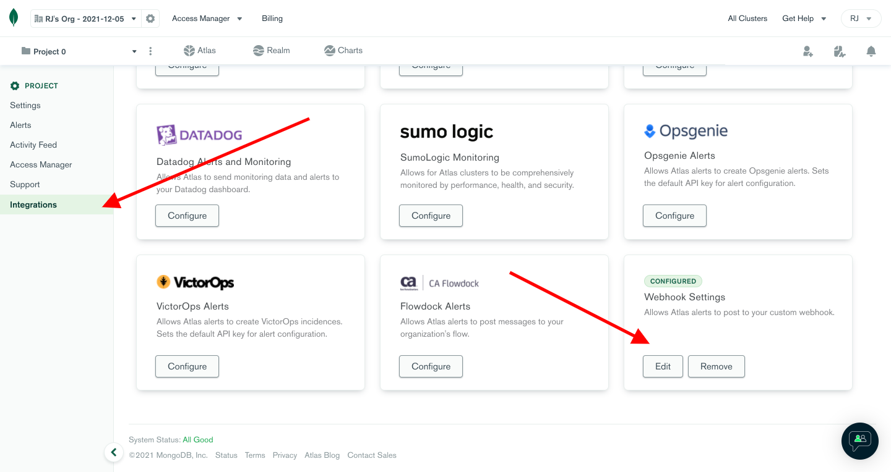
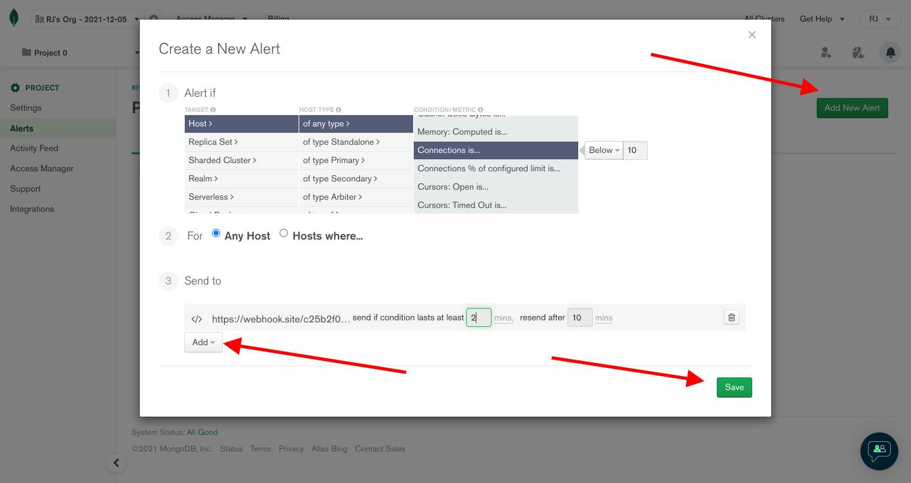
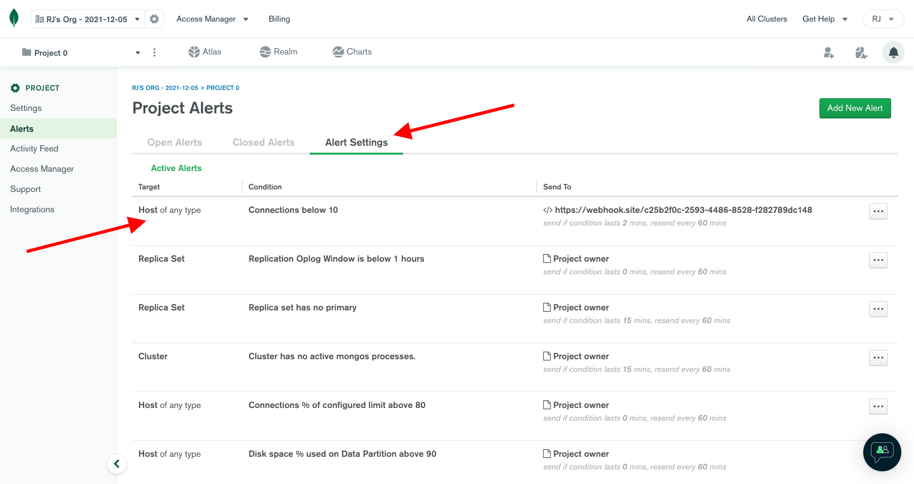

# MongoDB Atlas Integration

## In ilert: Create a MongoDB Atlas alert source

1.  Go to **Alert sources** --> **Alert sources** and click on **Create new alert source**

    <figure><figcaption></figcaption></figure>
2.  Search for **MongoDB Atlas** in the search field, click on the MongoDB Atlas tile and click on **Next**.&#x20;

    <figure><figcaption></figcaption></figure>
3. Give your alert source a name, optionally assign teams and click **Next**.
4.  Select an **escalation policy** by creating a new one or assigning an existing one.

    <figure><figcaption></figcaption></figure>
5.  Select you [Alert grouping](../../alerting/alert-sources.md#alert-grouping) preference and click **Continue setup**. You may click **Do not group alerts** for now and change it later.&#x20;

    <figure><figcaption></figcaption></figure>
6. The next page show additional settings such as customer alert templates or notification prioritiy. Click on **Finish setup** for now.
7.  On the final page, an API key and / or webhook URL will be generated that you will need later in this guide.

    <figure><figcaption></figcaption></figure>

## In MongoDB Atlas

1. In the Project page, click the **Bell (Notification) Icon** on top right.

2. Add Webhook Settings in Integration if it was not configured, by clicking **Integrations** and add the Webhook Settings (there can only be one Webhook).

3. Create the Alert by navigating to **Alert -> Add New Alert**. From here any alerts can be added, and make sure that it sends the Alert to the Webhook.

4. If the Alert has been configured, it should show up in the **Alert Settings** tab and the Alert should be created in ilert.

