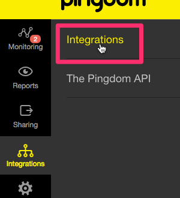
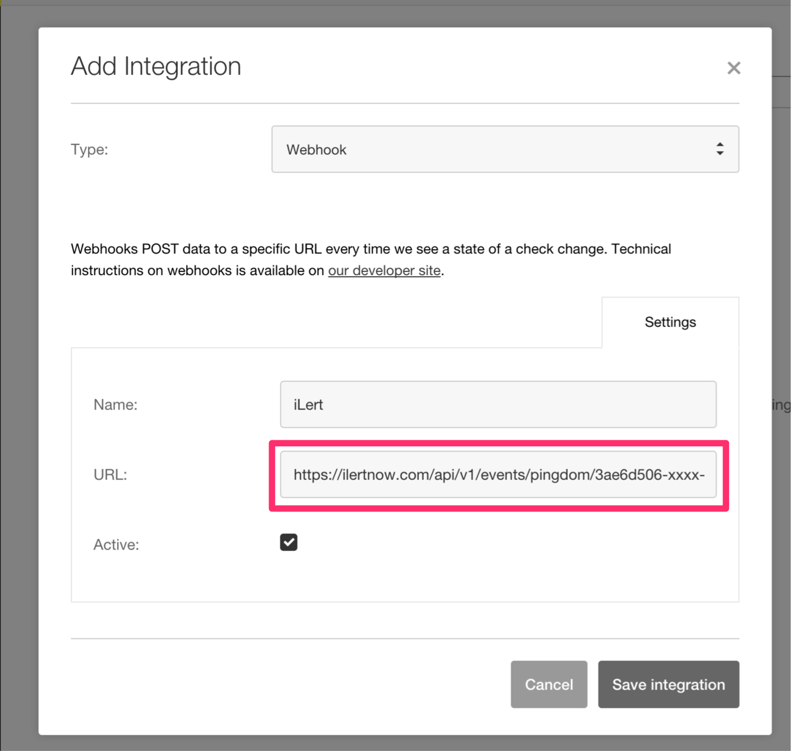
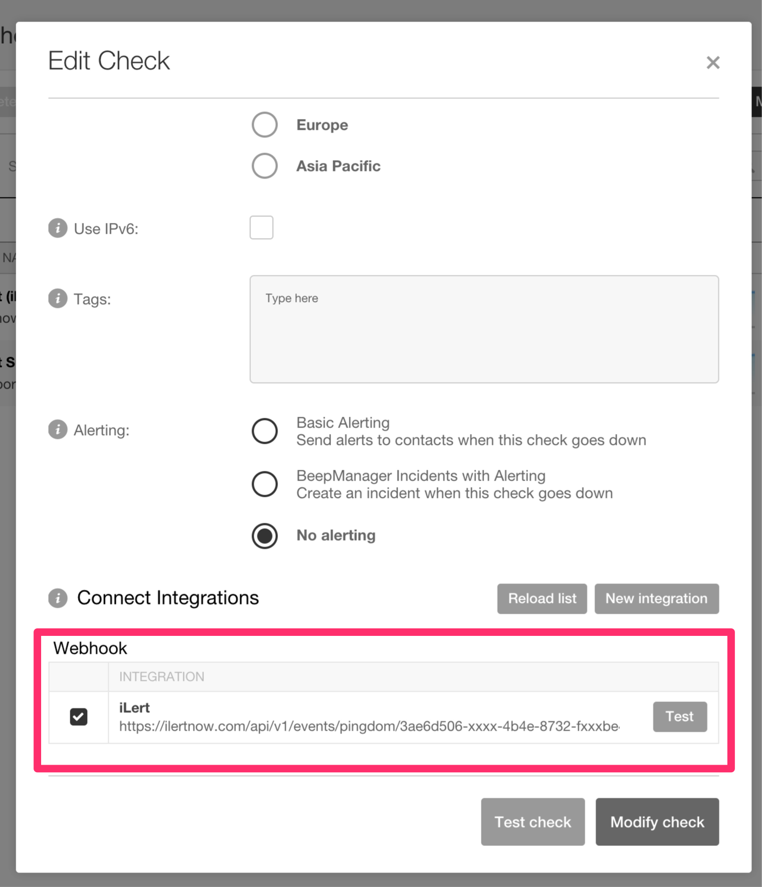

# Pingdom Integration

[Pingdom](https://www.pingdom.com/) is a website monitoring service provided by SolarWinds that offers real-time performance and uptime monitoring for websites, applications, and servers. With Pingdom integration, you can easily integrate Pingdom into ilert. The integration uses the [webhooks](https://help.pingdom.com/hc/en-us/articles/207081599) from Pingdom. Thus, you can easily extend pingdom with SMS, push and voice messaging, as well as rosters from ilert.

## In ilert: Create a Pingdom alert source 

1.  Go to **Alert sources** --> **Alert sources** and click on **Create new alert source**

    <figure><figcaption></figcaption></figure>
2.  Search for **Pingdom** in the search field, click on the Pingdom tile and click on **Next**.&#x20;

    <figure><figcaption></figcaption></figure>
3. Give your alert source a name, optionally assign teams and click **Next**.
4.  Select an **escalation policy** by creating a new one or assigning an existing one.

    <figure><figcaption></figcaption></figure>
5.  Select you [Alert grouping](../../alerting/alert-sources.md#alert-grouping) preference and click **Continue setup**. You may click **Do not group alerts** for now and change it later.&#x20;

    <figure><figcaption></figcaption></figure>
6. The next page show additional settings such as customer alert templates or notification prioritiy. Click on **Finish setup** for now.
7.  On the final page, an API key and / or webhook URL will be generated that you will need later in this guide.

    <figure><figcaption></figcaption></figure>

## In Pingdom: Create a new integration 

1. Click on "Integrations" in the Pingdom Dashboard and click on "Integrations" on the right side of the menu

2. On the following page, click on the button "Add integration". In the pop-up dialog, select the integration type "Webhook" and assign a name (eg ilert). In the "URL" field, copy the Webhook URL from the alert source set up in ilert and click on "Save integration".

3. The integration can now be used in pingdom checks. Switch to a pingdom check and click on "Edit". Activate the ilert Webhook integration and click on "Modify check".

## FAQ 

**Will alerts in ilert be resolved automatically?**

Yes, as soon as the state of a check in Pingdom is OK again, the alert in ilert will be fixed.

**Can I link Pingdom to multiple alert sources in ilert?**

Yes, create a webhook in Pingdom per alert source. You can then choose for each check in Pingdom which webhook you want to use for alerting.
