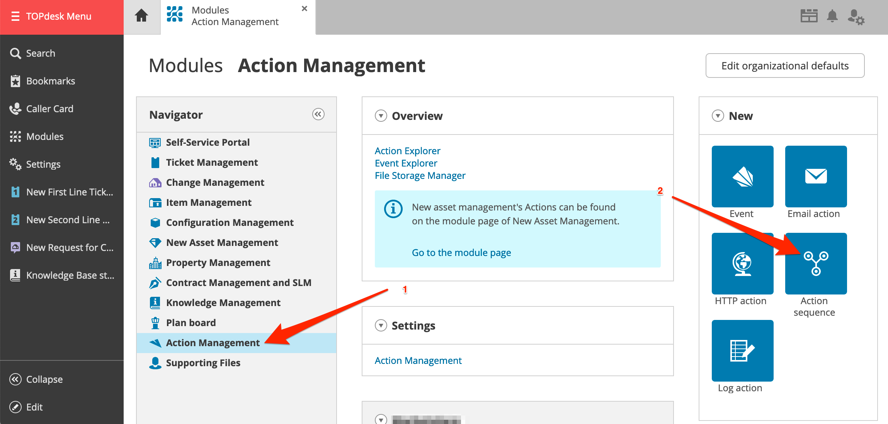

# TOPdesk Inbound Integration

[TOPdesk](https://www.topdesk.com/en/) is a modular service management software that helps businesses manage IT support, facilities management, HR, and other services. It provides a centralized platform for ticketing, asset management, and workflow automation.

Through ilert's integration with TOPdesk, incidents in ilert can be automatically generated from TOPdesk tickets while also enhancing TOPdesk with reliable alerting (via phone calls, SMS, push notifications, and more) on-call scheduling and automatic escalations.

<table data-card-size="large" data-view="cards"><thead><tr><th></th><th></th><th data-hidden data-type="content-ref"></th><th data-hidden data-card-target data-type="content-ref"></th></tr></thead><tbody><tr><td><strong>TOPdesk Outbound Integration</strong></td><td>Create tickets in TOPdesk based on alerts from ilert</td><td><a href="../outbound-integrations/topdesk.md">topdesk.md</a></td><td><a href="../outbound-integrations/topdesk.md">topdesk.md</a></td></tr></tbody></table>

With the ilert TOPdesk integration, you can create alerts in ilert based on TOPdesk event such as tickets or calls.

## In ilert: Create a TOPdesk alert source <a href="#in-ilert" id="in-ilert"></a>

1.  Go to **Alert sources** --> **Alert sources** and click on **Create new alert source**

    <figure><figcaption></figcaption></figure>
2.  Search for **TOPdesk** in the search field, click on the TOPdesk tile and click on **Next**.&#x20;

    <figure><figcaption></figcaption></figure>
3. Give your alert source a name, optionally assign teams and click **Next**.
4.  Select an **escalation policy** by creating a new one or assigning an existing one.

    <figure><figcaption></figcaption></figure>
5.  Select you [Alert grouping](../../alerting/alert-sources.md#alert-grouping) preference and click **Continue setup**. You may click **Do not group alerts** for now and change it later.&#x20;

    <figure><figcaption></figcaption></figure>
6. The next page show additional settings such as customer alert templates or notification prioritiy. Click on **Finish setup** for now.
7.  On the final page, an API key and / or webhook URL will be generated that you will need later in this guide.

    <figure><figcaption></figcaption></figure>


## In TOPdesk <a href="#in-topdesk" id="in-topdesk"></a>

> In this guide we will use **First Line Ticket** service for the integration. You can use any other service to sync with ilert.

### Create action sequences <a href="#create-action-sequences" id="create-action-sequences"></a>

1. Go to TOPdesk and then to **Modules**


2. Click on **Action Management** and then on **Action sequence** to add an action sequence



3. On the modal window, choose a service you are interested in e.g. **Ticket Management - First Line Ticket** and click on **Create new action sequence**


4. In the **Name** section, enter a name eg. `iLert Create Alert Action`
5. In the **Available** section, ensure that the **Active**, **Apply in the Self-Service Portal** and **Apply in the Operator's Section** checkboxes are checked
6. In the **Step 1** section **Name** field, enter a name e.g. `ilert_create_incident`
7. In the **Step 1** section **HTTP Method** field, choose **POST**
8. In the **Step 1** section **URL** field, paste the **Webhook URL** that you generated in ilert
9. In the **Step 1** section **Headers** field, add **Content-Type: application/json** and **Accept: application/json**
10. &#x20;In the **Step 1** section **Body** field, copy and paste the following JSON payload

```javascript
{
"eventType": "ALERT",
"incidentKey": "${naam}",
"summary": "${korteomschrijving}"
}
```


11. _Optional_: Add more entries to the request body to show custom information in an ilert alert. You can find more TOPdesk variables in the **DataDict**


**For example:** to add ticket caller to ilert alert details just add `persoonid` variable on the top-level of json body

```javascript
{
"eventType": "ALERT",
"incidentKey": "${naam}",
"summary": "${korteomschrijving}",
"persoonid": "${persoonid}"
}
```

12. &#x20;Click on **Save**
13. &#x20;Go to **Modules** again
14. &#x20;Click on **Action Management** and then on **Action sequence** to add an action sequence

.png>)

15. &#x20;On the modal window, choose a service you are interested in e.g. **Ticket Management - First Line Ticket** and click on **Create new action sequence**

 (1).png>)

16. &#x20;In the **Name** section, enter a name eg. `iLert Create Alert Action`
17. &#x20;In the **Available** section, ensure that the **Active**, **Apply in the Self-Service Portal** and **Apply in the Operator's Section** checkboxes are checked
18. &#x20;In the **Step 1** section **Name** field, enter a name eg. `ilert_resolve_incident`
19. &#x20;In the **Step 1** section **HTTP Method** field, choose **POST**
20. &#x20;In the **Step 1** section **URL** field, paste the **Webhook URL** that you generated in ilert
21. &#x20;In the **Step 1** section **Headers** field, add **Content-Type: application/json** and **Accept: application/json**
22. &#x20;In the **Step 1** section **Body** field, copy and paste the following JSON payload

```javascript
{
"eventType": "RESOLVE",
"incidentKey": "${naam}",
"summary": "${korteomschrijving}"
}
```


23. &#x20;Click on **Save**

### Create events <a href="#create-events" id="create-events"></a>

1. Go to **Modules**
2. Click on **Action Management** and then on **Event** to add a new event

.png>)

3. On the modal window, choose a service you are interested in e.g. **Ticket Management - First Line Ticket** and click on **Create new event**

.png>)

4. In the **Details** section **Name** field, enter a name eg. `iLert - Create Alert Event`
5. In the **Details** section **Active** field, ensure that checkbox is checked
6. In the **Details** section **Choose type** field, choose **New card**
7. In the **Linked actions** section, choose the action sequence `iLert - Create Alert Action` that you created in the last step
8. _Optional_: You can choose another card type (e.g. **Edit card**) and add conditions or specifications for your use case (e.g. Status changed to "Open"). In this case an ilert alert will be created only if event conditions and specifications match.


9. Click on **Save**
10. &#x20;Go to **Modules** again
11. &#x20;Click on **Action Management** and then on **Event** to add a new event

.png>)

12. &#x20;On the modal window, choose a service you are interested in e.g. **Ticket Management - First Line Ticket** and click on **Create new event**

.png>)

13. &#x20;In the **Details** section **Name** field, enter a name eg. `iLert - Resolve Alert Event`
14. &#x20;In the **Details** section **Active** field, ensure that checkbox is checked
15. &#x20;In the **Details** section **Choose type** field, choose **Edit card**
16. &#x20;In the **Linked actions** section, choose the action sequence `iLert - Resolve alert` that you created in the last step
17. &#x20;_Optional_: You can add conditions or specifications for your use case (e.g. ticket was closed). In this case an ilert alert will be resolved only if event conditions and specifications match.


18. &#x20;Click on **Save**

## FAQ <a href="#faq" id="faq"></a>

**Will alerts in ilert be resolved automatically?**

Yes

**Can I connect TOPdesk with multiple alert sources from ilert?**

Yes, simply create more action sequences in TOPdesk.

**Can I customize the alert messages?**

Yes, any custom field will be shown in the alert details.

## Related articles


[topdesk.md](../outbound-integrations/topdesk.md)

