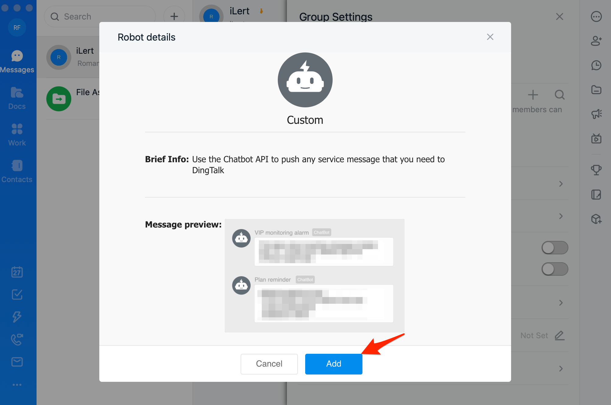
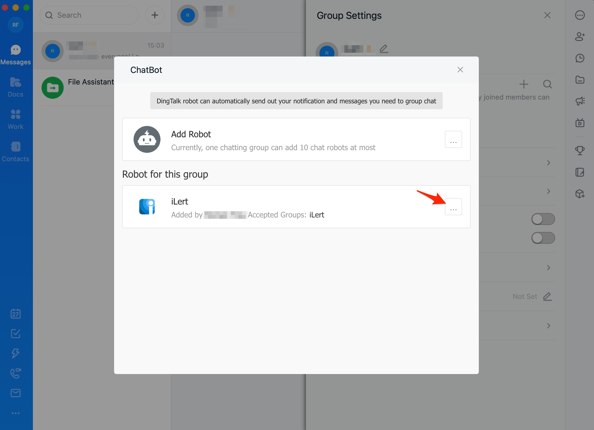
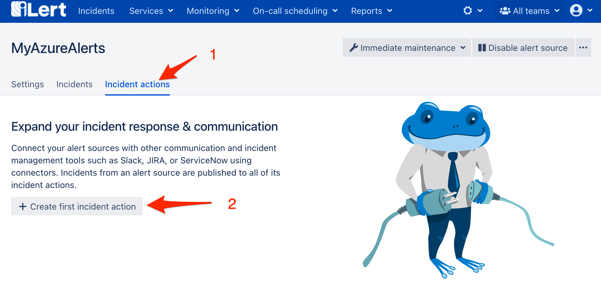
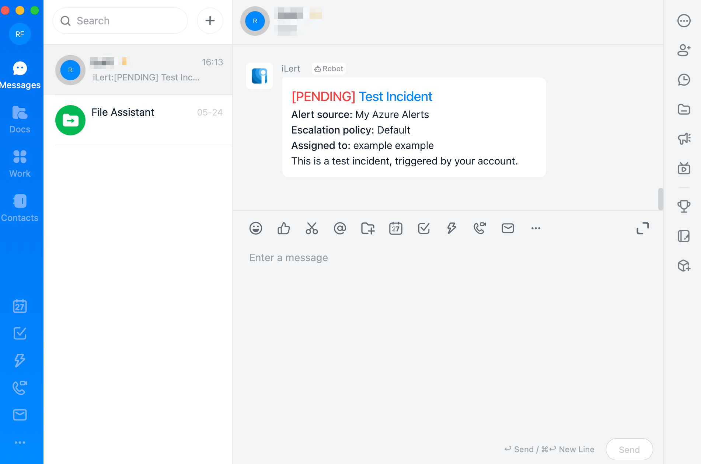

# DingTalk Integration

[DingTalk](https://www.dingtalk.com) is an intelligent working platform created by Alibaba Group to support tens of millions of enterprises to achieve higher working efficiency with the new digitalized working method.

## In DingTalk: Add an ilert Robot to a group 


**Admin permission required**

To set up the integration, you must have admin rights in ilert.


1. Go to DingTalk, select the group in which you want to publish ilert Alerts and click the **Context Menu** **->** **Group Assistant**

.png>)

2. Than click on the **Add Robot** button

.png>)

3. On the modal window click on the **Custom** tile

4. On the next modal window click on the **Add** button

5. On the next modal window, name the robot e.g. ilert, in the **Security Settings** section enable the **Additional Signature** option, check the **Terms of Service** and click on the **Finished** button

6. On the next modal window click on the **Finished** button

.png>)

7. On the next modal window click on context menu **"..."** button next to the ilert robot

8. On the next modal window copy the **webhook URL** and the **Additional Signature**, you will need it from step 3 in ilert.

## In ilert: Create the DingTalk Connector and link it to the alert source 

1. **\*\*Click the gear icon and then click on the** Connectors\*\* link

2. Click the **Create Connector** button

3. On the next page, choose **DingTalk** as type, name the connector and click on the **Save** button.

.png>)

4. Go to **Services -> Alert sources** and open the alert source whose alerts you want to post to DingTalk. Click on the **Alert actions** tab and then on the **Add new alert action** button

5. On the next page choose **DingTalk** as the type, choose the connector created in step 3, name it\*\*,\*\* choose **alert events** to publish and click on the **Save** button.

.png>)

6. Finished! You can now test the connection by clicking on the button **Test this connection**. Thereafter, a test message will be posted on the DingTalk group.

## FAQ 

**Can I link multiple DingTalk Accounts to an ilert account?**

Yes.

**Are updates to an alert published on the DingTalk group?**

Yes, the following updates to an alert are currently being released:

* **Escalations** : An alert is assigned to another user through an automatic escalation.
* **Manual Assignments** : An alert is manually assigned to someone.
* **Actions** : An alert is accepted or resolved.

**Can I choose which updates to an alert will be published in DingTalk?**

Yes.
