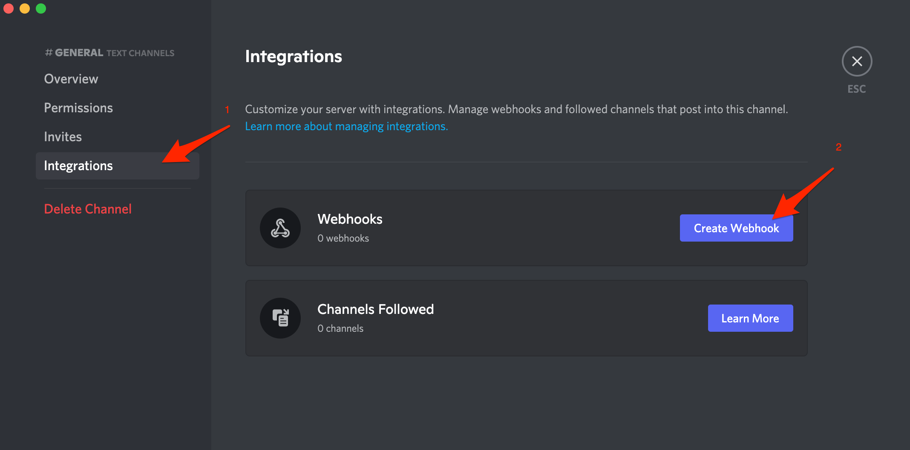

# Discord Integration

[Discord](https://discord.com/) is the easiest way to talk over voice, video, and text. Talk, chat, hang out, and stay close with your friends and communities.

## In Discord: Create a webhook 

1. Go to **Discord** and select a server
2. Go to a **Text Channel**, then click on the **Edit Channel** button

3. On the page click on the **Integrations** menu and then on the **Create Webhook** button

4. On the next page, name the webhook, e.g. ilert, save the changes and copy the **Webhook URL**

.png>)

## In ilert: Create a Discord Connector and link to the alert source 

1. Click on the gear icon and then on the **Connectors** button

 (1).png>)

2. Click on **Add Connector**

.png>)

3. Select **Discord** as **type** and fill in all fields. Enter a name and paste the Webhook URL of your Discord server that you have created in the previous step.

.png>)

4. Go to the alert sources tab and open the alert source whose alerts you want to publish in Discord. Click on **Alert actions** and then on **Create alert action**.

 (9).png>)

5. Select **Discord** as the **type**, **\*\*select the connector created in step 3 and click on** Save\*\* button.

.png>)

6. Finished! You can now test the connection by clicking on the button **Test this connection**.

A test ticket will be created in Discord.

.png>)

## FAQ 

**Can I link multiple Discord Accounts to an ilert account?**

Yes.

**Are updates to an alert published on the Discord Chat channel?**

Yes, the following updates to an alert are currently being released:

* **Escalations** : An alert is assigned to another user through an automatic escalation.
* **Manual Assignments** : An alert is manually assigned to someone.
* **Actions** : An alert is accepted or resolved.

**Can I choose which updates to an alert will be published in Discord Chat?**

Yes.
