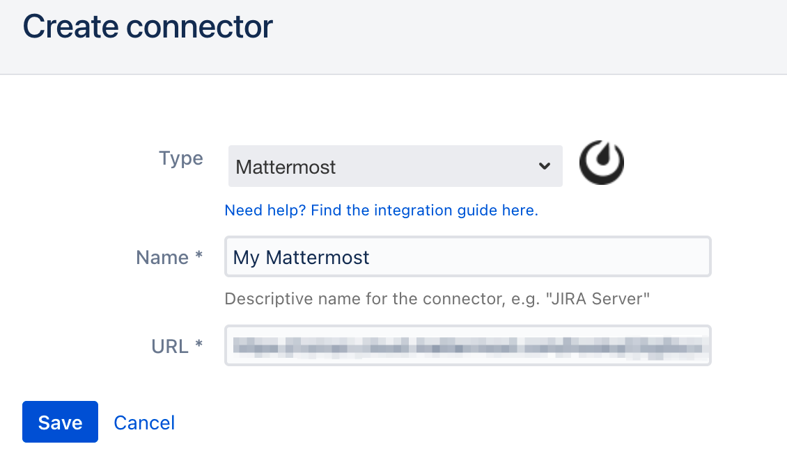

# Mattermost Integration


To set up this integration, you must have admin rights in ilert.


## In Mattermost: Create an incoming webhook 

1. Go to the main menu and click **Integrations**

2. Click on **Incoming Webhooks**

3. On the next page click on the **Add incoming Webhook** button

4. On the next page, name the webhook e.g. **iLert**, choose **a channel** and click on the **Save** button.

5. Your webhook has now been set up. You will need the URL in the next step.

## In ilert: Create the Mattermost Connector and link it to your alert source 

1. Click on the gear icon and navigate to → **Connectors**

.png>)

2. Click on **Add Connector**

.png>)

3. Select **Mattermost** as **Type**. Assign a name for the connector, enter the URL from above and save it.

4. **Go to** the alert sources tab and open the alert source whose alerts you want to publish to Mattermost. Click **Alert actions → Create alert action**.

 (1).png>)

5. Select **Mattermost** as the **type**, select the connector created in step 3 and give your connection a name.

.png>)

6. Finished! You can now test the connection by clicking on the **Test this connection** button. A test message will be posted in the Mattermost channel.

.png>)

## FAQ 

**Can I link multiple Mattermost Spaces to an ilert account?**

Yes.

**Are updates to an alert published in the Mattermost channel?**

Yes, the following updates to an alert are currently being published:

* **Escalations** : An alert is assigned to another user through an automatic escalation.
* **Manual Assignments** : An alert is manually assigned to someone.
* **Actions** : An alert is accepted or resolved.
