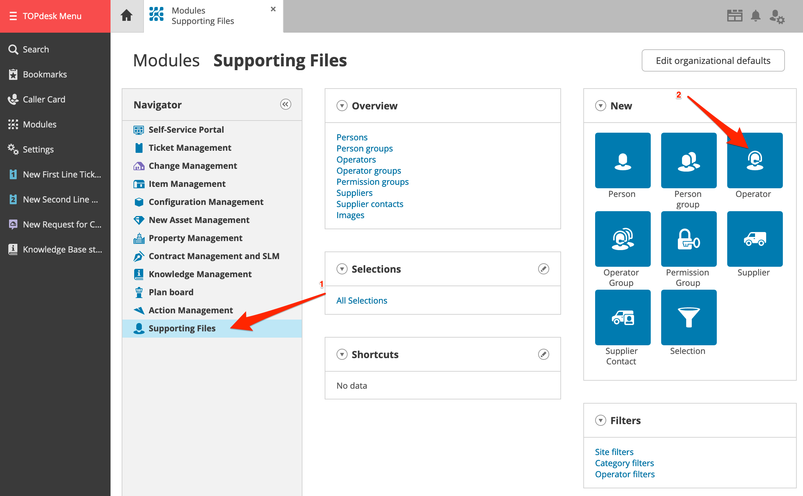
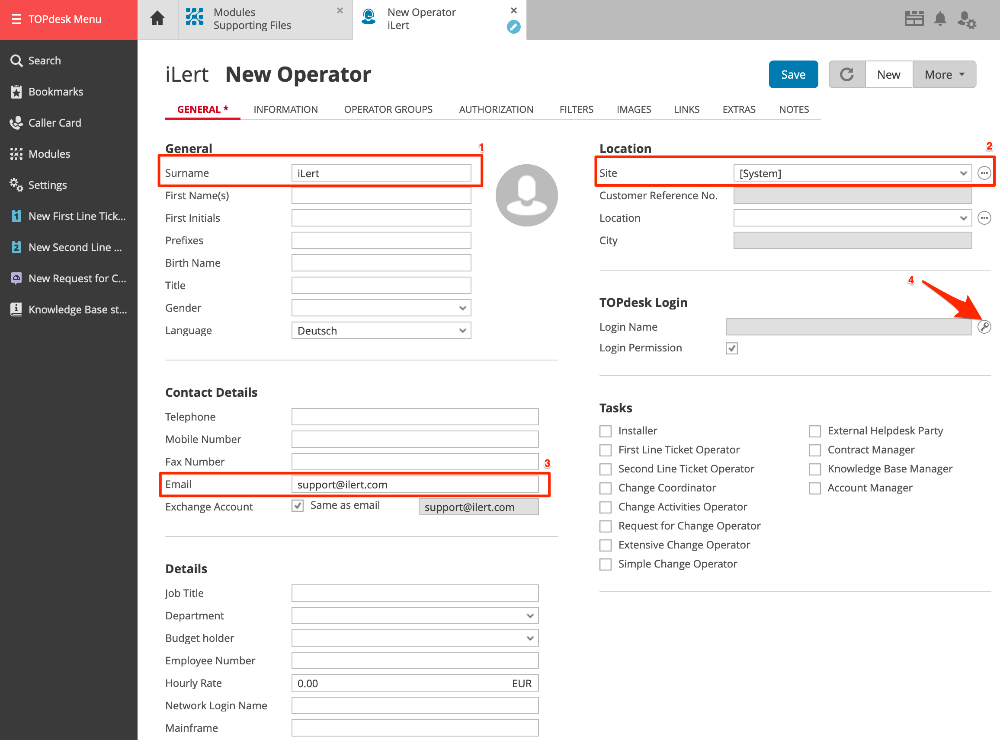
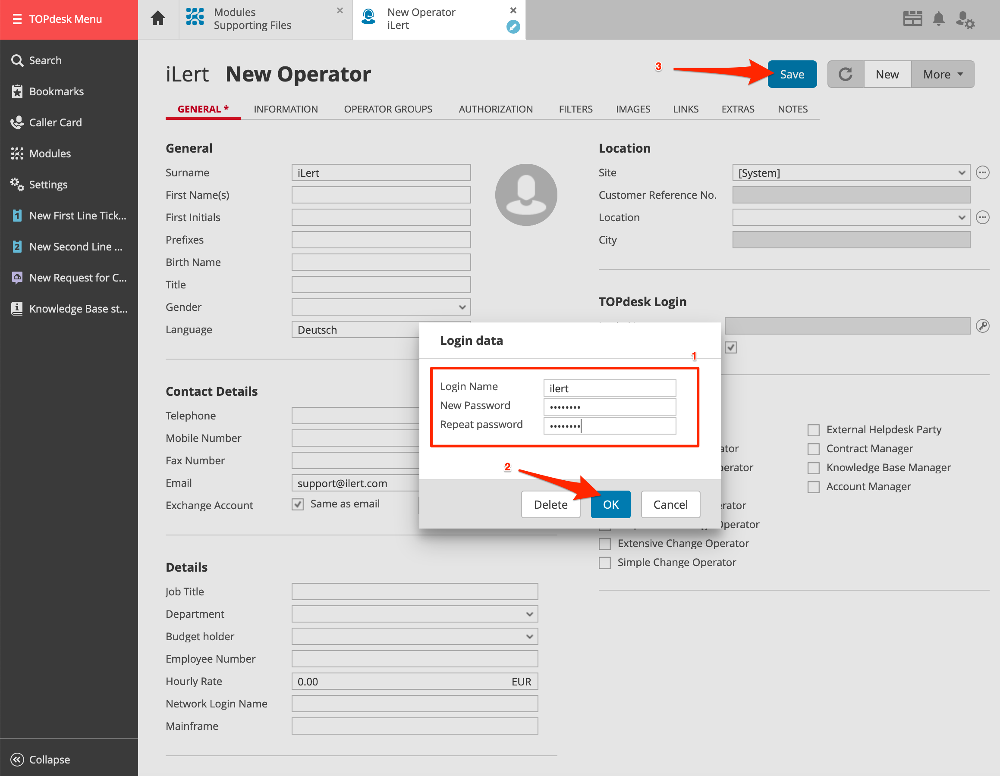
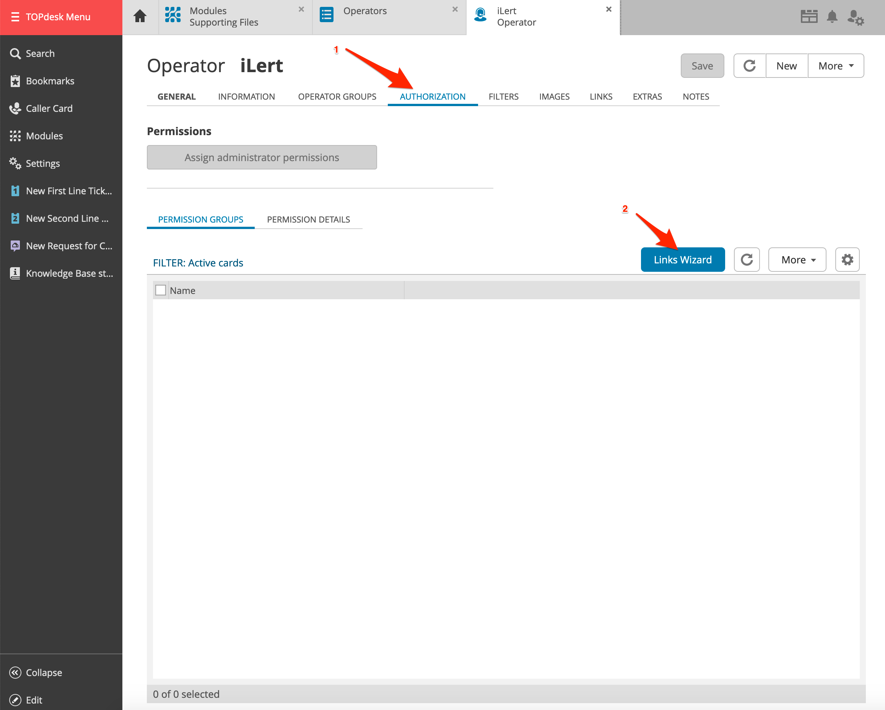
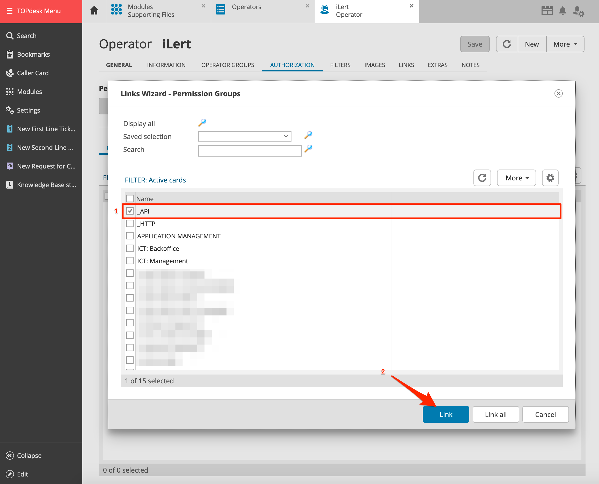
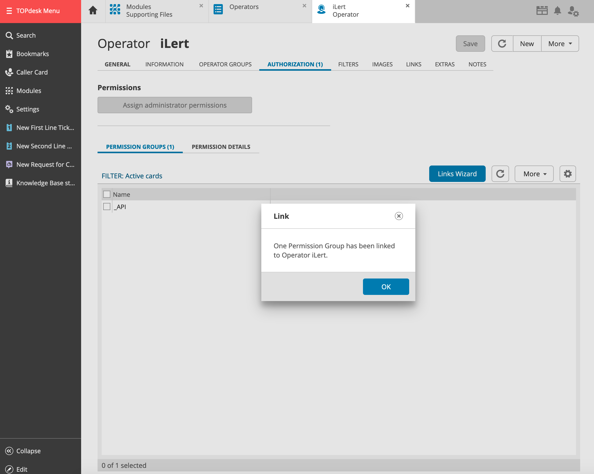
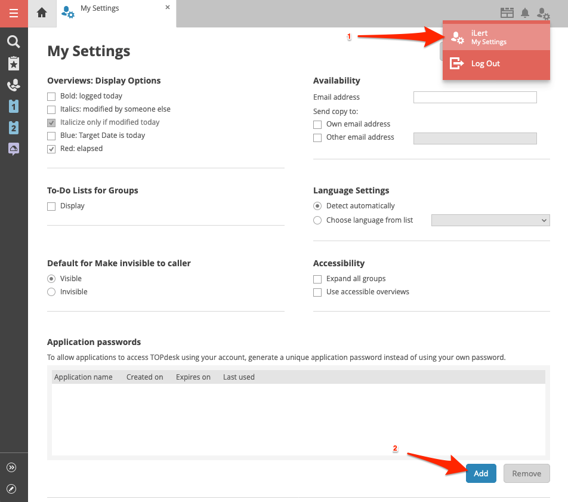
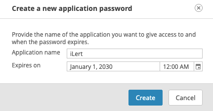
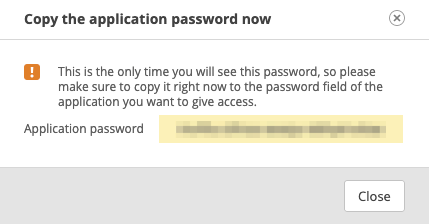

# TOPdesk Outbound Integration

## In TOPdesk: Create an API user 

1. Optional: create a dedicated ilert user in TOPdesk. This has the advantage that you can distinguish the TOPdesk tickets created by ilert.
2. Go to **Modules**, then to **Supporting Files**, and click on **Operator**

3. In the **Surname** section, enter a name eg. ilert
4. In the **Site** section, choose **\[System]**
5. In the **Email** section, enter a email eg. support@ilert.com
6. In the **Login name** section, click on **Edit login data** button

7. On the modal window, enter **Login Name**, **New Password**, **Repeat password** and click **OK**. Write down your username. You will need it later in ilert.

8. Click on **Save**
9. Go to **AUTHORIZATION** tab and click on **Links Wizard**

10. &#x20;On the modal window, choose **\_API** permission and click on **Link**

11. On the modal window, ensure that permisson group is linked and click on **OK**

12. &#x20;Logout and login with the new `iLert` account
13. &#x20;Go to **My Settings** and click on **Add** in the **Application passwords** section

14. &#x20;Enter an **Application name** e.g. `iLert` and ensure that the **Expires on** date is far in the future and click on **Create**

15. &#x20;Write down your password. You will need it later in ilert.

## In ilert: Create a TOPdesk Connector and link to alert source 

1. Click on the gear icon and then on **Connectors** button

.png>)

2. Click on **Add Connector**

.png>)

3. Select **TOPdesk** as **type** and fill in all fields. Enter a name, the URL of your TOPdesk server, username and password of the API user that you created [in the last step](topdesk.md).

.png>)

4. Go to the alert sources tab and open the alert source whose alerts you want to publish in TOPdesk. Click on **Alert actions** and then on **Create alert action**.

.png>)

5. Select **TOPdesk** as the **type**, select the connector created in step 3, fill in all fields. In the **Name** field, specify the alert action name.

.png>)

6. Finished! You can now test the alert action by clicking on the button **Test this connection**. Then a test ticket will be published in TOPdesk.

.png>)

## FAQ 

**Are updates to an alert published in the TOPdesk Ticket?**

Yes, the state of the ilert Alert is reflected in the brief description of the TOPdesk ticket, eg \[RESOLVED] Host compute.infra is DOWN.

**Can I choose which updates to publish to an alert in TOPdesk?**

Currently not. If you wish, we look forward to your feedback via chat or e-mail.

## Related articles


[topdesk.md](../inbound-integrations/topdesk.md)

