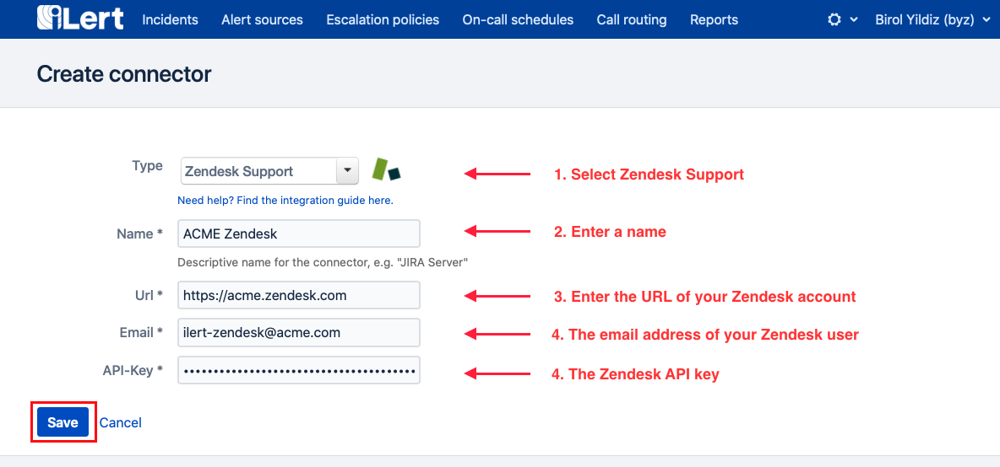
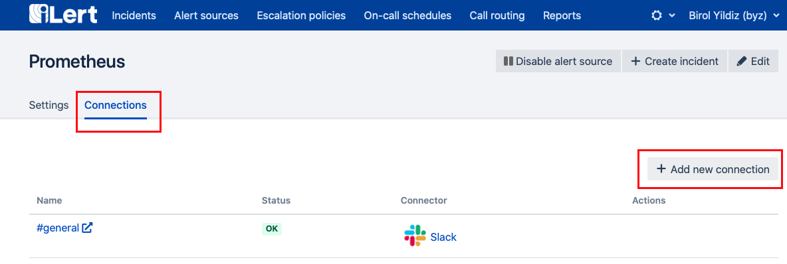
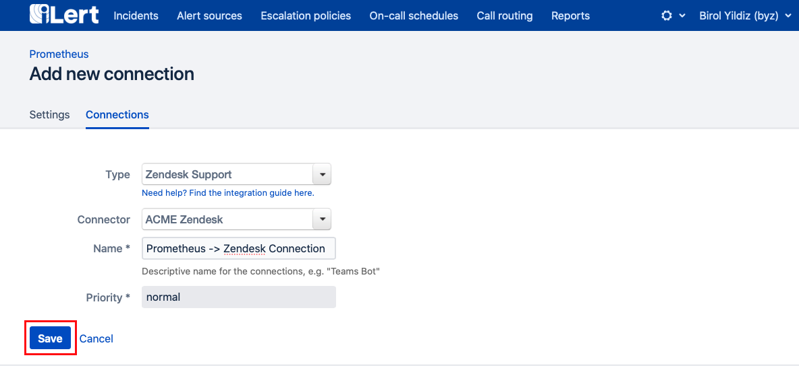
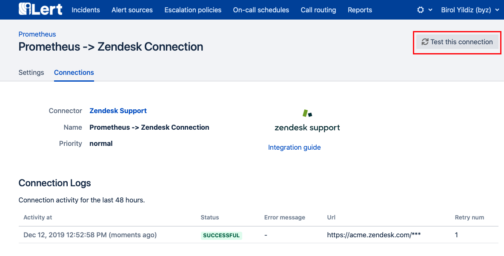

# Zendesk Outbound Integration

[Zendesk](https://www.zendesk.com/) is a cloud-based help desk management solution offering customizable tools to build customer service portal, knowledge base and online communities.

## In ilert: create a Zendesk connector and link it with an alert source 


**Admin Rights Required**

You need to have admin rights to setup this integration.


1. Click the gear icon → **Connectors**

2. Click on **Add Connector**

3. Select **Zendesk Support** and fill in the details

4. Go to **Alert sources** and select the alert source you want to connect with Zendesk. Click on **Connections → Add new connections**.

5. Select **Zendesk Support** as Type and select the **Connector** that you've create in step 3. Pick a name and priority. Tickets created in Zendesk will have this priority. Click **Save**.

6. You're done! You can now test this connection by clicking on **Test this connection**. A test ticket will be created in Zendesk.

## In Zendesk: Create API Token 

1. Optional: create a dedicated ilert user in Zendesk. That way, you will be able to distinguish tickets created by ilert.

2. Go to admin settings, select the API channel, enable token access and create an API token. 

3. You will need this API token later in ilert. Make sure to copy and store it. You won't be able to see it again in Zendesk. Click **Save**.

## FAQ 

**Are tickets updated in Zendesk if the alert is updated in ilert?**

Yes, status updates to ilert Alerts are reflected in the title of the Zendesk ticket, e.g. `RESOLVED` host compute.infra is `DOWN`.

**Can I choose which updates to publish to a ticket in Zendesk?**

Currently not. If that's something you'd like see in ilert, we look forward to your feedback via chat or e-mail.

