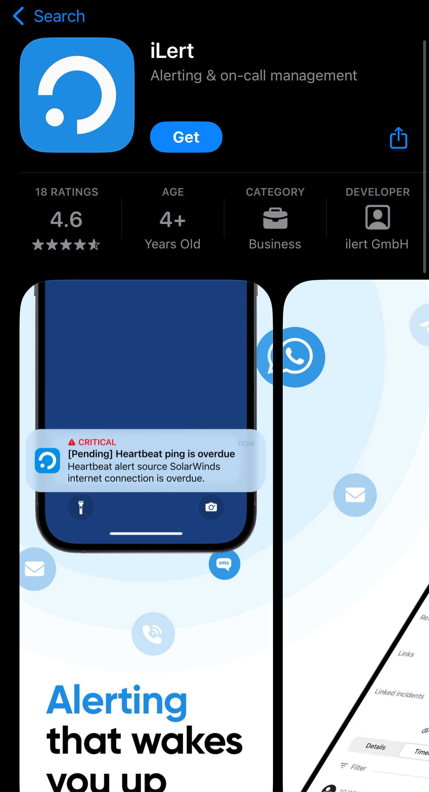
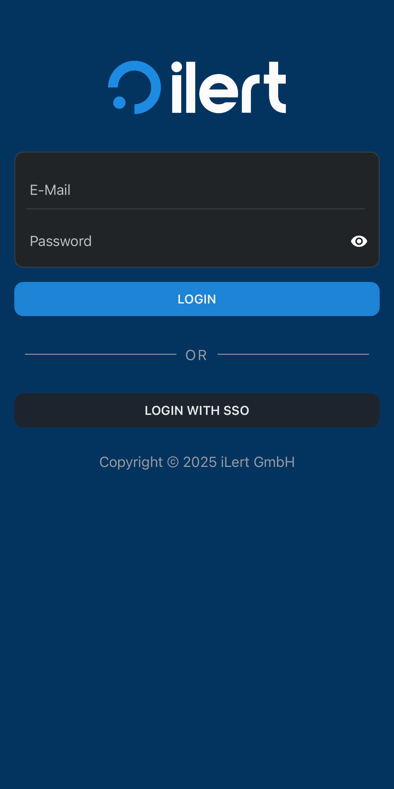
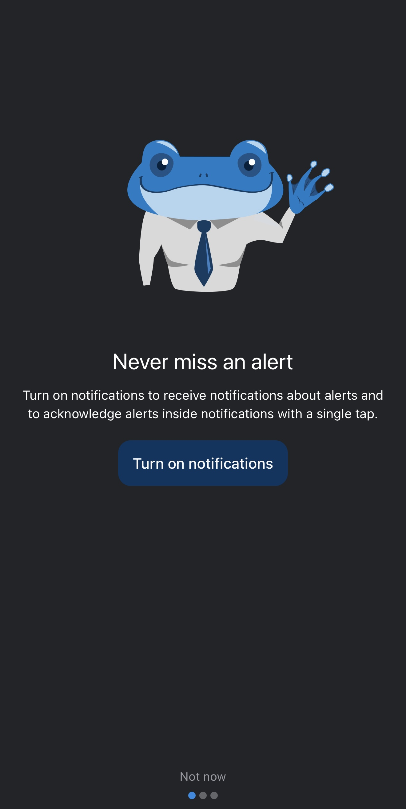
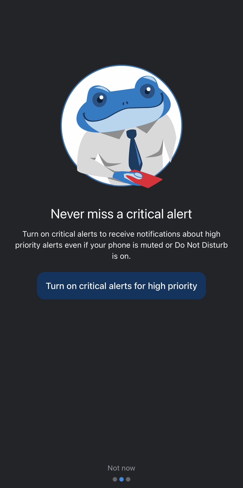
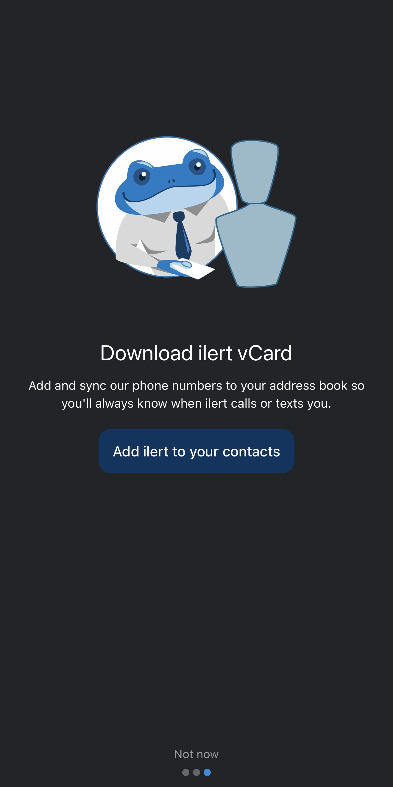
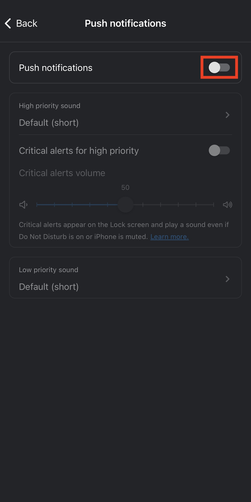
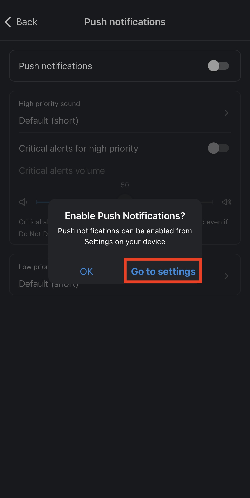
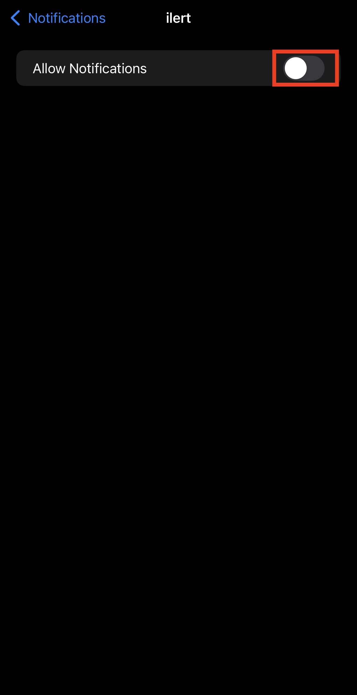

# Getting started with ilert mobile app

With the ilert mobile app, you can take full control of your incident response wherever you are: view and act on alerts (accept, resolve, escalate), manage incidents, check on-call schedules and escalation policies, review call logs, and oversee maintenance windows, heartbeat checks, service uptime, and status pages—all from a single, intuitive interface. The mobile app empowers you to take the first critical steps toward incident response and remediation on the go, ensuring you’re always ready to act.

### Download the app for iOS

<figure><figcaption></figcaption></figure>

Download the **ilert** app from the App Store.

1. Open the [**App Store**](https://apps.apple.com/app/ilert/id542915864?l=en) on your device. You can find the app for iPhone and iPad.
2. Search for **ilert** and tap **Get**.
3. Wait for installation to finish.

### Download the app for Android

Install the **ilert** app from the Google Play Store.

1. Open the [**Play Store**](https://play.google.com/store/apps/details?id=de.ilert.client.iphone\&hl=en_US) on your device.
2. Search for **ilert** and tap **Install**.
3. Launch the app once the download completes.

### Login

<figure><figcaption></figcaption></figure>

Sign in to your ilert account:

* **Email & Password:** Enter your credentials and tap **Sign In**.
* **SSO:** Tap **Sign In with SSO** (if your organization has enabled single sign-on).

If you don't yet have an ilert account, you will need to [create it first via the desktop application](https://app.ilert.com/signup).&#x20;

### Enable push notifications

You can turn on push notifications in two ways:

1. **Notification screens**\
   Enable immediately after your first login using the in-app onboarding screens.
2. **Manual settings**\
   If you skipped the cards, enable notifications via the app’s Settings menu later.

### Notification s**creens**

After your first login, you’ll see these screens. They aim to help you set up the push notifications. Swipe **left** or **right** to navigate between them, or tap **Not Now** to skip all.

<figure><figcaption></figcaption></figure> <figure><figcaption></figcaption></figure> <figure><figcaption></figcaption></figure>

#### 1. Turn on motifications

Enable push notifications so you never miss an alert from ilert.

#### 2. Enable Critical Alerts

Allow **high-priority** alerts to bypass Do Not Disturb and notify you immediately. [See here for more information](critical-push-notifications-and-dnd-overrides/).

#### 3. Add ilert to your contacts

Install a **vCard** containing all of ilert’s phone numbers—so calls from ilert are clearly identified on your device.

### Manual settings

If you skipped the onboarding screens, you can still enable push notifications at any time:

1. Click on the menu button in the top right corner.
2. Select the **Settings** (gear icon) in the ilert app.
3. Tap **Push notification settings**.
4. Toggle **Push notifications** on.
5. Tap **Go to settings**.
6. In your device’s Settings, tap **Allow notifications** for ilert.
7. Return to the ilert app—push notifications are now enabled.

<figure><figcaption></figcaption></figure> <figure><figcaption></figcaption></figure> <figure><figcaption></figcaption></figure>

