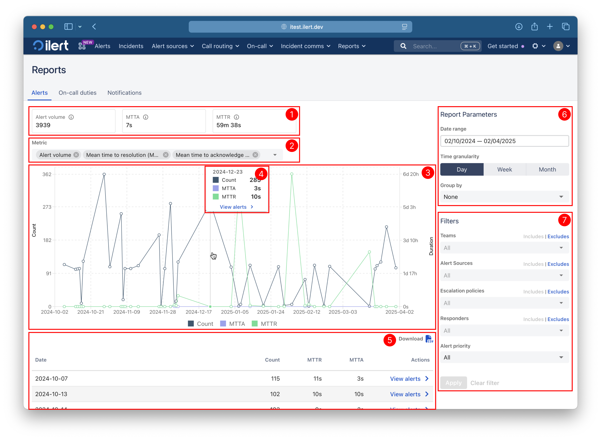
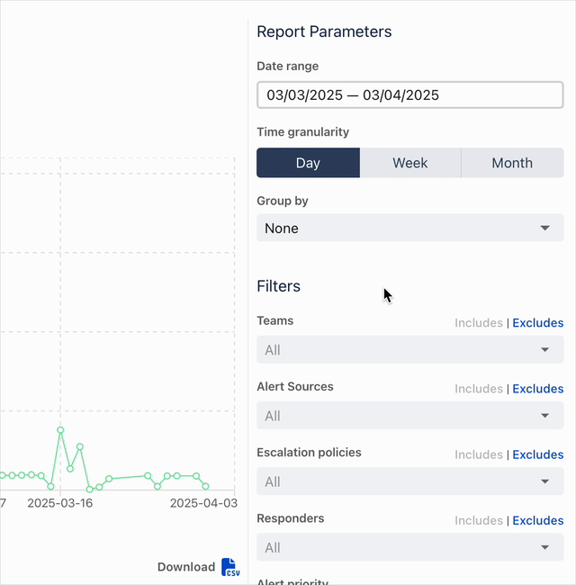
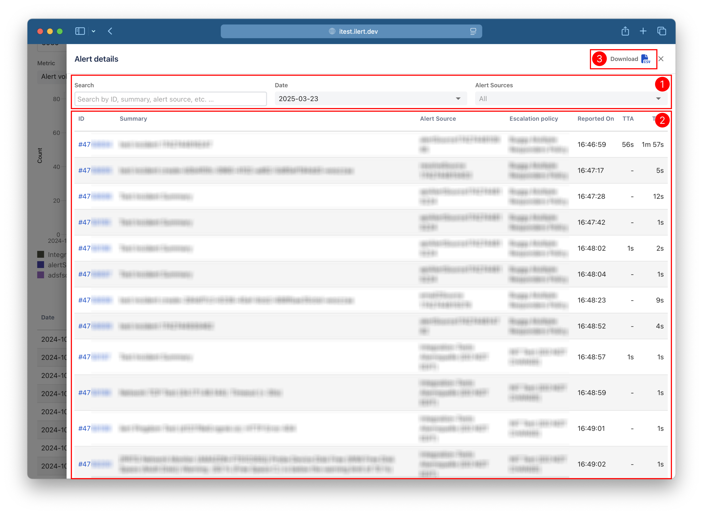

# Alerts

View volume of alerts, Mean Time to Acknowledge (MTTA), and Mean Time to Resolve (MTTR). Group by alert sources or escalation policies.

## Page layout

<figure><figcaption>
Page layout of alert reports
</figcaption></figure>

1. Combined metrics
2. Metric filter
3. Chart
4. Detailed info of a data point
5. Metric data table
6. Report Parameters
7. Filters

### Combined metrics

The widgets display the three metrics for the selected time range, taking into consideration the applied filters.

### Metric filter

Select which metrics to be displayed in the chart and the table. When the **Group by** filter is **None**, multiple metrics can be selected.

### Chart

The chart displays the report data in a line chart. When multiple metrics are selected, the chart may display another scale on the Y-axis on the right for the metrics MTTA and MTTR.


_The legend colours for alert sources and escalation policies are generated based on the hash consisting of type and identifier. Therefore, the colour stays the same even when the resource name is changed._


### Detailed info of a data point

The chart tooltip appears when hovering over the chart. The tooltip displays the names and values of a specific data point. It is vertically scrollable when the list is longer. Click anywhere on the chart to see the alerts on that point.

### Metric data table

View metrics grouped by day, week or month and optionally group by alert source or escalation policy by using the **Group by** filter. Click the CSV button to download the table in a CSV file.


**Unselected metrics are hidden in the table.**

_When the **Group by** filter is other than **None**, the table will show only the selected metric column. However, the downloaded CSV will include all three metrics._


### Report parameters

#### Date range

The **Date range** parameter defines the period during which alerts are created. Select a date in the calendar view and then select either a different day or the same day. Or fill in the **From** and **Until** fields.

<figure><figcaption>
Date-range picker demo
</figcaption></figure>

There are four predefined date ranges: the last 12 months, the last 6 months, the last 3 months, and the last month. These date ranges are calculated relative to the current date.

**Example date ranges**

| Today       | Preset        | Range              |
| ----------- | ------------- | ------------------ |
| 8 Jun 2025  | Last 3 months | 8 Mar–8 Jun 2025   |
| 1 Mar 2025  | Last 1 month  | 1 Feb–1 Mar 2025   |
| 31 Mar 2025 | Last 1 month  | 28 Feb–31 Mar 2025 |


_The **From** date is translated to the beginning of that day, and the **Until** date is translated to the beginning of the following day. This ensures that all the alerts on the From date and the Until date, plus those between them, are included in the report._


#### **Time granularity**

This parameter specifies the granularity at which the data is aggregated. Each data point in the charts and each row in tables will display a total or average value in the selected granularity.

#### **Group by**

This parameter can be used to group the alerts by alert source or escalation policy.

### Filters

The filters can be used to fine-tune which data is included in the report. When the **Apply** button is clicked, all parameters and filters are saved in the page URL, making it easier to bookmark your filters.

#### Teams

The **Teams** filter is available for users with access to [Teams feature](../user-administration/teams.md). This filter affects both the report data and the subsequent filters. When some teams are selected with **Includes**, the subsequent filters will show the resources and responders that belong to any of the selected teams. If **Excludes** is used, the subsequent filters will hide any resources or responders that belong to any of the selected teams. The same logic applies to the report data.


_Team selection is limited to a maximum of 10 teams._


#### Alert sources

The **Alert sources** filter can be used to show or hide the alerts associated with the selected alert sources.

#### Escalation policies

The **Escalation policies** filter can be used to show or hide the alerts associated with the selected escalation policies.

#### Responders

The **Responders** filter can be used to show or hide the alerts that were accepted and/or resolved by the selected responders.


_When all three filters (**Alert sources**, **Escalation policies,** and **Responders**) are in **Includes** state, the report data includes any alerts that are either related to any of the selected alert sources and escalation policies or accepted and/or resolved by the selected responders. In other words, an alert is included if it is matched by at least one of the filters. **In the previous version of reports, an alert was included only if it matched all filters.**_



_When one or more filters are set to **Excludes**, these filters take precedence over the filters with **Includes**. In other words, all alerts matched by the excluded filters are not included._


#### Alert priority

This filter can be used to select alerts based on their priority: High (with escalation) and Low (no escalation).

### Details

View the alerts, including their ID, summary, alert source, escalation policy, reported date, TTA, and TTR.

<figure><figcaption>
Page layout of alert details
</figcaption></figure>

1. Filter toolbar
2. Table
3. Download CSV report

#### Filter toolbar

The **Search** field allows you to filter the rows. It searches text in every column and matches by words.

Use the **Date** filter to switch days, weeks, or months based on the selected **Time granularity**.

The last filter appears if **Group by** is not **None**. Use this filter to view details of a specific alert source or escalation policy.

#### Table

The table displays the details of alerts. TTA and TTR columns may contain a hyphen `-` when nobody accepts an alert, or the alert is not resolved yet.


The date format of **Reported on** column changes based on selected **Time granularity**. For example, when **Day** is selected, only time is shown. If **Week** or **Month** is selected, both date and time are shown.


#### Download CSV button

Click the button to download the table in CSV format.
