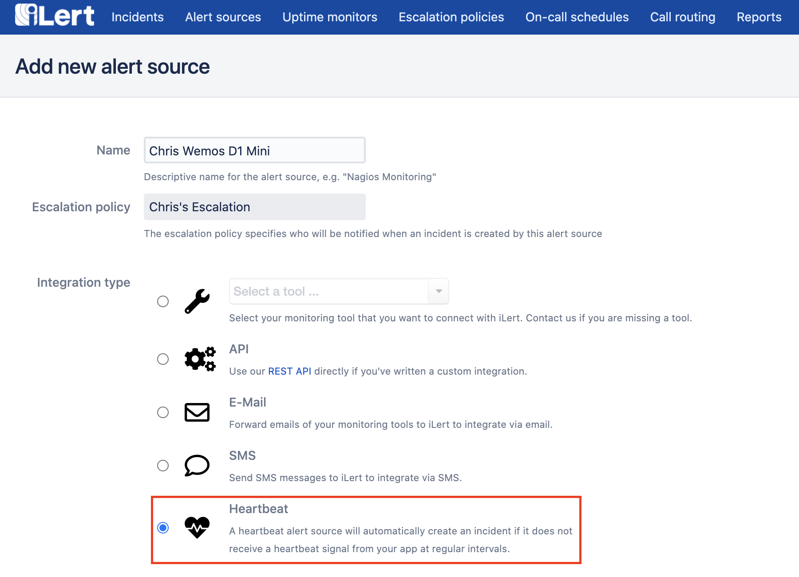
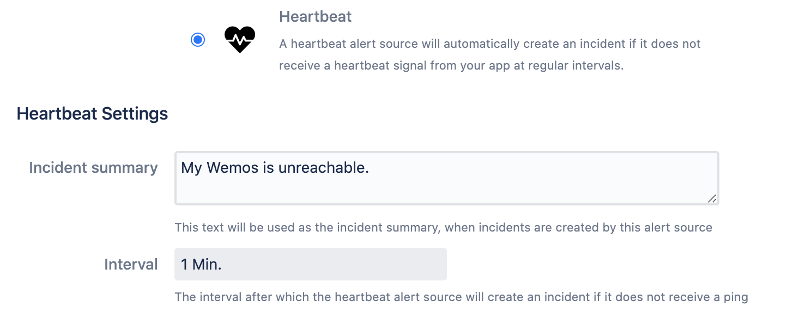
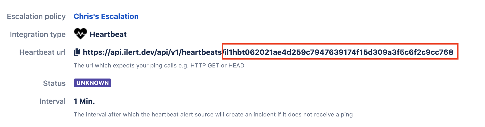

# Heartbeat Monitoring

iLert's heartbeat alert sources allow you to montior services, devices or workflows very easily - depending only on an HTTPS outbound connection.

Simple login to your account, click on the **Alert sources** navigation menu and choose **Create new alert source**.



Choose **Heartbeat** as alert source type and configure the settings to your liking, just like any other alert source you might have already created.

With heartbeat alert sources you may additionally choose an **interval** in which a ping \(HTTP request\) of your service, device or workflow is expected. In case the ping is not received by iLert in the configured interval an incident will be created.



After your alert source has been created, you will be taken to its details view, where the api key will be shown. You can use this api key to call ping requests for your heartbeat alert source.



Using the **url** \(including the api key\) you can simply try out heartbeats \(pings\) e.g. with curl on the command line:

```text
curl https://api.ilert.com/api/v1/heartbeats/${YOUR-APIKEY}

```

You can find more examples on how to implement heartbeats here:






