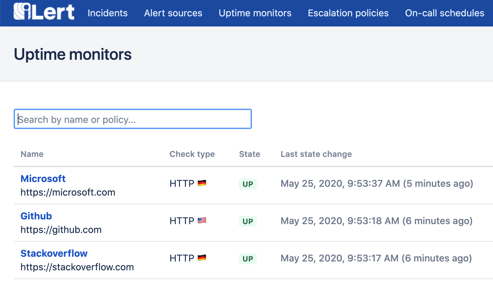

# Uptime Monitoring

iLert's uptime monitors allow you to quickly setup monitoring for any kind of exposed service e.g. HTTP (e.g. websites), ICMP (ping) or TCP and UDP servers.

## Creating a new uptime monitor

Setting up an uptime monitor is matter of seconds and as they seemlessly integrate with iLert's alerting platform you instantly benefit from on-call duty and other known features.

To create a new uptime monitor head to **Uptime monitors** and choose **Create new uptime monitor**.

When creating a monitor you may choose the region from which the uptime checks will be made. Uptime monitor checks are always backed from multiple locations inside of a region to ensure alerting correctness. E.g. if you select region Europe your primary uptime checks will be made from Frankfurt, however if any of the Frankfurt checks identifies an issue a secondary opinion is gathered from Dublin if this check confirms the issue and alert will be created and you will be alerted.

You can also see these single checks in the **Check result log** tab view.

## Uptime monitor reports

A monitors detail view offers flexible zooming in and out of the response graph starting with the creation of your uptime monitor. You may choose to share your Uptime monitors status at any time publicly using the **Copy shareable report link to clipboard** link.

In case you want to prevent others from seeing the shared link at a later time, you may revoke the link using **Regenerate report URL**.

The **Uptime log** shows all status changes in a condensed table view.


Every uptime monitor has a related alert source that is used to manage alerts created by failed uptime checks


## Automatically managing uptime monitors

Note that uptime monitors can be fully managed using [iLert's API](https://api.ilert.com/api-docs/#tag/Uptime-Monitors).\
The API even offers to create shareable links to automatically build status dashboards.

## Frequently asked questions

### From which locations do I have to expect uptime checks?

Currently when choosing iLert's **Europe** region you should at least expect checks from _Frankfurt_ and _Dublin_. When choosing iLert's **United States** region you should at least expect checks from _Virginia_ and _California_.

### How can I detect HTTP uptime checks?

The checks will always contain the `user-agent` HTTP header. The header value **will always start** with : `iLert`

### How can I detect TCP/UDP uptime checks?

You may provide your own id-value for `On connect send` when creating your uptime monitor.

### I cannot rely on user-agent headers for my firewall, is there a way to whitelist ip addresses of the checks?

Basically it is not possible to whitelist the ip addresses for all of our agents, as there are just too many IP blocks that may change at any time. However we do offer static IP agents in our Premium plan - the static ip addresses are listed [here](../getting-started/phone-numbers/#email-services).

### I am looking for uptime checks from a specific region / country?


Please feel free to reach out in case you have any questions regarding uptime monitoring and our regions / want to request new regions.


### How are the ICMP checks performed?

Each time the check is triggered, five packets are sent sequentially with a 100ms interval. The maximum round-trip time will be the response time of the check. If less than 3 packets were sent or less than 3 packets were received the check will fail and the uptime monitor will change its status.
