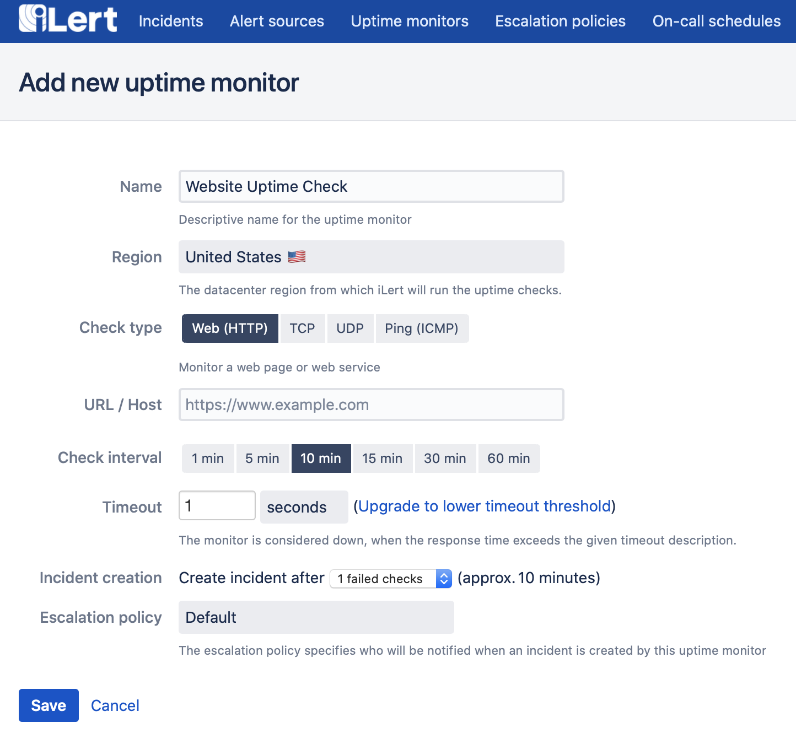
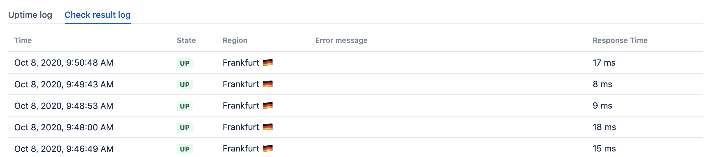
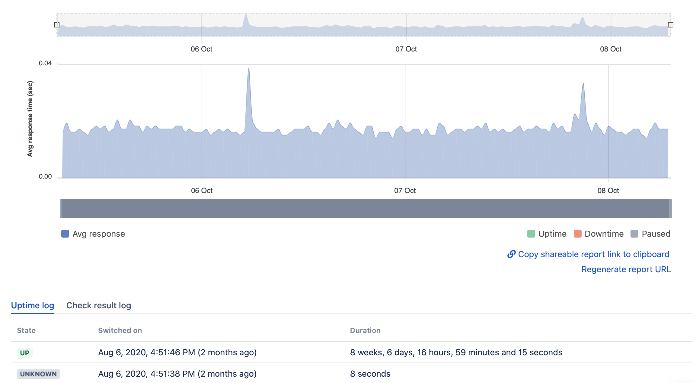

# Uptime Monitoring

iLert's uptime monitors allow you to quickly setup monitoring for any kind of exposed service e.g. HTTP \(e.g. websites\), ICMP \(ping\) or TCP and UDP servers.

Setting up an uptime monitor is matter of seconds and as they seemlessly integrate with iLert's alerting platform you instantly benefit from on-call duty and other known features.

To create a new uptime monitor head to **Uptime monitors** and choose **Create new uptime monitor**.

When creating a monitor you may choose the region from which the uptime checks will be made. Uptime monitor checks are always backed from multiple locations inside of a region to ensure alerting correctness. E.g. if you select region Europe your primary uptime checks will be made from Frankfurt, however if any of the Frankfurt checks identifies an issue a secondary opinion is gathered from Dublin if this check confirms the issue and incident will be created and you will be alerted.

You can also see these single checks in the **Check result log** tab view.

A monitors detail view offers flexible zooming in and out of the response graph starting with the creation of your uptime monitor. You may choose to share your Uptime monitors status at any time publicly using the **Copy shareable report link to clipboard** link.

In case you want to prevent others from seeing the shared link at a later time, you may revoke the link using **Regenerate report URL**.

The **Uptime log** shows all status changes in a condensed table view.


Every uptime monitor has a related alert source that is used to manage incidents created by failed uptime checks


Note that uptime monitors can be fully managed using [iLert's API](https://api.ilert.com/api-docs/#tag/Uptime-Monitors).  
The API even offers to create shareable links to automatically build status dashboards.

