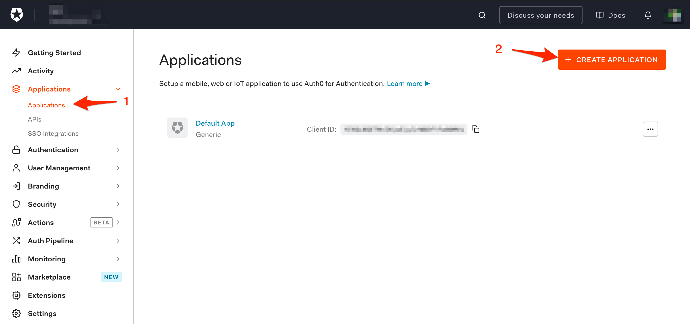

# Setting up SSO with Auth0

When starting with Auth0 Apps things can be a bit complicated and overwhelming. In this guide we take your from zero to your own Auth0 SAML App that integrates with iLert's SSO login.

## Creating an SAML Application

1\. Login to your Auth0 Dashboard. Open the applications page and click on the **Create Application** button.



2\. On the modal window name the app e.g. iLert, choose **Regular Web Application** tile and lick on the **Create** button

.png>)

3\. On the next page clicke on the **Addons** tab and enable the  **SAML2** addon

.png>)

On the next page you need to fill in the information that you can find in your iLert account settings

## Setting up SSO in iLert

1\. Log in to your iLert account as **account owner**, navigate to your **Account Settings** (cog right-side navigation) and click on the **Single sign-on** tab.


SSO with SAML requires your account to be on a Premium or Enterprise Plan, please always feel free to reach out in case you have any questions.



2\. Go back to Auth0 and click on the **Settings** tab on the **SAML** modal window. Paste your **SAML Endpoint URL** value into the Auth0 **Application Callback URL** field, than paste the following settings by first replacing the **Audience Restriction** field:

```javascript
{
  "audience": "<YOUR AUDIENCE RESTRICTIOnN",
  "nameIdentifierProbes": [
    "http://schemas.xmlsoap.org/ws/2005/05/identity/claims/emailaddress"
  ]
}
```


3\. Scroll down and click on the **Save** button

4\. After saving, click on the **Usage** tab. Here you can find all the values you need for iLert SSO

.png>)

Transfer the values to iLert's SSO settings

.png>)

Save the the iLert SSO settings. SSO is now configured, however to make the login process work properly you will have to do one more thing.

## Additional SSO Configurations


### Auto-provisioning Auth0 Users in iLert

You can easily auto-provision users on their first SSO login by enabling the checkbox for **Provision new users on first sso login** in your iLert account's settings. This way user accounts will be automatically setup with the role **User** in iLert. Keep in mind that this will require your account to have enough seats booked.

### Disable login with username and password

You can optionally disable the login for username and password combinations on your iLert account and enforce users to use SSO by disabling the checkbox for Allow login with username and password in your iLert account's settings.

### Passing additional attributes during auto-provisioning

Besides the `NameID` you may pass additional parameters for the user or the team to be automatically setup on the first login, please checkout our [auto provisioning section](auto-provisioning-users-and-teams.md).
