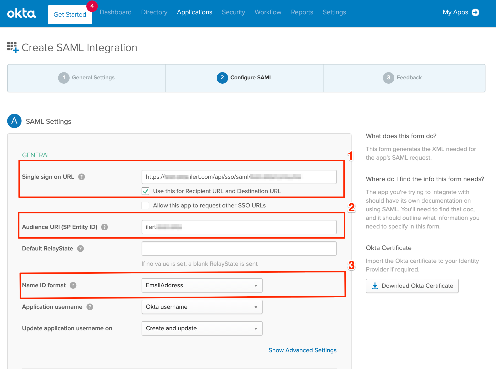
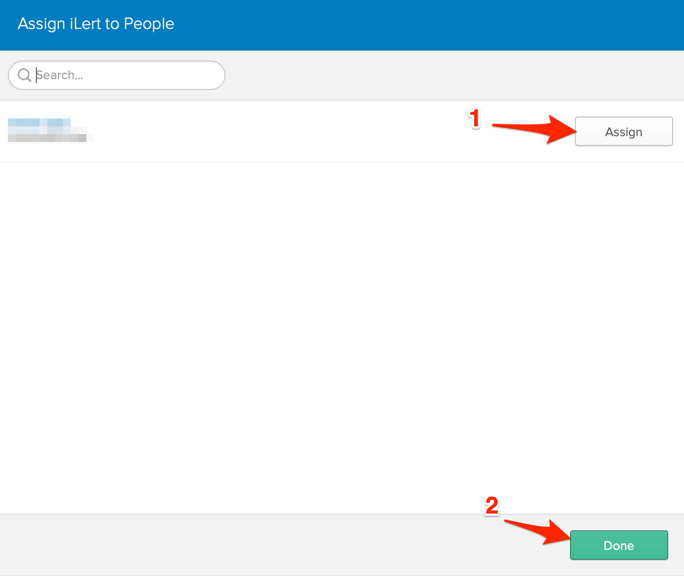

# Setting up SSO with Okta

When starting with Okta Apps things can be a bit complicated and overwhelming. In this guide we take your from zero to your own Okta SAML App that integrates with iLert's SSO login.

## Creating an SAML Application

Login to your Okta Dashboard. Open the applications page and click on the **Add Application **button.

On the next page click the **Create New App **button

On the new modal view choose **SAML** in the Sign on method and click on the **Create** button

On the next page enter **the application name** (e.g. iLert), choose an application icon if you wish and click on the **Next** button

On the next page you need to fill in the information that you can find in your iLert account settings

## Setting up SSO in iLert

Log in to your iLert account as **account owner**, navigate to your **Account Settings** (cog right-side navigation) and click on the **Single sign-on** tab.


SSO with SAML requires your account to be on a Premium or Enterprise Plan, please always feel free to reach out in case you have any questions.


Copy your **SAML Endpoint URL** and **Audience Restriction** values into the Okta SAML App settings, than choose **EmailAddress** in the **Name ID format** section. Scroll to bottom and click on the **Next** button

On the next page choose **I'm an Okta customer adding an internal app** in the **Are you a customer or partner?** section and **This is an internal app that we have created** in the **App type** section, than click on the **Finish** button

Before continuing with the the setup, make sure that the application username update settings are adjusted accordingly. This prevents the loss of account bindings in case of username updates in Okta. _(You can read more about these bindings at the end of this page)_

After saving, click on the **View Setup Instructions** button

Here you can find all the values you need for iLert SSO

Transfer the values to iLert's SSO settings

Save the the iLert SSO settings. SSO is now configured, however to make the login process work properly you will have to do one more thing.

## Adding Okta Users to your Okta SAML App

Right now both your iLert account and your Okta App are properly configured. However you have not yet added any users to your app, which means no one is able to login currently. Lets change that.

Head to your app's **Assignments** and click on the **Assign **button and than on the **Assign to People** button (or **Assign to Groups**)

Click on the **Assign** button beside your users that should be able to login to your iLert account. Confirm the assignment afterwards and click on the **Done** button

Your users should now be able to login to iLert using their Okta accounts.

## Additional SSO Configurations

### Auto-provisioning Okta Users in iLert

You can easily auto-provision users on their first SSO login by enabling the checkbox for **Provision new users on first sso login** in your iLert account's settings. This way user accounts will be automatically setup with the role **User** in iLert. Keep in mind that this will require your account to have enough seats booked.

### Disable login with username and password

You can optionally disable the login for username and password combinations on your iLert account and enforce users to use SSO by disabling the checkbox for Allow login with username and password in your iLert account's settings.

### Understanding Okta <-> iLert account bindings

Okta connects to your LDAP or OAuth2.0 or other identitiy provider and gives you quick access to import or export these users and groups for different kinds of applications, such as iLert.

When assigning a user in Okta to your iLert application, Okta creates a binding based on the configured application settings. If setup correctly, as described in this guide, this should be based on the username, which by default is the primary email address of the selected user. (These assignments are indivual for each relationship of a user and an application).

If a user changes his primary email address the assignment (User Name) for the application will stay the same.

And even if a user or admin changes the username itself (if this guide has been followed correctly) the user name assignment of the application will not be updated.

In iLert itself the Okta assigned application user name will be read from the SAML 2.0 NameID field and mapped explicitly to an internal user id. Which means that even if your users email addresses or usernames are changed, they will still be able login to their existing iLert account.

In case of a username change, Okta might inform you in some cases that the changed user still exists and has to be deprovisioned manually from the application itself, however you can ignore these warnings.


Please note that the email address can be changed without breaking the login or account binding. However the notifications of the iLert user will still be send to the old email address. The iLert user can safely change the email address for his notifications under profile settings.


### Passing additional attributes during auto-provisioning

Besides the `NameID` you may pass additional parameters for the user or the team to be automatically setup on the first login, please checkout our [auto provisioning section](auto-provisioning-users-and-teams.md).
